# Rust

### Sumário

- [Projetos](#projetos)
- [Utilitários](#utilitarios)
- [Livro: A Linguagem de Programação Rust](#livro-linguagem-programacao-rust)
    + [Obtenção do Livro em Português](#obtencao-livro-portugues)
- [Introduction](#introduction)
- [1. Getting Started](#1-getting-started)
    + [1.1 Installation](#11-installation)
    + [1.2 Hello, World!](#12-hello-world)
        - [Anatomy of a Rust Program](#anatomy-rust-program)
    + [1.3 Hello, Cargo!](#13-hello-cargo)
        - [Creating a Project with Cargo](#creating-project-cargo)
        - [Building and Running a Cargo Project](#building-and-running-cargo-project)
        - [Rust e o Seu Ponto de Entrada](#ponto-de-entrada)
- [3. Common Programming Concepts](#3-common-programming-concepts)
    + [3.1 Variables and Mutability](#31-variables-and-mutability)
        - [Constants](#constants)
        - [Shadowing](#shadowing)
    + [3.2 Data Types](#32-data-types)
        - [Scalar Types](#scalar-types)
            + [Integers Types](#integers-types)
        - [Compound Types](#compound-types)
    + [3.3 Functions](#33-functions)
        - [Parameters](#parameters)
        - [Statements and Expressions](#statements-expressions)
        - [Functions with Return Values](#functions-with-return-values)
    + [3.4 Comments](#34-comments)
    + [3.5 Control Flow](#35-control-flow)
        - [if Expressions](#if-expressions)
        - [Repetition with Loops](#repetition-with-loops)
- [4. Understanding Ownership](#4-understanding-ownership)
    + [4.1 What is Ownership?](#41-what-is-ownership)
        - [The Stack and the Heap](#stack-heap)
        - [Ownership Rules](#ownership-rules)
        - [Variable Scope](#variable-scope)
        - [The String Type](#the-string-type)
        - [Memory and Allocation](#memory-and-allocation)
        - [Pontos Adicionais](#pontos-adicionais-ownership)
    + [4.2 References and Borrowing](#42-references-and-borrowing)
        - [Mutable References](#mutable-references)
        - [Dangling References](#dangling-references)
        - [The Rules of References](#rules-of-references)
        - [Pontos Adicionais](#pontos-adicionais-references)
- [21. Appendix](#21-appendix)
    + [21.1 A - Keywords](#211-a-keywords)
- [Executando Código em Rust](#executando-codigo-rust)
- [Boas Práticas](#boas-praticas)

# <a id="projetos"></a>Projetos

- Convert temperatures between Fahrenheit and Celsius
- Generate the *n*th Fibonacci number
- Print the lyrics to the Christmas carol "The Twelve Days of Christmas", taking advantage of the repetition in the song

# <a id="utilitarios"></a>Utilitários

- `rustup`**:** ferramenta de gerenciamento de versão do Rust e de utilitários associados
- `rustc`**:** ferramenta de compilação
- `rustfmt`**:** ferramenta de formatação de código

+ A principal finalidade do `rustfmt` é automatizar o processo de formatação do código-fonte, tornando-o consistente e legível. Ela é usada para garantir que o código escrito em Rust siga as convenções de estilo recomendadas pela comunidade
+ Ambos `rustc` e `rustfmt` estão inclusos na instalação do `rustup`

# <a id="livro-linguagem-programacao-rust"></a>Livro: A Linguagem de Programação Rust

### <a id="obtencao-livro-portugues"></a>Obtenção do Livro em Português

Para ler o livro no modo offline, você precisa do utilitário `mdbook` instalado, você pode obtê-lo com o comando `cargo install mdbook`.

Após a instalação do utilitário, você utiliza o comando `mdbook build` para construir o livro, basicamente, isso significa que ele vai pegar os arquivos **.md** e transformá-los em um formato que possa ser utilizado pelo seu navegador (**.html**).

Os arquivos **.md** se encontram em um repositório, então você deve cloná-lo e **utilizar o comando de construção no clone do repositório** (no diretório criado pelo comando de clone).

Para abrir o livro no google-chrome você pode executar o comando `google-chrome book/index.html` (você deve se encontrar dentro do repositório local).

# <a id="introduction"></a>Introduction

Se você precisa de um resumo do que será visto neste livro, no final da "Introduction", em "How to Use This Book", temos o que você precisa.

# <a id="1-getting-started">1. Getting Started

## <a id="11-installation"></a>1.1 Installation

```bash
$ curl --proto '=https' --tlsv1.2 https://sh.rustup.rs -sSf | sh
```

O comando acima baixa um script e ele faz a instalação da última versão estável do utilitário `rustup`.

O Rust também precisa de um linker, um programa que ele usa para juntar a saída das suas compilações em um arquivo. É algo que você provavelmente já tem, mas caso um erro de link seja gerado, você deve instalar um compilador de C, pois ele provavelmente irá incluir um linker. Um compilador de C também é útil porque vários pacotes comuns do Rust dependem de codigo C, então irão precisar de um compilador de C.

Usuários Linux podem utilizar o GCC ou o Clang.

## <a id="12-hello-world"></a>1.2 Hello, World!

```Rust
// main.rs
fn main() {
    println!("Hello, World!");
}
```

Você utiliza o comando

```bash
$ rustc nome_do_arquivo.rs
```

para compilar o arquivo acima e depois

```bash
$ ./nome_do_arquivo
```

para executá-lo.

Observe que antes de executar um programa escrito em Rust, você deve compilá-lo e após a compilação, um binário executável será gerado.

### <a id="anatomy-rust-program"></a>Anatomy of a Rust Program

```rust
fn main() {

}
```

As linhas de código acima definem uma função chamada `main()`, ela é especial, **é sempre o primeiro código a ser executado em todo executável**, em um programa Rust.

A `main()` não tem parâmetros, se ela tivesse, eles deveriam estar dentro de `()`.

O corpo da função está envolto por `{}`, Rust requer as chaves em volta de todos os corpos das funções, a abertura das chaves define onde o corpo da função começa e o fechamento das chaves define onde o corpo da função termina.

No arquivo **main.rs**, a linha `println!("Hello, World!");` invoca um macro, não uma função. Usar `!` significa que você está invocando um macro e não uma função, macros nem sempre seguem as mesmas regras que uma função.

A string `"Hello, World!"` é passada como um argumento para `println!()` e então é impressa em tela.

A linha termina com um ponto e vírgula (`;`), o ponto e vírgula indica que uma expressão terminou e a próxima está pronta pra começar, a maioria das linhas em 
Rust terminam em ponto e vírgula.

## <a id="13-hello-cargo"></a>1.3 Hello, Cargo!

Cargo é o sistema de construção e o gerenciador de pacotes do Rust, ele é muito utilizado pela comunidade Rust porque lida com várias tarefas para você, como construir o seu código, fazer o download de bibliotecas que ele utiliza, além de construi-las (nos referimos as bibliotecas que o nosso código utiliza, depende de, de dependências).

O Cargo já vem instalado com o Rust, se você o instalou o Rust através do processo citado na seção 1.1.

### <a id="creating-project-cargo"></a>Creating a Project with Cargo

```bash
$ cargo new hello_cargo
```

O comando acima cria um novo diretório chamado `hello_cargo`, dentro dele o cargo cria um arquivo **Cargo.toml** e um diretório chamado **src**. Dentro de **src** é criado um arquivo chamado **main.rs**.

O diretório criado pelo Cargo (**hello_cargo**) já é inicializado como um novo repositório Git e já possui o arquivo **.gitignore**. Arquivos Git não serão gerados se você executar o `cargo new` dentro de um repositório Git já existente.

O conteúdo do arquivo **Cargo.toml** deve ser similar a

```toml
[package]
name = "hello_cargo"
version = "0.1.0"
edition = "2021"

# See more keys and their definitions at https://doc.rust-lang.org/cargo/reference/manifest.html

[dependencies]
```

**Cargo.toml** está na formato TOML (Tom's Obvious, Minimal Language) que é o formato de configuração do Cargo.

A primeira linha, `[package]`, é o título da seção que indica que as próximas declarações são configurações de pacote.

As próximas três linhas definem as informações de configuração que o Cargo precisa para compilar o programa, o nome, a versão, e a edição do Rust que será usada.

A última linha, `[dependencies]`, é o começo da seção para você listar qualquer uma das dependências do seu projeto. Em Rust, pacotes de código são denominados como **crates**.

O arquivo **main.rs** possuirá um "Hello, world!" gerado automaticamente.

O Cargo espera que seus arquivos de código fonte estejam dentro da pasta **src**, o nível superior do diretório do projeto é usado somente para arquivos README, informações de licença, arquivos de configuração e qualquer coisa que não seja relacionado ao código. Usar o Cargo ajuda a organizar os projetos, "Há um lugar para tudo e tudo está no lugar".

Se você começou um projeto sem o Cargo, que não o usa, você pode convertê-lo em um que usa, basta mover o seu código para **src** e criar um arquivo **Cargo.toml** apropriado.

### <a id="building-and-running-cargo-project"></a>Building and Running a Cargo Project

Em **cargo_hello**, construa o seu projeto usando o comando

```bash
$ cargo build
```

esse comando cria um executável em **target/debug/hello_cargo**, porque a construção padrão é a construção de "debug" (depuração). O Cargo coloca o executável no diretório chamado **debug**, você pode executar o executável com o comando

```bash
$ ./target/debug/hello_cargo
```

Executar `cargo build` pela primeira vez também faz com que o Cargo crie um novo arquivo no nível superior do diretório do projeto, **Cargo.lock**, este arquivo acompanha as exatas versões das dependências no seu projeto. Você nunca precisará mudar este arquivo manualmente, o Cargo gerencia o conteúdo para você.

Nós construímos o projeto com `cargo build` e o executamos com `./target/debug/hello_cargo`, mas nós também podemos usar `cargo run` para compilar o código e executar o executável resultante.

```bash
$ cargo run
```

Usar `cargo run` é mais conveniente do que usar `cargo build` e depois usar o caminho até o binário.

Observe que se seu código não possuir modificações, `cargo run` irá descobrir isso, então ele só executará o binário, caso você modifique o seu código fonte, Cargo reconstruirá o seu projeto antes de executá-lo.

Cargo também provê o comando `cargo check`, este comando analisa rapidamente o seu código para verificar se é possível compilá-lo, mas não produz um executável.

```bash
$ cargo check
```

Este comando é muito útil se você estiver querendo verificar se o seu trabalho ainda é compilável, pois não gerar um executável acelera bastante este processo.

### <a id="ponto-de-entrada"></a>Rust e o Seu Ponto de Entrada

Em Rust, para criar uma aplicação executável, você precisa de um **ponto de entrada** e o ponto de entrada padrão é a `main()`. A convenção é ter essa função em um arquivo chamado **main.rs** na raiz do projeto, se você quiser usar um nome diferente para o arquivo ou ter vários arquivos com funções `main()`, você precisa indicar ao Cargo como lidar com eles.

- **Convenção padrão:**
    + Tenha um arquivo **main.rs** na raiz do projeto
    + A função `main()` neste arquivo é o ponto de entrada padrão
    + Você pode usar `cargo run` para compilar e executar o programa
- **Outros nomes de arquivo:**
    + Se você desejar usar um nome diferente para o arquivo (por exemplo, **nome_do_arquivo.rs**), você precisa indicar isso ao Cargo
    + Use `cargo run --bin nome_do_arquivo` para compilar e executar o programa quando a função `main()` está em **nome_do_arquivo.rs**
- **Múltiplos pontos de entrada:**
    + Se você tem vários arquivos com funções `main()`, você pode usar um diretório **src/bin/** para organizá-los
    + Cada arquivo em **src/bin** é tratado como um ponto de entrada separado
    + Use `cargo run --bin nome_do_arquivo` para especificar qual ponto de entrada executar

# <a id="3-common-programming-concepts"></a>3. Common Programming Concepts

## <a id="31-variables-and-mutability"></a>3.1 Variables and Mutability

Variáveis, **por padrão, são imutáveis**, esta é uma das formas que o Rust te incentiva a escrever código que aproveita a segurança e a concorrência que ele oferece, ainda assim, você pode tornar elas mutáveis. Vamos observar o porque o Rust te encoraja a ser a favor da imutabilidade e porque, às vezes, você pode querer optar variáveis mutáveis.

Quando a variável é imutável, uma vez que o valor é vinculado ao nome, você não pode mudar o valor. Para ilustrar isso, vamos gerar um projeto chamado **variables** e, no nosso arquivo **main.rs**, inserir o código abaixo:

```rust
fn main() {
    let x = 5;

    println!("O valor de x é: {x}");

    x = 6;

    println!("O valor de x é: {x}");
}
```

A compilação do código acima gera um erro relacionado a imutabilidade. Erros de compilação podem ser frustrantes, mas eles simplesmente significam que o seu programa não está fazendo de forma segura o que você quer que ele faça, ainda.

Você recebeu a mensagem de erro `cannot assign twice to immutable variable x`, porque você tentou atribuir um novo valor a variável imutável `x`.

Se um erro de compilação não fosse gerado quando tentamos mudar o valor de uma variável imutável, esta situação poderia levar a vários bugs. Se uma parte do nosso código parte do pressuposto que um valor nunca vai mudar e a outra parte do código muda este valor, é possível que a primeira parte não fará o que foi designada para fazer. A causa deste tipo de problema pode ser difícil de rastrear, especialmente quando a segunda parte do código muda o valor, somente, às vezes. O compilador do Rust garante que quando você pontua que um valor não vai mudar, ele realmente não muda, assim você não precisa ficar de olho, você mesmo. Seu código é, portanto, mais fácil de raciocinar.

Entretanto, mutabilidade pode ser muito útil, fazendo até com que o código seja mais conveniente de escrever. Apesar das variáveis serem imutáveis por padrão, você pode torná-las mutáveis as declarando como `mut`. Declarar uma variável como `mut` indica aos leitores do código que outras partes do código iram alterar o valor da variável.

Vamos arrumar o código acima:

```rust
fn main() {
    let mut x = 5;

    println!("O valor de x é: {x}");

    x = 6;

    println!("O valor de x é: {x}");
}
```

Nos é permitido alterar o valor vinculado a `x` de `5` para `6` porque `mut` é utilizada. Utilizar ou não mutabilidade depende inteiramente de você e o que você acha que ficará mais claro em determinada situação.

### <a id="constants"></a>Constants

Assim como variáveis imutáveis, **constantes** são valores que são vinculados a um nome e não é permitido alterar eles, mas há algumas diferenças entre `const` e variáveis.

Primeiramente, você não pode utilizar `mut` com constantes, constantes não são simplesmente imutáveis por padrão, elas são **sempre imutáveis**. Você declara constantes utilizando a palavra-chave `const` ao invés de `let` e o tipo do valor **deve** ser especificado, enquanto Variáveis declaradas como `let` podem ter o seu tipo inferido.

Constantes podem ser declaradas em qualquer escopo, inclusive o escopo global, o que faz delas úteis para valores que serão utilizadas em vaŕias partes do código.

A última diferença entre constantes e outras variáveis é que o seu valor deve ser uma expressão constante, seu valor não pode ser o resultado de um valor que só pode ser obtido em tempo de execução.

Abaixo, temos um exemplo de uma declaração constante:

```Rust
const TRES_HORAS_EM_SEGUNDOS: u32 = 60 * 60 * 3;
```

O nome da constante é `TRES_HORAS_EM_SEGUNDOS` e o seu valor é uma combinação do resultado da multiplicação `60 * 60 * 3`. A convenção de nomeação de constantes em Rust é que ela deve estar completamente em maiúsculo. O compilador consegue calcular um limitado conjunto de operações em tempo de compilação, o que nos permite escolher entre escrever o valor de uma maneira que é fácil de ler e entender o seu significado, ao invés de escrever o valor resultante da expressão, que pode ser difícil de compreender. Em um capítulo a frente, veremos quais operações podem ser usadas quando declarando constantes.

Constantes são válidas por toda a execução do programa, considerando o escopo no qual foram declaradas. Esta propriedade faz de constantes úteis para valores que serão utilizados em várias partes do domínio da sua aplicação.

Nomear valores que ficarão codificados permanentemente em seu programa como constantes é útil para transmitir o significado desse valor para futuros mantenedores do código. Isso também ajuda a ter um lugar específico em seu código, caso você precise atualizar no futuro, valores que são codificados permanentemente.

### <a id="shadowing"></a>Shadowing

Você pode declarar uma nova variável com o mesmo nome de uma variável já existente. Rustaceans falam que a primeira variável foi sombreada ("shadowed") pela segunda, o que significa que a segunda variável é a que o compilador vai enxergar quando você usar o nome da variável. O que acontece é que a segunda variável ofusca a primeira, assumindo o controle do uso do nome da variável, até ela ser ofuscada, ou o seu escopo terminar. Nos podemos sombrear uma variável usando o nome dela em outra declaração.

```rust
fn main() {
    let x = 5;
    let x = x + 1;

    {
        let x = x * 2;

        println!("O valor de x neste escopo é: {x}");
    }

    println!("O valor de x é: {x}");
}
```

O código acima vincula `x` ao valor `5`, cria uma nova variável `x`, ao repetir `let x =`, utilizando o valor original de `x` e adicionando `1` a ele. Depois, dentro do escopo interno criado com as chaves, uma terceira declaração de `x` é realizada e cria uma nova variável, ofuscando a variável anterior. O seu valor é o valor anterior multiplicado por `2`. Quando o escopo acaba, o sombreamento interno termina e o valor de `x` volta a ser `6`.

Sombrear é diferente de marcar uma variável como `mut`, porque nós iremos receber um erro em tempo de compilação, caso a gente tente reatribuir a variável sem utilizar a palavra-chave `let`. Ao utilizar `let`, nós conseguimos realizar algumas transformações no valor, mas possuir uma variável imutável após as transformações terem sido completadas.

Outra diferença entre `mut` e sombrear é que, **quando sombreamos, estamos efetivamente criando uma nova variável ao utilizar a palavra-chave** `let`. Com isso, podemos mudar o tipo do valor da variável, mas reutilizar o nome.

```rust
    let espaco = "     ";      // Uma quantidade de espaços em branco (5).
    let espaco = espaco.len(); // O tipo foi alterado.
```

O primeiro `espaco` é uma variável do tipo string e a segunda é uma variável do tipo number. Sombrear nos poupa de ter que escolher diferentes nomes, como `espaco_str` e `espaco_num`, ao invés disso, podemos simplesmente reutilizar `espaco`. Contudo, se tentarmos fazer isso utilizando a palavra-chave `mut`, um erro será gerado, nos informando que não podemos mudar o tipo de uma variável mutável.

**Exemplo interessante:**

```rust
fn main() {
    let mut x: u32 = 1;

    {
        let mut x = x; // O `x` do escopo interno consegue enxergar o valor de `x` do escopo externo. O `x` interno deixa de existir quando o escopo em que ela se encontra termina.
        x += 2;

        println!("x: {x}"); // Saída: 3
    }

    /* Caso fizessemos o seguite:
    let x = "Olá";
    A saída abaixo seria "Olá". Isso é permitido pois estamos declarando uma nova variável, por isso é permitido um novo valor de tipo diferente. Pelo o que eu entendi, **a ideia do sombreamento é reutilizar o valor, apesar do tipo do valor acabar mudando**.
    */

    println!("x: {x}"); // Saída: 1
}
```

## <a id="32-data-types"></a>3.2 Data Types

**Todo valor em Rust é de um certo tipo de dado**, essa especificação é o que diz a ele como trabalhar com aquele dado. Iremos observar dois subconjuntos de dados, escalar e composto.

Tenha em mente que o Rust é uma linguagem de tipagem estática, o que significa que o Rust sabe os tipos de todas as variáveis em tempo de compilação. O compilador consegue, normalmente, **inferir** o tipo que nós desejamos baseado no valor da variável e como nós a utilizamos. Nos casos em que vários tipos são possíveis, por exemplo, quando convertemos uma `String` para um tipo númerico utilizando `parse()`, nós devemos denotar o tipo:

```rust
let variavel: u32 = "42".parse().expect("Não é um número.");
```

Se nós não adicionarmos a anotação de tipo, `: u32`, o Rust irá exibir um erro relacionado ao fato que o compilador precisa de mais informação sobre qual o tipo do valor que nós queremos usar.

### <a id="scalar-types"></a>Scalar Types

Um tipo escalar representa um valor único. Rust possui quatro tipos escalares primários: integers (inteiros), floating-point numbers (números de ponto flutuante), booleans (booleanos) e characters (caracteres).

### <a id="integers-types"></a>**Integers Types** <! Estou re-resumindo o arquivo como um todo, por conta do aumento no meu conhecimento sobre Rust. As linhas acima já foram refatoradas.

Um inteiro é um número sem o componente fracionário. A tabela abaixo ilustra a variação dos tipos inteiros.

|Comprimento|Signed|Unsigned|
|---|---|---|
|8-bit|i8|u8|
|16-bit|i16|u16|
|32-bit|i32|u32|
|64-bit|i64|u64|
|128-bit|i128|u128|
|arch|isize|usize|

Cada variação pode ser "signed" ou "unsigned" e tem um tamanho explícito. "Signed" e "unsigned" se refere a ser possível para o valor ser negativo ou não, se um número é "unsigned", ele só será positivo.

Cada variante que depende do sinal ("signed", "i". Pode ser positiva ou negativa) pode armazenar números de -(2^(n-1)) até 2^(n-1)-1, onde n é o número de bits que a variação usa. Então um i8 pode armazenar números de -(2^7) a até (2^7)-1, que é igual a -128 a até 127. Variações "unsigned" podem armazenar números que vão de 0 até (2^n)-1, então, um u8, pode armazenar de 0 a até (2^8)-1, que é igual a 0 a até 255.

Adicionalmente, os tipos `isize` e `usize` dependem da arquitetura do computador no qual o seu programa está sendo executado, o que é denotado na tabela como "arch": 64 bits se você está em uma arquitetura 64-bits e 32 bits se você está em uma arquitetura 32-bits.

Você pode escrever inteiros literais em qualquer uma das formas da tabela acima. Observe que literais numéricos que podem ser vários tipos numéricos permitem um tipo de sufixo, como `57u8`, para designar o tipo (com exceção dos bytes). Literais numéricos também podem usar "_" como separador visual para facilitar a leitura do número, como 1_000, que terá o mesmo valor que 1000 (se tivesse sido especificado desta forma),

Literais inteiros.

|Números literais|Exemplo|
|---|---|
|Decimal|98_222|
|Hexadecimal|0xff|
|Octal|0o77|
|Binário|0b1111_0000|
|Byte (u8 apenas)|b'A'|

Caso você não esteja seguro sobre qual tipo de integer usar, os valores padrões do Rust geralmente são um bom lugar para começar. O padrão para tipos inteiros é `i32`. A primeira situação na qual você terá que usar `isize` e `unsize` é quando estiver indexando algum tipo de coleção.

**Integer Overflow (Estouro de Número Inteiro)**

Vamos considerar o cenário no qual você tem uma variável do tipo `u8` (em que o valor associado a ela é do tipo `u8`), então você aceita valores no intervalo de 0 a até 255. Se você tentar mudar o valor dela para algo fora desse intervalo, como 256, por exemplo, um estouro de número inteiro irá ocorrer, o que pode resultar em dois tipos de comportamento. Quando você está compilando no modo depuração ("debug"), Rust inclui verificações de estouro de número inteiro que fazem com que o seu programa entre em pânico ("panicking") em tempo de execução se esse comportamento ocorrer. Rust usa o termo entrar em pânico quando um programa é encerrado com um erro.

Quando você está compilando em modo de liberação ("release"), com a opção `--release`, Rust não inclui uma checagem para estouro de número inteiro que causará pânico. Ao invês disso, caso o estouro de memória de número inteiro ocorrá, Rust irá realizar dois embrulhos ("wrapping") complementares. Em resumo, valores maiores que o máximo que o tipo aceita envolvem em torno ("wrap around") do valor mínimo que o tipo aceita. Neste caso (`u8`), o valor 256 se torna 0, o valor 257 se torna 1, e assim por diante. O programa não irá ser encerrado ("entrar em pânico"), mas a variável irá estar vinculada a um valor que provavelmente não é o que você está esperando que ela possua. Confiar no comportamento pontuado acima, no qual os valores acima do máximo envolvem em torno dos valores mínimos, é considerado um erro.

Para tornar explícito o fato que o código lida com a possibilidade de estouro, você pode utilizar os seguintes método disponibilizados pela biblioteca padrão do Rust ("standard libray", `std`) para tipos númerico primitivos:

- Envolva todos os modos com o método `wrapping_`*, por exemplo, `wrapping_add`
- Retorne o valor `None` caso ocorra um estouro nos métodos que utilizam `checked_*`
- Retorne o valor e um booleano indicando se houve ou não um estouro nos método que utilizam `overflowing_*`
- Saturar no valor mínimo ou máximo com os métodos que utilizam `saturating_*`

**Floating-Point Types**

Rust também tem dois tipos primitivos para números de ponto flutuante, os quais são números com casas decimais. Os tipos de ponto flutuante do Rust são `f32` e `f64`, os quais possuem tamanho 32 bits e 64 bits, respectivamente. O tipo padrão para pontos flutuantes é `f64`, porque nas CPU's mais modernas, a velocidade é praticamente a mesma do `f32`, mas é capaz de uma precisão maior. Todos os números de ponto flutuante são signed.

Um exemplo de código que usa números de ponto flutuante:

```Rust
// main.rs
fn main() {
    let x = 2.0; // `f64`
    let y: f32 = 3.0; // `f32`
}
```

Números de ponto flutuante são representados de acordo com o padrão IEEE-754. O tipo `f32` tem precisão simples, o `f64` tem precisão dupla.

**Operações Númericas**

Rust suporta as operações matemáticas básicas para todos os tipos númericos: adição, subtração, multiplicação, divisão e resto. A divisão inteira trunca em direção a zero para o número inteiro mais próximo. O código a seguir mostra como você usa cada operação númerica com a declaração `let`.

```Rust
// main.rs
fn main() {
    // Adição.
    let sum = 5 + 10;

    // Subtração.
    let difference = 95.5 - 4.3;

    // Multiplicação.
    let product = 4 * 30;

    // Divisão.
    let quotient = 56.7 / 32.2;
    let truncated = -5 / 3; // Resulta em -1.

    // Resto.
    let remainder = 43 % 5;
}
```

Cada expressão nestas declarações usa um operador matemático e avalia como um único valor, o qual é vinculado a uma variável. O apêndice **B - Operators and Symbols** contém uma lista com todos os operadores que o Rust provê.

**The Boolean Type**

Booleanos podem possuir um de dois valores: `true` e `false`. Booleanos possuem um byte de tamanho. O tipo booleano é especificado em Rust usando `bool`. Por exemplo:

```Rust
fn main () {
    let t = true;
    let f: bool = false; // Anotação de tipo explicita.
}
```

A principal maneira de usar valores booleanos é através de condicionais, por exemplo, a expressão `if`.

**The Character Type**

O tipo `char` do Rust é o tipo alfabético mais primitivo da linguagem. A seguir temos alguns exemplos da declaração de valores `char`:

```Rust
// main.rs
fn main() {
    let c = 'z';
    let z: char = 'Z'; // Anotação de tipo explicita.
    let heart_eyed_cat = '😻';
}
```

Observe que especificamos literais `char` com aspas simples, para literais string, nos usamos aspas duplas. O tipo `char` do Rust tem quatro bytes de tamanho e representa um valor escalar Unicode, o que significa que ele pode representar muito mais do que apenas ASCII. Letras acentuadas, caracteres japoneses, chineses, e coreanos, emojis, e espaços de largura zero são todos valores `char` válidos em Rust. Valores escalares Unicode vão de `u+0000` a até `u+D7FF`, e de `U+E000` a até `U+10FFFF`, inclusive. Entretanto, um "caracter" não é realmente um conceito em Unicode, então a intuição humana sobre o que é um "caracter" pode não corresponder ao que é um caracter em Rust. Veremos isto de forma detalhada no Capítulo 8.

### <a id="compound-types"></a>Compound Types

Tipos compostos podem agrupar múltiplos valores em um tipo. Rust possui dois tipos compostos primitivos: tuplas e arrays.

**The Tuple Type**

Uma tupla é uma maneira genérica de agrupar um número de valores com uma variedade de tipos em um tipo composto. Tuplas tem um comprimento fixo, uma vez declarada, ela não pode crescer ou diminuir em tamanho.

A forma de criar uma tupla é escrevendo uma lista de valores, separados por vírgula, dentro de um parênteses. Cada posição da tupla possui um tipo, e os tipos dos diferentes valores dentro da tupla não precisam ser iguais. No exemplo abaixo, nós adicionamos a notação de tipo opcional:

```Rust
// main.rs
fn main() {
    let tup: (i32, f64, u8) = (500, 6.4, 1);
}
```

A variável `tup` é vinculada a toda a tupla, porque uma tupla é considerada um único elemento composto. Para obter valores individuais da tupla, nos podemos usar correspondência de padrões para desestruturar o valor da tupla, desta forma:

```Rust
// main.rs
fn main() {
    let tup = (500, 6.4, 1);
    let (x, y, z) = tup;

    println!("The value of y is: {y}");
}
```

O programa acima, primeiro cria uma tupla e víncula a ela a variável `tup`. Então ele usa o padrão com `let` para pegar `tup` e tornar isto em três variáveis separadas, `x`, `y` e `z` (a variável `tup` ainda existe e mantém os seus valores). Isto é chamado de desestruturação, porque isso quebra uma única tupla em três partes. Finalmente, o programa imprime o valor de `y`, que é `6.4`.

Observe que não podemos desestruturar a tupla em uma quantidade de elementos menor que o seu comprimento.

Nós também podemos acessar um elemento da tupla diretamente utilizando a notação de ponto (`.`), seguido pelo índice do valor que nós queremos acessar. Por exemplo:

```Rust
// main.rs
fn main() {
    let x: (i32, f64, u8) = (500, 6.4, 1);
    let five_hundred = x.0;
    let six_point_four = x.1;
    let one = x.2;
}
```

O programa acima cria uma tupla `x` e acessa cada elemento da tupla utilizando seu respectivo índice. Como na maioria das linguagens de programação, o primeiro índice de uma tupla é 0.

Uma tupla sem qualquer valor tem um nome especial, **unit**. Este valor e o seu tipo correspondente são escritos utilizando parênteses vazios (`()`) e representam um valor vazio ou um tipo de retorno vazio. Expressões retornam implicitamente o valor unit se elas não retornam nenhum outro valor.

**The Array Type**

Outra forma de ter uma coleção de múltiplos valores é com um array. Diferentemente da tupla, cada elemento de um array deve possuir o mesmo tipo. Arrays em Rust, diferentemente de outras linguagens, possuem um comprimento fixo.

Para escrever valores em um array, nós os colocamos dentro de colchetes, separados por vírgulas.

```Rust
// main.rs
fn main() {
    let a = [1, 2, 3, 4, 5];
}
```

Arrays são úteis quando nós queremos alocar os dados na stack ao invés de aloca-los na heap, ou quando você quer garantir que você possui uma quantidade fixa de elementos. Arrays não são flexíveis como vetores, um vetor é similar a um tipo de coleção. Eles são disponibilizados pela biblioteca padrão (standard library) e podem crescer ou encolher de tamanho.

Arrays são muito úteis quando você sabe que a quantidade de elementos não irá mudar. Por exemplo, se vpcê está usando os nomes dos meses em seu programa, você provavelmente deve usar um array, porque você sabe que ele irá conter 12 elementos.

```Rust
let months = ["January", "February", "March", "April", "May", "June", "July", "August", "September", "October", "November", "December"];
```

Para especificar o tipo do array, você utiliza colchetes, dentro dele, você pontua o tipo dos valores, ponto e vírgula, e a quantidade de elementos do array.

```Rust
let a: [i32; 5] = [1, 2, 3, 4, 5];
```

Acima, cada valor possui o tipo `i32`. O número 5, após o ponto e vírgula, indica que o array contém 5 elementos.

Você também pode inicializar um array que contém o mesmo valor para cada elemento, especificando o valor inicial, seguido por ponto e vírgula, e o tamanho do array. Como é mostrado abaixo:

```Rust
let a = [3; 5];
```

O array acima irá conter `5` elementos, todos eles irão possuir o valor inicial `3`. Esta é uma forma mais concisa de escrever `let a = [3, 3, 3, 3, 3];`.

Um array é um pedaço de memória conhecido, de tamanho fixo, que pode ser alocado na stack. Você pode acessar seus elementos utilizando índices.

```Rust
// main.rs
fn main() {
    let a = [1, 2, 3, 4, 5];
    let first = a[0];
    let second = a[1];
}
```

No exemplo acima, a variável chamada `first` irá obter o valor `1` e a variável chamada `second` irá obter o valor `2`. Índices em arrays também começam em 0.

**Exemplo Interessante**

```Rust
// main.rs
fn main() {
    let tuple = ([1; 2], [3; 4]); // `tuple` é, basicamente, `([1, 1], [3, 3, 3, 3])`.
    let (position_zero, _position_one) = tuple;

    // `tuple.1[0]`, é a segunda posição da tupla (o índice 1, o vetor `[3, 3, 3, 3]`), pegando depois o índice 0 do vetor.
    println!("Sum of position_zero[0] + tuple.1[0]: {}", position_zero[0] + tuple.1[0]);
}
```

**Invalid Array Element Acess**

Considere o código abaixo:

```Rust
// main.rs
use std::io;

fn main() {
    let a = [1, 2, 3, 4, 5];

    println!("Please enter an array index.");

    let mut index = String::new();

    io::stdin()
        .read_line(&mut index)
        .expect("Failed to read line");
    
    let index: usize = index
        .trim()
        .parse()
        .expect("Index entered was not a number");

    let element = a[index];

    println!("The value of the element at index {index} is: {element}");
}
```

O código acima compila com sucesso. Se você fornecer um valor de 0 a 4 para o programa, o valor deste índice no array será impresso, mas caso você forneça um valor igual ao comprimento do array ou maior, o programa irá panicar.

O programa irá resultar em um erro em tempo de execução. Ele será encerrado com uma mensagem de erro e a impressão final não será realizada. Quando você tenta acessar um elemento usando indexação, Rust irá verificar se o índice é menor que o comprimento do array, caso ele seja igual ou maior, Rust irá panicar. Esta checagem ocorre em tempo de execução, especialmente no caso acima, porque não é possível para o compilador saber o valor que o usuário irá fornecer ao código.

Este é um exemplo dos princípios de segurança de memória do Rust em ação. Em muitas linguagens de baixo nível, este tipo de checagem não é feita e quando você fornece um índice inválido, uma posição de memória inválida pode ser acessada. Rust te protege contra este tipo de erro, encerrando a execução imediatamente, ao invés de permitir o acesso de memória.

## <a id="33-functions"></a>3.3 Functions

Funções são predominantes em Rust. E nós já vimos as funções mais importantes na linguagem: `main()`, que é o ponto de entrada para os programas escritos em Rust. Com isso, nós também acabamos por ver a palavra-chave `fn`, a qual permite a declaração de funções.

Rust usa a convenção de estilo "snake case" para funções e nome de variáveis, esta convenção dita que todas as letras devem ser minúsculas e "palavras separadas", devem ser separadas por um underscore. Abaixo temos um programa que contém um exemplo de definição de funções:

```Rust
// main.rs
fn main() {
    println!("Hello, world!");

    another_function();
}

fn another_function() {
    println!("Another function.");
}
```

Nós definimos uma função em Rust utilizando a palavra-chave `fn` seguida pelo nome da função e um conjunto de parênteses. As chaves dizem ao compilador onde o corpo da função começa e onde ele termina.

Nós podemos invocar qualquer função já definida utilizando o seu nome seguido por um conjunto de parênteses. Observe que no exemplo acima `another_function()` é definida após a `main()`, nós também poderíamos ter definido ela antes da `main()`. Rust não se importa onde você define suas funções, desde que elas estejam definidas em algum lugar no escopo que é visível pelo seu invocador.

Vamos iniciar um novo projeto chamado **functions**, para assim, explorar funções mais a fundo.

### <a id="parameters"></a>Parameters

Nós podemos definir funções que possuem parâmetros, que são variáveis especiais que fazem parte da assinatura da função. Quando uma função tem parâmetros, você pode prover valores concretos para eles, tecnicamente falando, o nome dos valores concretos fornecidos para uma função são argumentos.

```Rust
// main.rs
fn main() {
    another_function(5);
}

fn another_function(x: i32) {
    println!("The value of x is: {x}");
}
```

A declaração de `another_function()` possui um parâmetro, chamado `x`, o tipo de `x` é `i32`. Quando nós passamos `5` para `another_function()`, o macro `println!` coloca ele no lugar de `{x}`.

Na assinatura de funções, você deve declarar o tipo de cada parâmetro. Isto é uma decisão de design do Rust: requerer a anotação explicita de tipo significa que o compilador, provavelmente, não vai precisar que você utilize a função em algum lugar para descobrir o tipo do parâmetro. Isso também significa que o compilador vai ser capaz de fornecer mensagens de erro mais úteis, pois ele sabe que tipos a função espera.

Quando você vai definir uma função que possui múltiplos parâmetros, separe cada parâmetro com uma vírgula:

```Rust
// main.rs
fn main() {
    print_labeled_measurement(5, 'h');
}

fn print_labeled_measurement(value: i32, unit_label: char) {
    println!("The measurement is: {value}{unit_label}");
}
```

O exemplo acima cria uma função chamada `print_labeled_measurement()` com dois parâmetros, o primeiro, é chamado `value` e seu tipo é `i32`, o segundo, é chamado `unit_label` e seu tipo é `char`. A função imprime o texto contendo os valores de `value` e `unit_label`.

Por conta de termos invocado a função com os seguintes valores como argumentos `5` e `h`, a saída do programa irá as conter.

### <a id="statements-expressions"></a>Statements and Expressions

Os corpos da função são feitos de uma série de declarações, terminando, opcionalmente, em uma expressão. Até então, as funções que nós abordamos não incluem uma expressão final, mas nós vimos expressões como parte de uma declaração. Rust é uma linguagem baseada em expressões, esta é uma distinção importante de se entender, outras linguagens não fazem essa distinção, então vamos analisar as diferenças entre declarações e expressões e como elas afetam o corpo das funções:

- **Statements** (declarações) são instruções que realizão algum tipo de ação e não retornam um valor
- **Expressions** (expressões) são avaliadas em um valor resultante

```Rust
// main.rs
fn main() {
    let y = 6;
}
```

A definição de funções é uma declaração, o exemplo anterior como um todo, é uma declaração em si.

Declarações não retornam valoes, então, você não pode atribuir uma declaração `let` a declaração de outra variável, como o código abaixo exemplifica, isso irá gerar um erro.

```Rust
fn main() {
    let x = (let y = 6);
}
```

A declaração `let y = 6` não retorna um valor, então não há nada para vincular a `x`. Isso funciona de forma diferente para outras linguagens, como C e Ruby, onde as atribuições retornam o valor da atribuição. Nessas linguagens você pode fazer `x = y = 6`, fazendo com que ambos `x` e `y`, possuam o valor `6`; não é assim que Rust funciona.

Expressões são avaliadas em um valor e compõem boa parte do código que você escreverá em Rust. Considere a seguinte operação matemática, 5 mais 6, é uma expressão que é avaliada no valor 11. Expressões podem fazer parte de declarações, na declaração acima, `let y = 6`, é uma expressão que resulta no valor 6; invocar uma função é uma expressão, chamar um macro é uma expressão. Um novo escopo criado com chaves é uma expressão, por exemplo:

```Rust
fn main() {
    let y = {
        let x = 3;
        x + 1
    };

    println!("The value of y os: {y}");
}
```

a expressão

```Rust
{
    let x = 3;
    x + 1
}
```

é um bloco, que neste caso, é avaliado em `4`, o valor é vinculado a `y` como parte da declaração `let`. Observe que a linha `x + 1` não possue um ponto e vírgula ao final, diferentemente da maioria das linhas que vimos até então. Expressões não terminam com ponto e vírgula, se você adicionar um ponto e vírgula ao final de uma expressão, você torna ela em uma declaração e ela não irá retornar um valor.

### <a id="functions-with-return-values"></a>Functions with Return Values

Funções podem retornar valores para o código que a invoca. Nós não nomeamos valores de retorno, mas nós devemos declarar o seu tipo após a flecha ("`->`"). Em Rust, o valor de retorno de uma função é um sinônimo do valor da expressão final do bloco do corpo da função. Você pode antecipar o retorno de uma função utilizando a palavra-chave `return` e especificando um valor, mas a maioria das funções retornam a última expressão implicitamente. Abaixo temos uma função com valor de retorno:

```Rust
// main.rs
fn five() -> i32 {
    5
}

fn main() {
    let x = five();

    println!("The value of x is: {x}");
}
```

Não há chamadas de função, macros e nem mesmo declarações `let` na função `five()`, somente o número `5`. Esta é uma função perfeitamente válida em Rust. Observe que o tipo do retorno é especificado, `-> i32`.

O `5` em `five()` é o valor de retorno da função, e é por isso que o seu tipo é `i32`. A linha `let x = five();` mostra que nós estamos usando o valor de retorno da função para inicializar a variável. Por conta do fato da função `five()` retornar `5`, a linha citada acima é similiar a linha a seguir:

```Rust
let x = 5;
```

A função `five()` não possui parâmetros e define o tipo do valor de retorno, o corpo da função é somente o número `5`, sem o ponto e vírgula, porque é uma expressão e nós queremos que o seu valor seja o valor de retorno.

Considere o código abaixo:

```Rust
// main.rs
fn main() {
    let x = plus_one(5);

    println!("The value of x is: {x}");
}

fn plus_one(x: i32) -> i32 {
    x + 1
}
```

Executando o código acima, ele imprimirá "`The value of x is: 6`", mas se nós adicionarmos um ponto e vírgula ao final da linha que contém `x + 1`, transformando a expressão em uma declaração, um erro ocorrerá.

A mensagem de erro principal será `mismatched types`. O que ocorre é que a função `plus_one()` diz que irá retornar um `i32`, mas declarações não são avaliadas em um valor (o ponto e vírgula transformou a expressão em uma declaração), o que é expresso pelo `()` (o tipo unit), portanto, nada é retornado. Essa situação contradiz a definição da função, resultando em um erro. Na saída para o código com ponto e vírgula, a mensagem de erro que será provida pelo Rust, sugere a remoção do ponto e vírgula para resolução do problema.

Sobre o bloco formado por chaves `{ /* ... */ }`, além do bloco ser uma expressão que pode conter declarações, ele também define um escopo sintático (syntactic scope) para vinculações `let` dentro dele.

## <a id="#34-comments"></a>3.4 Comments

Em Rust, o estilo de comentário idiomático começa com duas barras, o comentário continuara até o final da linha. Para comentários que se extendem por mais de uma linha, você incluirá `//` em cada linha.

Comentários pode ser colocados ao final de linhas que contém código. O mais frequente é que o comentário esteja em uma linha separada, acima do código que ele pontua sobre.

```Rust
fn main() {
    // Comentário.

    // Múltiplas linhas
    // de comentário.

    // Isso é mais frequente.
    let lucky_number = 7; // Isso é permitido.
}
```

## <a id="35-control-flow"></a>3.5 Control Flow

A capacidade de executar um código, caso uma condição seja `true`, e a capacidade de executar um código repetidamente, caso a condição de um laço de repetição seja `true`, são blocos básicos de construção na maioria das linguagens de programação. As construções mais comuns que permitem que você controle o fluxo de execução do Rust são as expressões `if` e loops.

### <a id="if-expressions"></a>if Expressions

Uma expressão `if` permite você ramificar o seu código dependendo de condições. Você provê uma condição e então pontua, "se a condição for satisfeita", execute este bloco de código, se a condição não for satisfeita, não execute este bloco de código.

```Rust
// main.rs
fn main() {
    let number = 3;

    if number < 5 {
        println!("condition was true");
    } else {
        println!("condition was false");
    }
}
```

Todas as expressões `if` começam com a palavra-chave `if`, seguida de um condição. Neste caso, a condição verifica se a variável `number` possue um valor menor que 5. Nós colocamos o bloco de código oara ser executado, caso a condição seja verdadeira, imediatamente após a condição, dentro das chaves. Blocos de código associados com condições `if` são chamados, algumas vezes, de braços ("arms"), igual aos braços em expressões `match`.

Opcionalmente, nós podemos incluir uma expressão `else`, para dar ao programa um bloco de código alternativo para ser executado caso a condição seja avaliada como `false`. Se você não prover uma expressão `else` e a condição for `false`, o programa irá, simplesmente, pular o bloco `if` e seguir para o próximo pedaço de código.

É importante pontuar que a condição neste código, deve ser um `bool`. Se a condição não for um `bool`, um erro será gerado. Por exemplo, no código abaixo:

```Rust
// main.rs
fn main() {
    let number = 3;

    if number {
        println!("number was three");
    }
}
```

A condição `if` é avaliada no valor `3` e o Rust lançará o seguinte erro `error[E0308]: mismatched types`, `expected bool, found integer`. O erro indica que o Rust esperava um `bool`, mas obteve um inteiro. Diferente de outras linguagens como Ruby e JavaScript, Rust não tenta converter tipos não booleanos para booleanos. Você deve ser explícito e sempre prover um `if` com um booleano como condição.

**Handling Multiple Conditions with else if**

Você pode utilizar múltiplas condições combinando `if` e `else` em uma expressão `else if`. Por xemplo:

```Rust
fn main() {
    let number = 6;

    if number % 4 == 0 {
        println!("number is divisible by 4");
    } else if % 3 == 0 {
        println!("number is divisible by 3");
    } else if % 2 == 0 {
        println!("number is divisible by 2");
    } else {
        println!("number is not divisible by 4, 3 or 2");
    }
}
```

O programa tem quatro possíveis caminhos a tomar, após a execução dele a saída deve ser `number is divisible by 3`.

Quando o programa é executado, ele verifica as expressões `if` por turno e executa o corpo da primeira que é avaliada como `true`. Observe que mesmo que 6 seja divisível por 2, a mensagem `number is divisible by 2`, ou a mensagem, `number is not divisible by 4, 3, 2`, não é impressa. Isto ocorre, porque Rust só executa o bloco da primeira condição avaliada como `true`, e uma vez que ele encontra uma, ele nem verifica as condições restantes.

Usar muitas expressões `else if`, pode deixar seu código confuso, então, se você possue mais de uma, você pode querer refatorar o seu código. O capítulo 6 vai falar sobre uma estrutura de construção ramificada poderosa, chamada `match`, para os casos citado anteriormente.

**Using if in a let Statement**

Por conta do fato do `if` ser uma expressão, nós podemos usá-lo do lado direito de uma declaração `let` para vincular o resultado a variável.

```Rust
// main.rs
fn main() {
    let condition = true;
    let number = if condition { 5 } else { 6 };

    println!("The value of number is: {number}");
}
```

A variável `number` terá vinculado a ela um valor baseado na saída da expressão `if`. A impressão do código acima, será `The value of number is: 5`.

Relembrando que blocos de código são avaliados na última expressão contida neles e, números, são expressões por si só. No código acima, o valor para o qual a expressão `if` será avaliada, depende de qual bloco será executado. Isto significa que o potencial valor da expressão `if` resultante de cada ramificação deve possuir o mesmo tipo. Observe que no exemplo acima, ambos os resultados da expressão `if` e `else` são inteiros `i32`, se fossem de tipos diferentes (mismatched), um erro seria acusado.

```Rust
// main.rs
fn main() {
    let condition = true;
    let number = if condition { 5 } else { "six" };

    println!("The value of number is: {number}");
}
```

O código acima irá gerar o erro citado, pois os braços `if` e `else` possuem valores de tipos incompatíveis (`error[E0308]: if and else have incompatible types`).

A expressão no bloco `if` é avaliada em um inteiro e a expressão no bloco `else` é avaliada em uma string (`&str`). Isto não irá funcionar pois variáveis devem possuir um tipo único e o Rust precisa saber em tempo de compilação qual é o tipo definitivo da variável `number`. Rust não conseguirá saber o tipo de variável, se ele só será determinado em tempo de execução. Para conseguir fazer isso, o compilador precisaria ser mais complexo e prover uma quantidade menor de garantias sobre o código, se ele precisasse acompanhar vários tipos hipotéticos para qualquer variável.

### <a id="repetition-with-loops"></a>Repetition with Loops

Muitas vezes é útil executar um bloco de código mais de uma vez, para esta tarefa, Rust provê uma grande quantidade de loops, os quais irão executar o código dentro do corpo do loop até o seu final e então, começar a executar a partir do ínicio, novamente.

Rust possui três tipos de loops, `loop`, `while` e `for`.

**Repeating Code with loop**

A palavra-chave `loop` diz ao Rust para executar o bloco de código de forma continua até que você diga a ele, explicitamente, para parar.

```Rust
// main.rs
fn main() {
    loop {
        println!("again!");
    }
}
```

Quando nós executamos o programa acima, `again!` será impresso de forma contínua, até que nós encerremos a execução do programa de forma manual. A maioria dos terminais suporta o atalho `Ctrl + C` para interromper um programa que está preso em execução contínua dentro de um loop.

O símbolo que será impresso, `^C`, representa que você pressionou `Ctrl + C`. Você pode ou não ver a impressão `again!` impressa após `^C`, dependendo de onde seu código se encontrava no loop quando recebeu o sinal de interrupção.

Rust provê uma forma de encerrar o loop usando código, você pode utilizar a palavra-chave `break`, dentro do loop, para dizer ao programa quando parar de executar o loop.

Também há a palavra-chave `continue` que diz ao programa para pular o restante do código da iteração atual e começar uma nova.

**Returning Values from Loops**

Um dos usos para um `loop` é tentar novamente uma operação que você sabe que pode falhar, como verificar se uma thread completou o seu trabalho. Você também pode precisar retornar o resultado da operação para o código fora do loop, para fazer isso, você pode adicionar o valor que você deseja retornar após a expressão `break` uqe você usa para parar o loop.

```Rust
// main.rs
fn main() {
    let mut counter = 0;
    let result = loop {
        counter += 1;

        if counter == 10 {
            break counter * 2;
        }
    };

    println!("The result is {result}");
}
```

Antes do loop, nós declaramos uma variável chamada `counter` e a inicializamos com `0`. Depois, nós declaramos uma variável chamada `result` que irá conter o valor retornado pelo loop. A cada iteração do loop, nós adicionas `1` a variável `counter` e então, verificamos se o seu valor é igual a `10`. Quando o valor de `counter` for igual a `10`, nós utilizamos a palavra-chave `break` com o valor `counter * 2`. Após o loop, nós usamos o ponto e vírgula no final da declaração que víncula o valor a `result`. Finalmente, imprimimos o valor de `result`, que neste caso, é `20`.

**Loop Labels to Disambiguate Between Multiple Loops**

Se você possui loops dentro de loops, `break` e `continue` se aplicam para o mais profundo naquele ponto. Opcionalmente, você pode especificar um rótulo para o loop para especificar a qual loop você quer aplicar as palavras-chave citadas anteriormente, ao invés de aplica-las para o loop mais profundo. Rótulos de loops devem começar com uma aspas simples. Abaixo temos um exemplo de dois loops aninhados.

```Rust
fn main() {
    let mut count = 0;

    'counting_up: loop {
        println!("count = {count}");

        let mut remaining = 10;

        loop {
            println!("remaining = {remaining}");

            if remaining == 9 {
                break;
            }

            if count == 2 {
                break 'counting_up;
            }

            remaining -= 1;
        }

        count += 1;
    }

    println!("End count = {count}");
}
```

O loop mais externo possui o rótulo `'counting_up` e, irá contar de 0 a 2. O loop interno, que não possui um rótulo, contará de 10 a 9. O primeiro `break`, que não específica um rótulo, irá encerrar, somente, o loop mais interno. A declaração `break 'counting_up` irá encerrar o loop mais externo, abaixo, temos a saída do programa:

```bash
count = 0
remaining = 10
remaining = 9
count = 1
remaining = 10
remaining = 9
count = 2
remaining = 10
End count = 2
```

**Exemplo Interessante**

Vamos alterar o código acima:

```Rust
fn main() {
    let mut count = 0;

    let result = 'counting_up: loop {
        println!("count = {count}");

        let mut remaining = 10;

        loop {
            println!("remaining = {remaining}");

            if remaining == 9 {
                break;
            }

            if count == 2 {
                break 'counting_up "Valor de Retorno";
            }

            remaining -= 1;
        }

        count += 1;
    };

    println!("End count = {count}");

    println!("Mesmo utilizando o rótulo, você pode possuir um valor de retorno: {result}");
}
```

Mesmo utilizando o rótulo, nós ainda podemos retornar um valor de retorno. A saída será:

```bash
count = 0
remaining = 10
remaining = 9
count = 1
remaining = 10
remaining = 9
count = 2
remaining = 10
End count = 2
Mesmo utilizando o rótulo, você pode possuir um valor de retorno: Valor de Retorno
```

**Conditional Loops with while**

Geralmente, um programa precisará avaliar uma condição dentro de um loop, enquanto a condição for `true`, o loop será executado. Quando a condição deixa de ser `true`, o programa faz a chamada do `break`, encerrando o loop. É possível implementar este comportamento usando uma combinação de `loop`, `if`, `else` e `break`, mas este é um padrão tão comum em Rust que ele possui uma construção própria chamada `while`.

```Rust
// main.rs
fn main() {
    let mut number = 3;

    while number != 0 {
        println!("{number}!");

        number -= 1;
    }

    println!("LIFTOFF!!!");
}
```

O programa acima usa o `while` para percorrer o loop três vezes, contando de forma regressiva e, após o loop, imprimindo uma mensagem e encerrando a sua execução.

A construção `while` elimina uma grande quantidade de aninhamentos que seria necessário se você usasse `loop`, `if`, `else` e `break`, e é mais claro. Enquanto a condição for avaliada em `true`, o código será executado, caso contrário, você sairá do loop.

**Looping Through a Collection with for**

Você pode usar a construção `while` para iterar sobre os elementos de uma coleção, tal como, um array.

```Rust
// main.rs
fn main() {
    let a = [10, 20, 30, 40, 50];
    let mut index = 0;

    while index < 5 {
        println!("the value is: {}", a[index]);

        index += 1;
    }
}
```

O loop no código acima, imprime cada elemento no array `a`.

O código conta através dos elementos no array, o `index` começa em `0`, e então, o loop é executado até chegar no índice final do array (isto é, quando o `index < 5` deixa de ser `true`). O código acima imprimirá

```bash
the value is: 10
the value is: 20
the value is: 30
the value is: 40
the value is: 50
```

Todos os cinco valores aparecem no terminal, como esperado, e mesmo que o índice acabe por possuir o valor `5`, o loop é encerrado antes da tentativa de obter um sexto elemento do array.

No entando, a abordagem acima é propensa a erros, nós podemos fazer com que o programa entre em pânico se o valor do índice ou a condição de teste esteja incorreta. Por exemplo, se você mudar a definição do array `a` para possuir quatro elementos e esquecer de ajustar a condição para `while index < 4`, o código entraria em pânico. O código também é mais lento, pois o compilador adiciona código de tempo de execução para executar a verificação de condicional se o índice está dentro dos limites do array em cada iteração do loop.

Uma alternativa mais concisa é utilizar o loop `for` e executar código para cada item na coleção.

```Rust
// main.rs
fn main() {
    let a = [10, 20, 30, 40, 50];

    for element in a {
        println!("the value is: {element}");
    }
}
```

Quando nós executamos o código acima, a saída será a mesma do programa anterior, mas, o mais importante, agora nós aumentamos a segurança do código e eliminamos as chances de bugs que podem ocorrer se formos além do limite do fim do array ou, não indo longe o suficiente e deixando de imprimir alguns itens.

Ao usar o loop `for`, você não irá precisar lembrar de mudar mais nenhum pedaço de código se você mudar o número de valores no array, diferentemente do cenário no qual usamos o `while`.

Por conta da segurança e de como eles são concisos, os loops `for` são a construção de loop mais comum em Rust. Mesmo em situações nas quais você quer executar o código um certo número de vezes, como no código que usa o `while` para percorrer um array, a maioria dos Rustceans ainda usaria o `for`. A forma de fazer isso é usar `range`, fornecida pela biblioteca padrão, ela gera todos os números em uma sequência, começando a partir de um número e terminando antes de outro número.

Abaixo, usaremos um loop `for` com o `range` e um outro método, o `rev()`, para que o intervalo seja percorrido de forma reversa.

```Rust
// main.rs
fn main() {
    for number in (1..4).rev() {
        println!("{number}!");
    }

    println!("LIFTOFF!!!");
}
```

O código acima é mais conciso e seguro em comparação ao que foi utilizado o `while` para realizar a mesma ideia.

Observe também que o tempo de compilação do código acima, foi menor do que a versão com o `while`.

# <a id="4-understanding-ownership"></a>4. Understanding Ownership

Ownership (propriedade) em Rust é um dos recursos mais únicos e que possui as mais profundas implicações para o restante da linguagem. Este recurso permite que o Rust faça garantias de segurança de memória sem a necessidade de um coletor de lixo, por isso é importante entender como ownership funciona. Neste capítulo, estudaremos ownership e vários recursos relacionados: borrowing (empréstimo), slices e, como o Rust organiza os dados na memória.

## <a id="41-what-is-ownership"></a>4.1 What is Ownership?

Ownership é um conjunto de regras que governam como um programa Rust gerência memória. Todos os programas tem que gerenciar a maneira que eles usam a memória do computador enquanto estão em execução. Algumas linguagens possuem um coletor de lixo que regularmente procura por memória que não está mais sendo utilizada enquanto o programa é executado; em outras linguagens, o programador deve alocar e liberar a memória explicitamente. Rust usa outra abordagem, a memória é gerenciada através de um sistema de ownership que possue um conjunto de regras que o compilador verifica. Se qualquer uma das regras é violada, o programa não irá compilar, nenhum dos recursos do ownership irão deixar o seu programa mais lento, em relação a velocidade em tempo de execução.

Por conta do fato que ownership é um conceito novo para muitos programadores, demora um tempo para se acostumar, a boa notícia é que quanto mais experiente você fica em Rust e no sistema de regras de ownership, mais fácil e natural será desenvolver código de forma segura e eficiente.

Quando você compreender ownership, você terá uma fundação sólida para entender o que torna o Rust único. Neste capítulo você aprenderá ownership através de exemplos que focam em uma estrutura de dados muito comum, strings.

### <a id="stack-heap"></a>The Stack and the Heap

Muitas linguagens de programação não fazem com que você tenha que pensar na stack e na heap de forma frequente, mas em linguagens de programação de sistemas, como Rust, se um valor está na stack ou na heap, isso afeta como a linguagem se comporta. Parte da ownership será descrita em relação a stack e a heap mais tarde, neste capítulo, mas a seguir, veremos uma breve explicação em preparação.

Ambas stack e a heap são partes da memória disponíveis para o código usar em tempo de execução, mas elas são estruturadas de forma diferente. A stack armazena os valores na ordem em que ela os obtém e então, remove os valores na ordem oposta, nos referimos a esse comportamento como "last in, first out (LIFO)". Pense na stack como uma pilha de pratos (uma pilha), quando você adiciona mais pratos, você os pôe no topo, e quando você precisa de um, você pega um do topo. Adicionar ou remover pratos do meio ou do fundo da pilha não funcionaria muito bem. O ato de adicionar dados a stack é referenciado como empilhar ("pushing"), e remover dados da stack é referenciado como desempilhar ("popping"). Todo o dado armazenado na stack deve possuir um tamanho conhecido e fixo, dados com tamanho desconhecido em tempo de compilação, ou que podem mudar de tamanho, devem ser armazenados na heap.

A heap é menos organizada, quando você adiciona dados a heap, você solicita uma certa quantidade de espaço, o alocador de memória encontra um espaço vazio na heap que é suficientemente grande, marca que ele está em uso e retorna um ponteiro para ele, que é um endereço da localização. Este processo é referenciado como alocação. Por conta do fato que o ponteiro para a heap é de tamanho conhecido, você pode armazena-lo na stack, mas caso você queria os reais valores dos dados, você deve seguir o ponteiro até o endereço. Imagine que você queria uma mesa com um grupo de amigos em um restaurante, quando você chega, você solicita uma mesa e o anfitrião irá disponibilizar uma para você que caiba todo o seu grupo, caso outra pessoa chegue depois, ela pode perguntar aonde você está sentado para lhe achar.

Empilhar na stack é mais rápido que alocar na heap porque o alocador nunca precisa procurar por um lugar para armazenar novos dados, a localização é sempre no topo da stack. Em comparação, alocar espaço na heap é mais trabalhoso porque o alocador precisa encontrar um lugar grande o suficiente para guardar o dado e então, realizar a contabilidade para se preparar para a próxima alocação.

Acessar dados na heap é mais lento que acessar dados na stack porque você tem que seguir um ponteiro até lá, os processadores contemporâneos são mais rápidos se movimentarem menos memória. Continuando a analogia acima, imagine um garçom pegando pedidos de várias mesas, é mais eficiente pegar todos os pedidos de uma mesa antes de ir para a próxima. Tirar os pedidos da mesa A, e então os da mesa B, depois da A, novamente, e voltar para a B, tornaria o processo muito mais lento. Considere também que um processador irá realizar seu trabalho de forma mais eficiente se ele trabalhar em um dado que está mais próximo de outros dados (como no caso da stack), do que em dados que estão distantes (o que pode acontecer na heap).

Quando o seu código invoca uma função, os valores que serão passados para ela (incluindo possíveis ponteiros para dados na heap) e variáveis locais, são empilhados na stack. Quando a função é encerrada, os valores são desempilhados da stack.

Ficar acompanhando quais partes do código usam dados da heap, minimizar a quantidade de dados duplicados na heap, e remover da heap dados não utilizados para que você não fique sem espaço, são todos problemas que ownership aborda. Uma vez que você entenda ownership, você não irá precisar ficar pensando sobre a stack e a heap de forma frequente, mas enentender que o principal propósito do ownership é gerenciar dados da heap pode ajudar a entender o porque ele trabalha da forma que ele trabalha.

### <a id="ownership-rules"></a>Ownership Rules

- Todo valor em Rust possui um dono ("owner")
- Só pode haver um owner por vez
- Quando o owner sai do escopo, o valor será descartado

### <a id="variable-scope"></a>Variable Scope

Agora que já passamos do básico, não iremos mais incluir `fn main() { }` nos exemplos, então lembre-se de fazer isso de forma manual, pois a ideia é exemplos mais concisos no que a gente pretende destacar.

O primeiro exemplo de ownership será sobre o escopo de algumas variáveis. Um escopo é o intervalo dentro de um programa para o qual um item é válido.

```Rust
let s = "hello";
```

A variável `s` se refere a uma string literal, onde o valor da string é codificado no texto do nosso programa. A variável é válida do momento no qual ela é declarada até o fim do escopo atual. Abaixo, vemos um exemplo onde os comentários denonatam onde a váriavel `s` é válida.

```Rust
{                    // s não é válida aqui por ainda não tem sido declarada.
    let s = "hello"; // s é válida partir deste ponto em diante.

    // Você pode utilizar a variável s.
}                    // O escopo acabou e s não é mais válida.
```

Em outras palavras, hpa dois momentos importantes no exemplo acima:

- Quando `s` entra no escopo e é válida
- Ela permanece válida até o momento no qual ela sai do escopo

Até então, a relação entre escopos e quando as variáveis são válidas é similar as outras linguagens de programação. Agora nós iremos construir em cima deste entendimento, introduzindo  o tipo `String`.

### <a id="the-string-type"></a>The String Type

Para ilustrar as regras de ownership, nós precisamos de um tipo de dado mais complexo do que os vistos anteriormente, os tipos vistos anteriormente possuem um tamanho conhecido e podem ser armazenados na stack, e removidos desta, quando o escopo no qual se encontram é encerrado. Além do que, pode ser bem rápido e trivial copia-los para fazer um novo, uma instância independente, se outra parte do código precisa usar o mesmo valor em um escopo diferente. Nós queremos dados que são armazenados na heap e explorar como o Rust sabe quando limpar este dado, e o tipo `String` é um bom exemplo.

Nós iremos nós concentrar nas partes da `String` que são relacionadas a ownership. Estes aspectos também são aplicados a tipos de dados mais complexo, seja eles disponibilizados pela biblioteca padrão ou por uma criada por você. Falaremos mais sobre `String`s no capítulo 8.

Nós já vimos string literais, onde uma string é codificada em nosso programa. String literais são convenientes, mas não são adequadas para todas as situações nas quais nós podemos querer usar texto. Uma razão é que elas são imutáveis, outra razão é que nem todo valor de uma string pode ser conhecido quando escrevemos o nosso código, por exemplo, se nós queremos pegar a entrada de um usuário e a armazenar. Para essas situações, Rust possui um segundo tipo de string, `String`, este tipo gerencia o dado alocado na heap e é capaz de armazenar uma quantidade de texto que é desconhecido em tempo de compilação. Você pode criar uma `String` a partir de uma string literal usando a função `from()`.

```Rust
let s = String::from("hello");
```

O operador dois pontos duplos (`::`) nos permite nomear esta função `from()` específica sob o tipo `String`, ao invés de ter que usar algum tipo de nome como `string_from`. Nós iremos debater mais sobre este sintaxe em "Method Sintax", no capitulo 5, e falaremos sobre espaçamento de nomes com módulos no capítulo 7, "Paths for Referring to an Item in Module Tree".

Este tipo de string pode ser alterada:

```Rust
let mut s = String::from("hello");

s.push_str(", world!"); // push_str() acrescenta uma literal a uma String.

println!("{}", s); // Saída: hello, world!
```

Então, qual a diferença? Porque `String` pode ser modificada, mas literais não? A diferença está em como esses dois tipos lidam com a memória.

### <a id="memory-and-allocation"></a>Memory and Allocation

No caso de uma string literal, nós sabemos o seu conteúdo em tempo de compilação, então o texto é codificado diretamente no executável final, é por este motivo que string literais são tão rápidas e eficientes. Mas estas propriedades são por conta da imutabilidade da string, infelizmentem nós não podemos por um pedacinho da memória no binário para cada pedaço de texto cujo tamanho é desconhecido em tempo de compilação e que ainda pode mudar de tamanho durante a execução do programa.

Para o tipo `String`, em ordem de suportar um pedaço de texto que é mutável e pode crescer, nós precisamos alocar uma quantidade da memória na heap, desconhecido em tempo de compilação, para guardar o seu conteúdo, isto significa:

- A memória deve ser solicitada ao alocador em tempo de execução
- Nós precisamos de uma maneira de retornar a memória para o alocador quando pararmos de usar a nossa `String`

A primeira parte é feita por nós, quando nós invocamos `String::from()`, a sua implementação solicita a memória necessária para isso. Isto é praticamente universal em linguagens de programação.

Entretanto, a segunda parte é diferente, em linguagens com coletor de lixo ("garbage collector", GC), o GC acompanha e libera a memória que não está mais sendo utilizada e nós não precisamos pensar nisso. Na maioria das linguagens sem GC, é nossa responsabilidade identificar quando a memória não está mais sento utilizada e pedir explicitamente ao código para libera-la. Fazer isso de forma correta tem sido, historicamente, um problema difícil de programação, se esquecermos, desperdiçamos memória, se fazermos isso muito cedo, teremos uma variável inválida. Se fizermos isso duas vezes, é um bug também, nós precisamos de um pair exato, uma alocação (`allocate`) com uma liberação (`free`).

Rust toma um caminho diferente, a memória é automaticamente retornada uma vez que a variável que é dona dela sai de escopo. Abaixo vamos ter um exemplo com uma `String` ao invés de uma string literal.

```Rust
{
    let s = String::from("hello"); // s é válida deste ponto em diante.

    // Você pode utilizar a variável s.
}                                  // O escopo acabou e s não é mais válida.
```

Há um momento natural no qual nós podemos retornar a memória que a nossa `String` precisa para o alocador: quando `s` sai do escopo. Quando uma variável sai do escopo Rust invoca uma função especial para nós, a função `drop`, e é onde o autor da `String` pode por o código de retorno de memória. Rust chama `drop` automaticamente no fechamento das chaves.

Nota: em C++. este padrão de desalocação de recursos ao final do tempo de vida de um item é chamado as vezes de "Resource Acquisition Is Initialization" (RAII). A função `drop` em Rust será familiar se você já usou o padrão RAII.

O padrão citado acima tem um grande impacto na forma em que código Rust é escrito, pode parecer simples agora, mas o comportamento do código pode ser inesperado em situações mais complicadas quando nós queremos ter múltiplas variáveis que usam o dado que nós alocamos na heap. Vamos explorar algumas dessas situações.

**Variables and Data Interacting with Move**

Múltiplas variáveis podem interagir com o mesmo dado de formas diferentes em Rust, observe o exemplo abaixo:

```Rust
let x = 5;
let y = x;
```

Nós provavelmente podemos tentar adivinhar o que isto está fazendo: "víncula o valor `5` a `x` e então, faz uma cópia do valor em `x` e o víncula a `y`". Agora nós temos duas variáveis, `x` e `y`, ambas igual a `5`. Isto é realmente o que está acontecendo, porque inteiros são valores simples, com um tamanho conhecido e fixo, e estes dois valores `5` são empilhados na stack.

Vamos observar a versão com `String`:

```Rust
let s1 = String::from("hello");
let s2 = s1;
```

Isto parece muito similar, então nós podemos assumir que a forma que isso funciona pode ser a mesma, que a segunda linha faria uma cópia do valor em `s1` e o vincularia a `s2`, mas não é bem o que acontece.

Observe a imagem abaixo para ver o que acontece com a `String` por debaixo dos panos. Uma `String` é composta por três partes, como pode ser visto a esquerda, um ponteiro para a memória que contém o conteúdo da String, um comprimento e uma capacidade. Este grupo de dados é armazenado na stack e a direita é a memória na heap que contém o conteúdo.

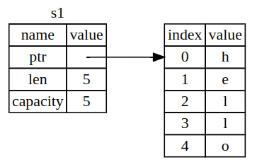

O comprimento é o quanto de memória, em bytes, o conteúdo da `String` está atualmente usando, a capacidade é a quantidade total de memória, em bytes, que a `String` recebeu do alocador. A diferença de comprimento e capacidade importa, mas não neste contexto, então, por enquanto, iremos ignorar a capacidade.

Quando nós atribuímos `s1` para `s2`, o dado `String` é copiado, o que significa que nós copiamos o ponteiro, o comprimento e a capacidade que se encontram na stack. Nós não copiamos o conteúdo da heap para o qual o ponteiro se refere, em outras palavras, a representação da memória se pareceria com a imagem abaixo:

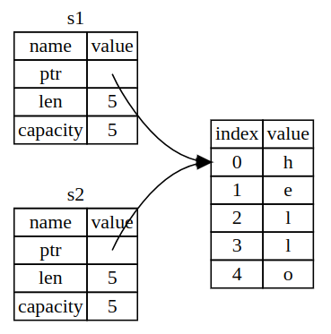

A representação abaixo abaixo, a qual mostra o que a memória se pareceria se Rust copiasse os dados da heap também. Se o Rust fizesse o mostrado abaixo, a operação `s1 = s2`, poderia ser muito cara em termos de performance em tempo de execução, se os dados na heap fossem muito grandes.


Mais cedo, nós vimos que quando uma variável sai do escopo, Rust chama automaticamente a função `drop` e limpa a memória heap para essa variável, mas e a imagem que mostra ambos os ponteiros referenciando a mesma posição? Isto é um problema: quando `s2` e `s1` saem do escopo, ambos irão tentar liberar a mesma memória, isto é conhecido como o "double free error" e é um dos bugs de segurança de memória que nós mencionamos anteriormente. Liberar memória duas vezes, pode levar a corrupção de memória, o que pode potencialmente levar a vunerabilidades de segurança.

Para garantir segurança de memória, após a linha `let s2 = s1;`, Rust considera que `s1` não é mais válida, então, Rust não precisa liberar nada quando `s1` sai do escopo. Observe o que ocorre quando você tenta usar `s1` depois de ter criado `s2`, um erro será gerado "`borrow of moved value`".

```Rust
let s1 = String::from("hello");
let s2 = s1;

println!("{}, world!", s1);
```

Se você já ouviu os termos "shallow copy" e "deep copy", enquanto trabalhava com outras linguagens de programação, o conceito de copiar o ponteiro, o comprimento e a capacidade sem compiar os dados da heap, soa como uma cópia rasa ("shallow copy"). Entretanto, por conta que Rust inválida a primeira variável (`s1`), ao invés de ser chamada de shallow copy, é conhecida como um "move". No código acima, nós dizemos que `s1` foi movida para `s2`.

Como agora, só `s2` é válida, quando ela sai do escopo, somente ela irá liberar a memória, então o problema citado anteriormente foi resolvido.

Em adição, isto implica em uma escolha de design, o Rust nunca irá criar automaticamente uma "deep copy" dos seus dados, portanto, qualquer cópia automática pode ser assumida como barata em termos de performance em tempo de execução.

**Variables and Data Interacting with Clone**

Se nós quisermos realizar uma deep copy, se nós quisermos copiar os dados na heap da `String`, não apenas os dados na stack, nós podemos usar um método comum chamado `clone`. Abaixo temos um exemplo do método `clone` em ação.

```Rust
let s1 = String::from("hello");
let s2 = s1.clone();

println!("s1 = {}, s2 = {}", s1, s2);
```

O código acima funciona exatamente como a figura em que temos ponteiros apontando para posições diferentes da heap, onde os dados da heap são copiados.

Quando você vê a invocação do `clone`, você sabe que algum código arbitrário está sendo executado e que aquele código pode ser custoso. É um indicador visual que alguma coisa diferente está acontecendo.

**Stack-Only Data: Copy**

Precisamos falar também sobre o código que usa inteiros, que funciona e é válido:

```Rust
let x = 5;
let y = x;

println!("x = {}, y = {}", x, y);
```

O código acima parece meio contraditório do que acabamos de aprender, pois não precisamos vamos a chamada ao `clone`, mas `x` ainda é válido e não foi movido para `y`.

A razão é que tipos como os inteiros, os quais possuem um tamanho conhecido em tempo de compilação, são armazenados completamente na stack, então cópias do atual valor são mais rápidas de fazer, o que significa que não há razão para nós fazermos com que `x` deixe de ser válido após criar a variável `y`. Em outras palavras, não há diferença entre a deep copy e a shallow copy, então fazer a chamada ao `clone` não faria nada de diferente do que a shallow copy já faz.

Rust possui uma anotação especial chamada `Copy`, que é uma trait que nós podemos colocar em tipos que são armazenados na stack, como inteiros são (conversaremos mais sobre traits no capitulo 10). Se um tipo implementa a trait `Copy`, variáveis que a utilizam, não são movidas, mas sim completamente copiadas, fazendo com que elas continuem válidas mesmo depois de serem atribuídas a outra variável.

Rust permite que um tipo tenha implementando, ou a trait `Copy`, ou a trait `Drop`. Se o tipo necessita que algo especial ocorra quando o valor sai do escopo e nós adicionamos a trait `Copy` para este tipo, um erro de compilação ocorrerá. Para saber como adicionar a trait Copy para o seu tipo, para implementar esta característica, consulte "Derivable Traits" no apêndice C.

Você pode checar a documentação do tipo para verificar se ele implementa a trait `Copy` ou não, mas a regra geral é que qualquer grupo de valores escalares simples podem implementar `Copy`, e nada que exija alocação ou seja alguma forma de recurso pode implemtar esta trait. Abaixo, está listado algums tipos que implementam `Copy`:

- Todo os inteiros, como o `u32`
- O tipo booleano, `bool`, com valores `true` e `false`
- Todos os tipos de ponto-flutuante, como o `f64`
- O tipo caracter, `char`
- Tuplas, mas só se os tipos contidos nela, também implementarem `Copy`. Por exemplo, `(i32, i32)` implementa `Copy`, mas `(i32, String)` não implementa

**Ownership and Functions**

As mecânicas de passar um valor para uma função são similares a aquelas de vincular um valor a uma variável, passar a variável para uma função, ou irá move-la, ou irá criar uma cópia, assim como a atribuição faz.

```Rust
// main.rs
fn main() {
    let s = String::from("hello"); // s entra no escopo.

    takes_ownership(s);            // O valor de s é movida para a função...
                                   // ... então ele não é mais válido aqui.

    let x = 5;                     // x entra no escopo.

    makes_copy(x);                 // x seria movido para a função
                                   // mas i32 implementa a trait `Copy`, então você ainda pode usar x depois da linha anterior.
} // Aqui, x sai do escopo, s também. Mas por conta do fato que s foi movida, nada de especial acontece.

fn takes_ownership(some_string: String) { // some_string entra no escopo.
    println!("{}", some_string);
} // Aqui, some_string sai do escopo e `drop` é chamada. A memória é liberada.

fn makes_copy(some_integer: i32) { // some_integer entra no escopo.
    println!("{}", some_integer);
} // Aqui, some_integer sai do escopo. Nada de especial acontece.
```

Se nós tentassemos usar `s` após a invocação de `takes_ownership`, Rust lançaria um erro em tempo de compilação, estas checagens estáticas nós protegem.

**Return Values and Scope**

Retorno de valores também podem transferir a ownership.

```Rust
// main.rs
fn main() {
    let s1 = gives_ownership();        // gives_ownership move o seu retorno.
    let s2 = String::from("hello");    // s2 entra no escopo
    let s3 = takes_and_gives_back(s2); // s2 é movido para takes_and_gives_back, o qual move o seu valor de retorno para s3.
}                                      // Aqui, s3 sai do escopo e é dropado. s2 foi movido, então nada acontece. s1 sai de escopo e é dropado.

fn gives_ownership() -> String {
    let some_string = String::from("yours"); // gives_ownership irá mover seu valor de retorno para quem o chama.

    some_string                              // some_string é retornada e é movida para a função que invocou a sua.
}

// Está função pega uma String e retorna uma.
fn takes_and_gives_back(a_string: String) -> String { // a_string entra no escopo.
    a_string                                          // a_string é retornada e é movida para a função que invocou a sua.
}
```

A ownership de uma variável segue o mesmo padrão toda vez, atribuir o seu valor para outra variável, move a ownership. Quando uma variável que possui dados na heap sai de escopo, o valor será limpo pela `drop`, a não ser que a dado tenha sido movido para outra variável.

Enquanto isso funciona, ficar pegando a ownership e depois retornando-a a cada função é um pouco cansativo. E se nós quisermos permitir que uma função use o valor mas não possua a sua ownership? É um pouco importuno que qualquer coisa que nós passemos, também precisa ser devolvida, caso nós quisermos utilizar novamente, em adição a qualquer dado resultante do corpo da função que nós podemos querer retornar também.

Rust nós permite retornar múltiplos valores utilizando uma tupla.

```Rust
fn main() {
    let s1 = String::from("hello");
    let (s2, len) = calculate_length(s1);

    println!("The length of '{}' is {}." s2, len);
}

fn calculate_length(s: String) -> (String, usize) {
    let length = s.len(); // len() retorna o comprimento de uma String.

    (s, length)
}
```

Mas isto é muita cerimônia e muito trabalho para um conceito que deveria ser comum, tanto que Rust tem um recurso para passar um valor sem transferir a sua ownership, chamado "referência".

### <a id="pontos-adicionais-ownership"></a>Pontos Adicionais

Alguns pontos interessantes que se encontram na versão do livro que possui quiz:

Segurança é a ausência do comportamento indefinido.

Um dos objetivos de fundação do Rust é garantir que os seus programas nunca se comportem de forma indefinida.

Outro objetivo é previnir o comportamento citado acima em tempo de compilação ao invés de previni-lo em tempo de execução. As motivações deste objetivo são:

- Capturar bugs em tempo de compilação significa evitar esses bugs em produção, aumentando o quão confiável o seu software é
- Capturar bugs em tempo de compilação significa menos checkagens em tempo de execução, aumentando a performance do seu software

Um fator curioso é que permitir comportamentos inesperados pode resultar em corrupção de memória, que compõe 70% das vulnerabilidades de segurança em sistemas de baixo nível.

Agora sobre memória, memória é o espaço onde o dado é armazenado durante a execução do programa. Vamos analisar as linhas de racíocinio abaixo, sobre memória:

- Se você não é familiar com programação de sistemas, você pode pensar em memória em um alto nível como "memória é a RAM no meu computador" ou "memória é o que se esgota se nós carregarmos muitos dados"
- Se você é familiar com programação de sistemas, você pode pensar em memória em um baixo nível como "memória é um array de bytes" ou "memória é o ponteiro que eu adquiro através do `malloc`"

Ambos os modelos de memória são válidos, mas não definem bem como Rust funciona. O modelo de alto nível é muito abstrato, pois você precisa entender o conceito de ponteiro para entender Rust, por exemplo. O modelo de baixo nível nível é muito concreto, Rust não permite que você interprete a memória como um array de bytes, por exemplo.

Rust provê uma maneira bem particular de como interpretar a memória. Ownership é uma disciplina para usar memória de maneira segura com uma maneira particular de analisa-la.

**Variables Live in the Stack**

O programa abaixo define um número `n` e chama a função `plus_one()` com `n`. O diagrama abaixo do programa tenta ilustrar o conteúdo da memória durante a execução do programa em três pontos específicos.

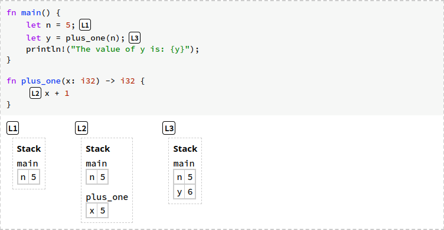

Variáveis vivem em **frames**. Um frame (quadro) é um mapeamento das variáveis para valores dentro de um único escopo, como uma função:

- O frame para `main` na localização L1 contém `n` = `5`
- O frame para `plus_one` em L2 contém `x` = `5`
- O frame para `main` em L3 contém `n` = `5` e `y` = `6`

Frames são organizados na **stack** das funções atualmente chamadas, por exemplo, em L2 o frame para `main` está acima do frame da função `plus_one`. Após o retorno, Rust desaloca o frame da função (desalocar também é referido como **liberar** ou **dropar**). A sequência de frames é chamada stack porque o frame mais recente é sempre o próximo a ser liberado.

Observe que este modelo de memória não descreve completamente como o Rust trabalha, o compilador do Rust pode por `n` ou `x` em um registro ao invés de coloca-los em um frame na stack. Mas a distinção é um detalhe de implementação, ela não deve mudar como você entende segurança em Rust, para que assim, nós possamos focar somente no caso das variáveis em frame.

Quando uma expressão lê uma variável, o valor da variável é copiado de seu slot em seu frame na stack, por exemplo, se nós executarmos o código abaixo

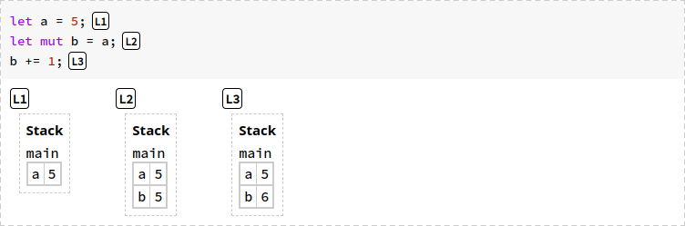

o valor de `a` é copiado para `b`, `a` não é modificada, mesmo após a alteração no valor de `b`.

**Boxes Live in the Heap**

Entretanto, copiar dados pode ocupar muita memória, por exemplo, o programa abaixo cópia um array com um milhão de elementos.

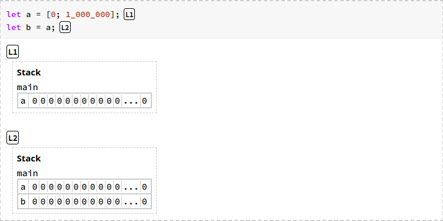

Observe que copiar o valor de `a` para `b` faria com que o frame da `main` contivesse dois milhões de elementos

Para tranferir o acesso ao dado sem copia-lo, Rust usa ponteiros, ponteiro é um valor que descreve uma localização na memória. O valor para onde o ponteiro aponta é chamado de ponta ("pointee", ou posição de memória). Uma forma comum de criar um ponteiro é alocar memória na **heap**, a heap é uma região separada da memória onde dados podem viver indefinidamente, os dados na heap não são amarrados a um frame específico na stack. Rust provê um construtor chamado `Box` para colocar dados na heap, por exemplo, nós podemos enrolar o array de um milhão de elementos em `Box::new` da seguinte forma:

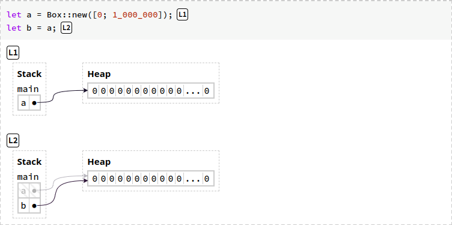

Observe que agora, só haverá um array por vez, Em L1, o valor de `a` é um ponteiro (representado pelo ponto e seta) para o array dentro da heap. A declaração `let b = a` copia o ponteiro de `a` para `b`, mas o dado que é apontado não é copiado. Note que `a` está mais cinza por conta de seu valor ter sido movido.

**Rust Does Not Permit Manual Memory Management**

Gerenciar memória é o processo de alocar e desalocar a memória, em outras palavras, é o processo de encontrar memória que não está sendo utilizada e depois retornar ela quando você não está mais a utilizando. Frames na stack são automaticamente gerenciados pelo Rust, quando uma função é chamada, Rust aloca um frame na stack para a função invocada, quando a chamada termina, Rust desaloca o frame na stack.

Como nós vimos no código acima, nós podemos alocar a memória e colocar dados nela com `Box::new(...)`, mas quando os dados na heap são desalocados? Imagine que o Rust tivesse uma função `free()` que desalocasse dados da heap, imagine que o Rust permitisse o programador a chamar a `free()`, este tipo de gerenciamento de memória pode, facilmente, levar a bugs, por exemplo, nós podemos acabar por ler um ponteiro que aponta para uma memória que foi liberada:

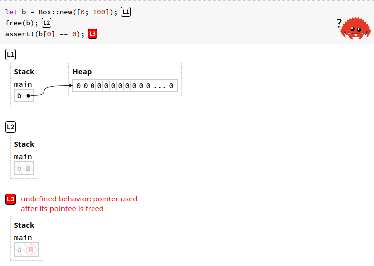

Nota: há uma forma de executar programas Rust que não compilam, através de uma [ferramenta especial](https://github.com/cognitive-engineering-lab/aquascope?tab=readme-ov-file) que simula, por exemplo, se a propriedade de checagem de empréstimo estivesse desabilitada, para propósitos educacionais. Desta forma nós podemos verificar cenários do tipo, e se "o Rust nós permitisse compilar este programa não seguro".

Nó código acima, nós alocamos um array na heap, depois nós chamamos `free(b)`, que desaloca a memória na heap de `b`. Portanto, o valor de `b` é um ponteiro para uma memória inválida, o que poderia fazer com que o programa quebrasse, ou pior ainda, ele não quebraria e retornaria dados arbitrários. Este programa não é seguro.

Rust não permite que a memória seja desalocada manualmente, este tipo de política evita os comportamentos indefinidos, como o que pode ocorrer no cenário acima.

**A Box's Owner Manages Deallocation**

O Rust automaticamente libera a memória na heap (a memória na heap da caixa, "box"). Abaixo nós temos uma descrição quase correta da polítca do Rust para liberar boxes.

Se a variável é vinculada a uma box, quando o Rust desaloca o frame da variável, ele também desaloca a memória heap da box (está descrição está quase correta). Por exemplo, abaixo temos um diagrama que aloca e libera uma box.


Em L1, antes de chamar `make_and_drop()`, o estado da memória é apenas um frame na stack para `main()`. Em L2, enquanto invocamos `make_and_drop()`, `a_box` aponta para o `5` na heap, uma vez que `make_and_drop()` termina a sua execução, Rust desaloca o seu frame na stack. `make_and_drop()` continha a variável `a_box`, então Rust também desaloca o dado na heap em `a_box`. Portanto a heap está vazia em L3.

O gerenciamento da memória heap pertencente a box foi feito com sucesso. Mas e se nós tentarmos abusar deste sistema? O que acontece quando nós vinculamos duas variáveis a uma box.

```Rust
let a = Box::new([0; 1_000_000]);
let b = a;
```

O array da box foi vinculado para `a` e `b`, no código acima, considerando a nossa definição "quase correta", Rust iria tentar liberar a memória heap da box duas vezes, por conta dela estar vinculada a duas variáveis. Isto também é um comportamento indefinido.

Para evitar esta situação, finalmente iremos falar sobre ownership. Quando `a` é vinculada a `Box::new([0; 1_000_000])`, nós dizemos que `a` é **dona** da box. A declaração `let b = a` **move** a ownership da box de `a` para `b`. Considerando estes conceitos, a política do Rust para liberação das boxes é mais precisamente descrita como:

**Se uma variável é dona de uma box, se a variável tem a ela uma box vinculada, quando o Rust desaloca o frame ao qual a variável pertence, ele desaloca também a memória heap utilizada pela box.**

No exemplo acima, `b` é dono da box que contém o array como valor, então quando o seu escopo termina, o Rust desaloca a box somente uma vez, em nome de `b` e não `a`.

**Collections Use Boxes**

Boxes são usadas por estruturas de dados Rust, como vetores, strings e hashmap, para guardar o número de elementos de uma variável. Abaixo temos um exemplo que cria, move e modifica uma string.

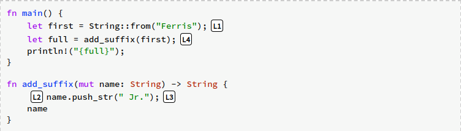

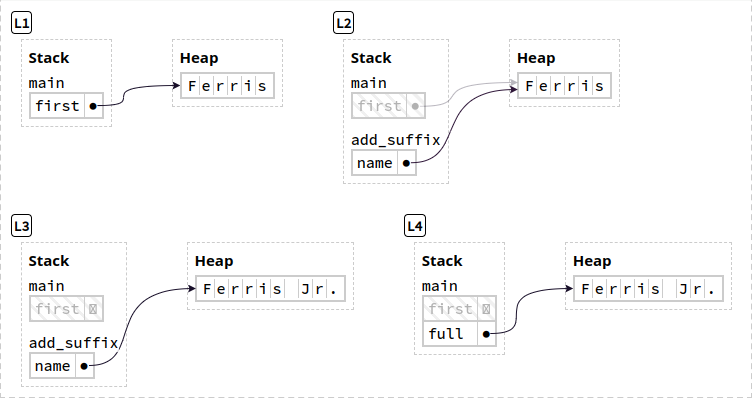

- Em L1, a string "Ferris" foi alocada na heap, seu dono é `first`
- Em L2, a função `add_suffix()` foi chamada, isto move a ownership da string de `first` para `name`. O dado da string não é copiado, mas o ponteiro para o dado é
- Em L3, a função `push_str()` altera a string na heap. Ela faz três coisas:
    + Aloca outra posição de memória, maior
    + Escreve "Ferris Jr." na nova posição alocada
    + Libera o espaço de memória original na heap
- Em L4, o frame para `add_suffix()` não existe mais e a função retornou `name`, transferindo a ownership da string para `full`

**Variables Cannot Be Used After Being Moved**

O programa acima ajuda a ilustrar o princípio chave de segurança da ownership. Vamos imaginar o seguinte cenário, `first` sendo usada na `main()` após a chamada a `add_suffix()`, abaixo temos a simulação deste cenário:

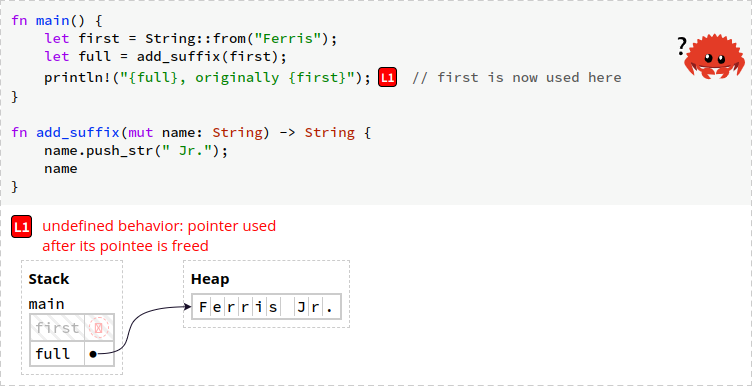

`first` aponta para uma posição de memória que foi desalocada (isto após a chamada a `add_suffix()`), então fazer a leitura de `first` em `println!` seria uma violação as regras de segurança de memória (pois poderia produzir um comportamento indefinido). Fique atento que não é um problema `first` apontar para uma posição de memória que foi desalocada, **o problema é que nós tentamos utilizar** `first` **após ele não possuir mais um valor válido**.

Se nós tentarmos compilar o código acima, o Rust irá gerar um erro (`error[E0382]: borrow of moved value: first`), falando que nós tentamos utilizar `first`, sendo que a ownership de seu valor foi movida. O erro também fala que o tipo `String` não implementa o trait `Copy` e pontua a tentativa de empréstimo ("`borrowed`").

O princípio da movimentação de um dado da heap diz que, se uma variável x move a ownership do seu dado na heap para outra variável y, você não pode mais usar x, após a movimentação.

Isso mostra a relação entre ownership, movimentação e segurança, pois mover a ownership de um dado na heap, previne comportamento indefinido que pode ser causado pela leitura de memória desalocada.

**Cloning Avoids Moves**

Uma forma de evitar a movimentação de um dado é clonar ele usando o método `clone()`, utilizando ele, nós iremos previnir o problema de segurança que ocorreu no programa anterior.

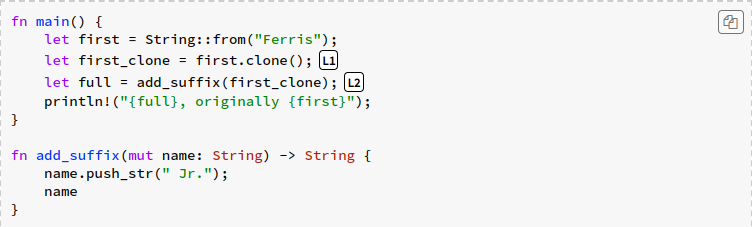

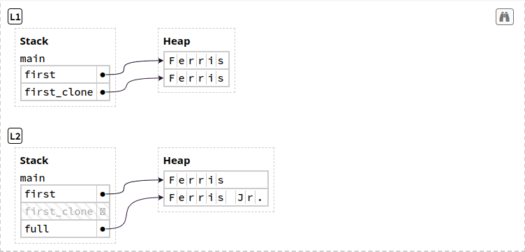

Observe que em L1, `first_clone` não é uma shallow copy, mas sim uma deep copy. Shallow copy é quando você tem uma variável na stack que tem vinculado a ela um ponteiro e ele aponta para a mesma posição de memória na heap que outro ponteiro, vinculado a outra variável. Uma Deep Copy não copia somente o ponteiro, ela também copia os dados na heap (aloca uma nova posição de memória na heap que vai conter os dados copiados).

Assim, `first_clone` que é movida e acaba invalidada por `add_suffix()`, a variável original `first` não é alterada e é seguro continuar o seu uso.

Considere o seguinte cenário: dentro de uma declaração if, você move uma variável, mas você nunca entra dentro do if. Você pode usar usar essa variável após o if?

O Rust não tenta determinar se uma declaração if vai, ou não, ser executada, ele assume que ela pode ser executada. Então você não pode usar a variável após o if.

Até então, podemos ver a ownership, primeiramente, como a disciplina do gerenciamento da heap:

- Todo dado na heap deve ter como dona uma, e somente uma, variável
- O Rust desaloca dados na heap uma vez que seu dono sai de escopo
- A ownership pode ser transferida através da movimentação, a movimentação ocorre em atribuições e chamadas de função
- Dados na heap só podem ser acessados através do seu dono atual, por um dono anterior, não

## <a id="42-references-and-borrowing"></a>4.2 References and Borrowing

```Rust
fn main() {
    let s1 = String::from("hello");
    let (s2, len) = calculate_length(s1);

    println!("The length of '{}' is {}.", s2, len);
}

fn calculate_length(s: String) -> (String, usize) {
    let length = s.len(); // len() retorna o comprimento de uma String.

    (s, length)
}

// Listing 4-5: Returning ownership of parameters
```

O problema com o código acima é que temos que retornar a `String` para a `main()` para poder usá-la após a chamada a função `calculate_length()`, porque a `String` foi movida para a função. Ao invés disto, nós podemos prover uma referência para o valor da `String`.

- Uma referência é como um ponteiro, ela é um endereço que nós podemos seguir para acessar os dados armazenados neste endereço
- Os dados pertencem a outra variável
- Diferentemente de um ponteiro, uma referência garante apontar para um valor válido de um tipo específico pelo resto de sua vida

Vamos refazer o código Listing 4-5 usando uma referência para um objeto como parâmetro ao invés de mover a ownership daquele valor.

```Rust
fn main() {
    let s1 = String::from("hello");
    let len = calculate_length(&s1);

    println!("The length of '{}' is {}.", s1, len);
}

fn calculate_length(s: &String) -> usize {
    s.len()
}
```

Primeiramente, observe que o código na declaração da variável e no retorno da função não é mais o mesmo. Em segundo lugar, observe que agora o argumento passado para `calculate_length()` é `&s1`, e o tipo do seu parâmetro é `&String` e não mais `String`. Os e-comerciais representam referências, e elas permitem que você se refira a um valor sem tomar a ownership da variável que é dona dele.

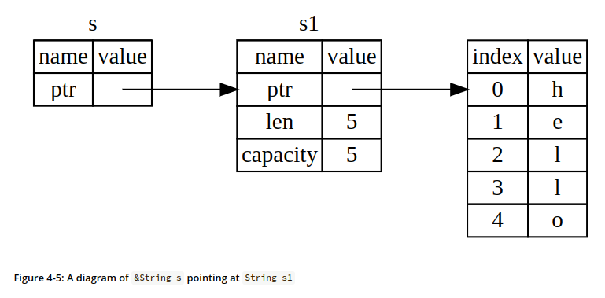

Mais a frente iremos falar sobre o oposto de referenciar, que seria desreferenciar.

A sintaxe `&s1` nos permite criar uma referência que se refere ao valor de `s1`, mas não é dona dele. Por conta do fato que ela não é dona dele, o valor para o qual ela aponta não vai ser dropado quando a referência para de ser usada.

A assinatura da função também irá usar o `&` para indicar que o tipo do parâmetro é uma referência.

```Rust
fn calculate_length(s: &String) -> usize { // s é uma referência para uma String.
    s.len()
} // Aqui, s sai do escopo, mas como ela não possui a ownership do valor na heap que ela se refere, ele não é dropado.
```

O escopo no qual a variável `s` é válida ainda é o mesmo que qualquer parâmetro de qualquer função, mas o valor apontado pela referência não é dropado quando `s` para de ser usado, porque `s` não possui a ownership do valor. Quando funções possuem referências como parâmetros ao invés de valores reais, nós não precisamos retornar os valores em ordem de devolver a ownership, porque nós nunca a possuímos.

Nós chamamos o até de criar uma referência de borrowing ("empréstimo"). Como na vida real, se uma pessoa possui algo, você pode pegar isso emprestado e quando você terminar de usar, você o devolve. Você não é dono do que pega emprestado.

Se nós tentarmos modificar algo que nós estamos pegando emprestado, um erro será gerado. Observe o código abaixo:

```Rust
fn main() {
    let s = String::from("hello");

    change(&s);
}

fn change(some_string: &String) {
    some_string.push_str(", world");
}
```

O seguinte erro será gerado `error[E0596]: cannot borrow *some_string as mutable, as it is behind a & reference`. Assim como variáveis são imutáveis por padrão, as referências também são. Nós não temos a permissão de modificar algo para o qual nós nos referimos.

### <a id="mutable-references"></a>Mutable References

Para corrigir o código acima, você pode permitir que o valor emprestado seja modificado utilizando ao invés de uma referência, uma referência mutável.

```Rust
fn main() {
    let mut s = String::from("hello");

    change(&mut s);
}

fn change(some_string: &mut String) {
    some_string.push_str(", world");
}
```

Primeiramente nós tornamos `s` mutável e então criamos uma referência mutável com `&mut s` que é passada como argumento para `change()`. A assinatura da função `change()` foi atualizada para aceitar uma referência mutável como argumento. Tudo isto torna muito claro que `change()` irá alterar o valor que é emprestado a ela.

Referências mutáveis tem uma grande restrição: se você possue uma referência mutável a um valor, você não pode possuir outras referências a aquele valor.

```Rust
    let mut s = String::from("hello");
    let r1 = &mut s;
    let r2 = &mut s;

    println!("{}, {}", r1, r2);
```

O código acima gera o seguinte erro, `error[E0499]: cannot borrow s as mutable more than once at a time`. O primeiro empréstimo mutável ocorre na declaração de `r1` e deve durar até o seu uso em `println!`, mas neste meio tempo, nós tentamos criar outra referência mutável em `r2` que tenta pegar emprestado o mesmo dado que `r1`.

A restrição previnindo múltiplas referências mutáveis para o mesmo dado, ao mesmo tempo, permite mutações, mas de uma forma bastante controlada. Isto é algo que novos Rustaceans tem dificuldade de aceitar, porque a maioria das linguagens permite mutações quando você quiser, mas a existência desta restrição possue um motivo, previnir "data race". Uma data race ocorre quando:

- Dois ou mais ponteiros acessam o mesmo dado, ao mesmo tempo
- Pelo menos um dos ponteiros está sendo usado para gravar nos dados
- Não há nenhum mecanismo sendo usado para sincronizar o acesso aos dados

Data races causam undefined behavior e pode ser difícil encontra-las e corrigi-las em tempo de execução, Rust as previne se recusando a compilar códigos com data races.

Lembre-se que nós podemos usar chaves para criar novos escopos, permitindo assim, múltiplas referências mutáveis, considerando que elas não são simultâneas.

```Rust
    let mut s = String::from("hello");

    {
        let r1 = &mut s;
    } // `r1` sai do escopo aqui, sendo assim, podemos criar novas referências sem problemas.

    let r2 = &mut s;
```

Lembrando que o Rust também não permite uma combinação de referências mutáveis e imutáveis:

```Rust
    let mut s = String::from("hello");
    let r1 = &s; // "no problem"
    let r2 = &s; // "no problem"
    let r3 = &mut s; // "BIG PROBLEM"

    println!("{}, {}, and {}", r1, r2, r3);
```

O código acima irá gerar o seguinte erro `error[E0502]: cannot borrow s as mutable because it is also borrowed as imutable`.

Usuários de uma referência imutável não esperam que o valor mude subtamente, entretanto, múltiplas referências imutáveis são permitidas, porque ninguém que está lendo o dado tem a habilidade de alterá-lo e afetar os outros que também estão o lendo.

Observe que o escopo de uma referência começa onde ela é introduzida e continua até o último momento no qual ela é usada. Isso é ilustrado pelo código abaixo, onde o último uso das referências imutáveis é em `println!`:

```Rust
    let mut s = String::from("hello");
    let r1 = &s; // "no problem"
    let r2 = &s; // "no problem"

    println!("{} and {}", r1, r2);
    // "variables r1 and r2 will note be used after this point"

    let r3 = &mut s; // "no problem"

    println!("{}", r3);
```

O escopo das referências imutáveis `r1` e `r2` termina após o `println!`, onde elas são usadas pela última vez, que é antes da criação da referência mutável `r3`. Os escopos não se sobrepõem, então está tudo certo com o código, o compilador consegue dizer que a referência não está mais sendo usada em um ponto antes do final do escopo.

Lembre-se que é muito melhor você obter um erro em tempo de compilação do que obter um dado que não é o que você espera em tempo de execução, o que poderia ser causado por empréstimos realizados de forma incorreta.

### <a id="dangling-references"></a>Dangling References

Em linguagens que utilizam ponteiros é fácil criar um dangling pointer que é um ponteiro que se refere a um endereço de memória que pode ter sido dado a outra pessoa, isso pode ocorrer ao desalocar o espaço de memória enquanto você preserva o ponteiro para ela. O compilador de Rust não permite que isso aconteça, ele garante que um dado não vai sair de escopo antes que a referência para este dado saia.

```Rust
fn main() {
    let reference_to_nothing = dangle();
}

fn dangle() -> &String {
    let s = String::from("hello");

    &s
}
```

O código acima, que tenta de forma proposital criar uma dangling reference, gera o seguinte erro `error[E0106] missing lifetime specifier`. O erro fala de um conceito que veremos mais a frente, **lifetime**s, mas o que é importante para nós no momento é mensagem de auxílio `this function's return type contains a borrowed value, but there is no value for it to be borrowed from` que descreve uma dangling reference.

```Rust
fn dangle() -> &String {           // `dangle()` retorna uma referência para uma String.
    let s = String::from("hello"); // `s` é uma nova String.

    &s                             // Uma referência para a String `s` é retornada.
}                                  // Aqui `s` sai do escopo e é dropado. A memória na hash é liberada.
                                   // "Danger!"
```

`s` é criada dentro de `dangle()`, quando `dangle()` encerrá a sua execução, `s` será desalocada, mas o código acima tenta passar uma referência para ele. A referência para ela seria um ponteiro para uma String inválida, o Rust não permite isto.

Caso nós retornássemos a String diretamente, o código funcionaria, porque a ownership seria movida e o dado na hash não seria desalocado.

### <a id="rules-of-references"></a>The Rules of References

Recapitulando:

- Em um dado momento, você pode ter uma referência mutável ou qualquer número de referências imutáveis
- Referências devem sempre ser válidas

### <a id="pontos-adicionais-references"></a>Pontos Adicionais

**References and Borrowing**

Ownership, boxes e moves proveem uma fundação para programar de forma segura com a heap. Entretanto, APIs que só utilizam de movimentação podem ser inconvenientes de usar. Observe o exemplo abaixo, onde nós tentamos ler strings duas vezes:

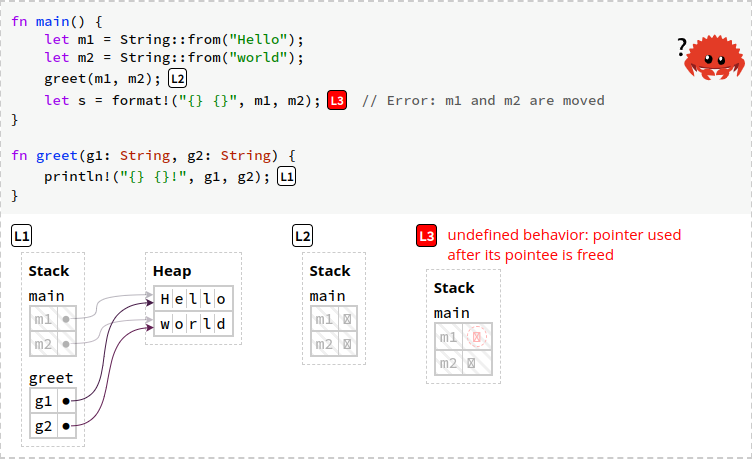

No exemplo acima, chamar `greet()` move os dados de `m1` e `m2` para os parâmetros de `greet()`, ambas strings são dropadas após o final da execução da função, então não podem ser usadas na `main()`. Se nós tentarmos ler as variáveis na operação `format!`, isso iria gerar um undefined behavior, o compilador iria rejeitar o programa e acusar o error `error[E0382] borrow of moved value : m1`.

Quandos nós precisamos usar a string mais que uma vez, o comportamento relacionado a movimentação pode ser extremamente inconveniente, fazendo com que nós tenhamos que retornar a ownership da string, como mostrado no código abaixo.

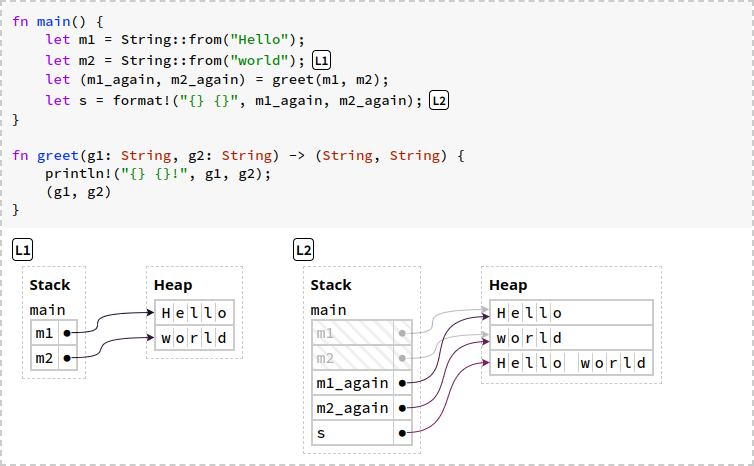

No entanto, este estilo de programa é bastante detalhado. Rust provê um estilo mais conciso de ler e escrever sem a necesidade de mover a ownership.

**References Are Non-Owning Pointers**

Uma **referência** é uma espécie de ponteiro. Abaixo, reescrevemos o programa acima de uma maneira mais conveniente.

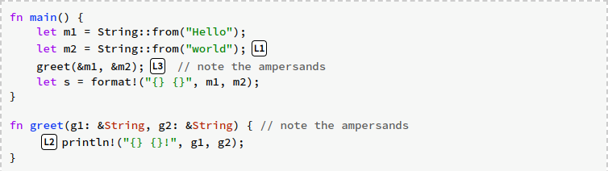

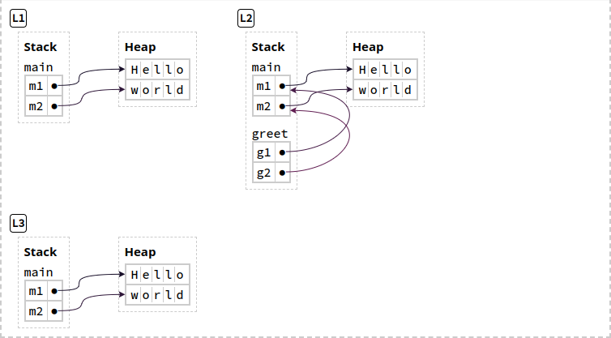

A expressão `&m1` usa o operador e-comercial para criar uma referência (um empréstimo) para `m1`. O tipo do parâmetro `g1` de `greet()` é alterado para `&String`, o que significa "referenciar uma `String`".

Observe em L2 que existem duas etapas de `g1` até a string "`Hello`". `g1` é uma referência que aponta para `m1` na stack, e `m1` é uma String que contém uma box que aponta para "`Hello`" na heap.

Enquanto `m1` é dona do dado na heap ("`Hello`"), `g1` não é dona nem de `m1`, nem de "`Hello`". Então, quando `greet()` é encerrada e o programa alcança a etapa L3, nenhum dado na heap foi desalocado. Somente o frame do stack para `greet()` desaparece. Este fato é consistente com o nosso princípio de desalocação da Box, porque `g1` não é dona de "`Hello`", então Rust não desaloca "`Hello`" em nome de `g1`.

**Referências são ponteiros não proprietários**, pois eles não são donos dos dados para o qual apontam.

**Dereferencing a Pointer Accesses Its Data**

Os exemplos anteriores que usam boxes e strings não mostram como o Rust "segue" os ponteiros para os seus dados. Por exemplo, o macro `println!` tem funcionado misteriosamente, tanto para o tipo de string no qual você move a ownership, quanto para o tipo de string no qual você usa referências. O mecanismo por debaixo dos panos é o operador de desreferência, escrito com um asterisco (*). Por exemplo, abaixo temos um programa que usa a desreferência de diferentes maneiras.

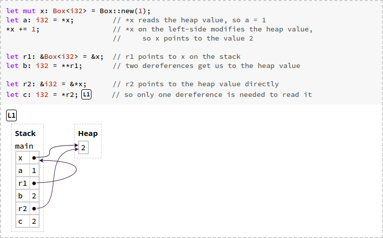

Observe a diferença entre `r1` apontar para `x` na stack e `r2` apontar para o valor `2` na heap.

Você provavelmente não vai ver o operador de desreferência com frequência quando você ler códigos feitos em Rust. Rust insere de forma implícita desreferência e referências em certos casos, como no caso da chamada ao método com o operador ponto. Por exemplo, o programa abaixo mostra dois modos equivalentes de chamar as funções `i32::abs` (valor absoluto) e `str::len` (comprimento da string).

```Rust
let x: Box<i32> = Box::new(-1);
let x_abs1 = i32::abs(*x); // Desreferência explícita.
let x_abs2 = x.abs();      // Desreferência implícita.
assert_eq!(x_abs1, x_abs2);

let r: &Box<i32> = &x;
let r_abs1 = i32::abs(**r); // Desreferência explícita (duas vezes).
let r_abs2 = r.abs();       // Desreferência implícita (duas vezes).
assert_eq!(r_abs1, r_abs2);

let s = String::from("Hello");
let s_len1 = str::len(&s); // Referência explícita.
let s_len2 = s.len();      // Referência implícita.
assert_eq!(s_len1, s_len2);
```

O exemplo mostra conversões implícitas de três maneiras:

1. A função `i32::abs()` espera a entrada de um tipo `i32`. Para fazer a chamada de `abs()` com uma `Box<i32>` você pode desreferenciar de forma explícita a box, como em `i32::abs(*x)`. Você também pode desreferenciar de forma implícita a box usando a sintaxe de chamada de método, como em `x.abs()`. A sintaxe de ponto é utilizada na sintaxe de chamada da função
2. A conversão implícita funciona para múltiplas camadas de ponteiros, por exemplo, chamando `abs()` para uma referência para a box `r: &Box<i32>` irá inserir duas desreferências
3. Esta conversão também funciona na direção oposta. A função `str::len()` espera uma referência `&str`, se você chamar `len()` em uma `String` que move a ownership, Rust irá inserir o operador de empréstimo (na verdade, há uma conversão adicional de `String` para `str!`)

Veremos mais sobre chamadas de métodos e conversões implícitas mais tarde. O importante agora é entender que as conversões estão acontecendo com chamadas de métodos e alguns macros, como `println!`.

**Exemplo Interessante**

Considerando o seguinte programa, que está mostrando o estado da memória após a última linha

# <a id="21-appendix"></a>21. Appendix

## <a id="211-a-keywords"></a>21.1 A - Keywords

Tópico que lista as palavras-chave, com poucas explicações, mas muito útil.

# <a id="executando-codigo-rust"></a>Executando Código em Rust

- Instale o Rust
- Tenha um Ponto de Entrada
- Compile o arquivo
- Execute o executável gerado pela compilação

# <a id="boas-praticas"></a>Boas Práticas

- Para nome de arquivos, se você for utilizar mais de uma palavra, as separe por um underscore
- A abertura de chaves deve estar na minha linha da declaração da função e estar separada dela por um espaço em branco
- Rust utiliza quatro espaços ao invés do TAB
- Nomes de variáveis constantes devem estar completamente em maiúsculo