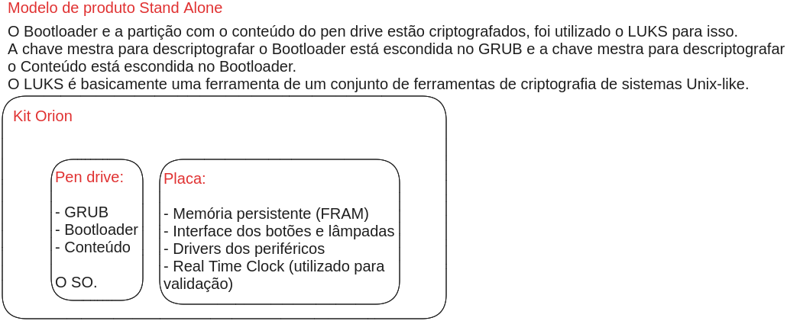

#  Sistema Operacional

Um sistema operacional (SO) é um software fundamental que atua como uma interface entre o hardware do computador e os programas da aplicação. Ele desempenha diversar funções essenciais para o funcionamento do sistema computacional como um todo. Aqui estão algumas das principais finalidades de um sistema operacional:

1. **Gerenciamento de recursos:**
    - **CPU (Unidade Central de Processamento):** o sistema operacional gerencia o uso da CPU, decidindo quais processos e tarefas têm acesso à CPU e por quanto tempo
    - **Memória:** alocação e desalocação de memória para os processos, garantido que cada programa tenha a quantidade necessária de memória para sua execução
    - **Dispositivos de entrada/saída:** controle e comunicação com periféricos como teclado, mouse, impressora, etc
2. **Abstração de hardware:** fornece uma camada de abstração entre o hardware do computador e os aplicativos. Isso permite que os desenvolvedores de software escrevam programas sem precisar se preocupar com detalhes específicos do hardware
3. **Gerenciamento de processos:**
    - Inicia, interrompe, retorna e encerra processos (programas em execução)
    - Gerencia a execução concorrente de vários processos
4. **Sistema de arquivos:**  fornece uma estrutura para armazenar, organizar e recuperar dados em dispositivos de armazenamento, como discos rígidos e unidades flash
5. **Interface com o usuário:** oferece uma interface para interação entre o usuário e o sistema. Pode ser uma interface gráfica de usuário (GUI) ou uma interface de linha de comando (CLI)
6. **Segurança:**
    - Controla o acesso a recursos do sistema, protegendo dados e previnindo acessos não autorizados
    - Implementa políticas de segurança, como autenticação e autorização
7. **Comunicação entre processos:** permite a comunicação e a troca de dados entre processos em execução no sistema
8. **Gerenciamento de redes:** facilita a comunicação entre computadores em uma rede, permitindo a troca de dados e o acesso a recursos compartilhados
9. **:Atualizações e manutenção** facilita a instalação de atualizações de software e realiza a manutenção do sistema operacional
10. **Gerenciamento de energia:** em dispositivos móveis e laptops, o sistema operacional gerencia o consumo de energia para otimizar a vida útil da bateria

Em resumo, um sistema operacional é uma camada essencial de software que permite que os aplicativos sejam executados em um computador, fornecendo abstração de hardware, gerenciamento de recursos, segurança e outras funcionalidades críticas para o funcionamento eficiente de um sistema computacional.

# Kernel

O kernel é uma parte central e essencial de uma sistema operacional (SO). Ele é responsável por gerenciar recursos de hardware e fornecer serviços básicos para os aplicativos e outros compenentes do SO. Aqui estão algumas das principais funções e finalidades do kernel:

1. **Gerenciamento de memória:**
    - Alocação e desalocação de espaço de memória para processos e programas em execução
    - Proteção da memória para evitar que processos acessem áreas de memória de outros processos
2. **Gerenciamento de processos:**
    - Inicia, interrompe, retoma e encerra processos
    - Coordena a execução concorrente de vários processos
    - Fornece mecanismos de comunicação entre processos
3. **Gerenciamento de dispositivos de entrada/saída (E/S):**
    - Controla a comunicação entre o SO e os dispositivos de E/S, como teclado, mouse, disco rígido, impressora, etc
    - Fornece interfaces para drivers de dispositivos para facilitar a comunicação com o hardware
4. **Comunicação com o hardware:**
    - Fornece uma camada de abstração para o hardware subjacente, permitindo que os software interaja com o hardware de maneira consistente, independente das diferenças de hardware específicas
    - Gerencia interrupções e eventos do hardware
5. **Sistema de arquivos:**
    - Gerencia o acesso e a manipulação de arquivos no sistema de arquivos
    - Implementa políticas de permissões e segurança no acesso aos arquivos
6. **Gerenciamento de recursos do sistema:**
    - Monitora e gerencia o uso de recursos do sistema, como CPU, memória e dispositivos de armazenamento
    - Garante que os recursos sejam alocados de maneira eficiente entre os processos em execução
7. **Políticas de segurança:** implementa controles de segurança, como controle de acesso e proteção da memória, para garantir que o SO e os processos sejam executados de maneira segura
8. **Temporização e gerenciamento de eventos:** fornece serviços de temporização e gerencia eventos temporizados no sistema
9. **Inicialização do sistema:**
    - Inicializa o sistema operacional durante o processo de inicialização (boot)
    - Carrega módulos e drivers necessários para a operação do sistema
10. **Gestão de energia:** em sistemas que suportam gestão de energia, o kernel pode desempenhar um papel na administração do consumo de energia para otimizar o uso de recursos e a vida útil da bateria

O kernel é uma camada de software crítica que atua como uma ponte entre o hardware do computador e os aplicativos em execução no sistema operacional. Ele é responsável por garantir o correto funcionamento e a eficiência do sistema operacional como um todo. Cada tipo de sistema operacional (Linux, Windows, MacOS, etc.) possui seu próprio kernel específico, adaptado para suas características e requisitos particulares.

# SO x Kernel

Como podemos ver, as listas de características são muito similares, a diferença entre as definições do sistema operacional e do Kernel reside nas camadas e nas responsabilidades específicas que cada um abrange no contexto de um sistema computacional.

- **Sistema operacional (SO):**
    + O SO é um software mais abrangente que inclui não apenas o kernel, mas também uma variedade de utilitários, bibliotecas, interfaces de usuário, gerenciadores de janelas, sistemas de arquivos, comandos de linha, ferramentas de rede, e muito mais
    + O SO oeferece uma interface completa para os usuários interagirem com o computador e para os aplicativos serem executados. Isso inclui uma interface gráfica de usuário (GUI) ou a interface de linha de comando (CLI)
    + O SO abrange tanto o espaço do kernel quanto o espaço do usuário, onde os aplicativos são executados
    + Ele fornece uma série de serviços e funcionalidades além daquelas diretamente gerenciadas pelo kernel, como a instalação e execução de aplicativos, controle de configurações, atualizações de software, etc.
- **Kernel:**
    + O kernel é uma parte central e fundamental do sistema operacional
    + Ele gerencia recursos de hardware, fornece serviços básicos e implementa políticas essenciais para o funcionamento do sistema
    + O kernel opera em um nível mais baixo, diretamente com o hardware, e é responsável pelo gerenciamento direto de processos, memória, dispositivos de E/S e comunicação entre hardware e o software
    + É uma camada de software que atua como uma interface entre o hardware e os aplicativos, proporcionando uma abstração eficiente dos recursos de hardware

Em resumo, o SO é uma entidade mais ampla que inclui não apenas o kernel, mas também outros componentes essenciais que fornecem uma experiência completa de computação. O kernel, por outro lado, é uma parte central do sistema operacional que lida diretamente com o gerenciamento de recursos de hardware e fornece uma base para o restante do SO. SO é a soma total de todos os componentes, enquanto o kernel é a parte central que lida com o núcleo das operações do sistema.

# Unix-like

O termo "Unix-like" refere-se a sistemas operacionais (SOs) que compartilham características ou conceitos fundamentais com o SO Unix original. O Unix é um SO desenvolvido na década de 1970 no Bell Labs da AT&T e se tornou uma referência em SOs multiusuários e multitarefa, conhecido por sua eficiência, flexibilidade e robustez.

Os SOs "Unix-like" não são clones diretos do Unix, mas seguem os princípios e a filosofia de design do Unix. Eles incorporam características semelhantes, como:

1. **Modelo de permissões:** uso de permissões para controlar o acesso a arquivos e recursos
2. **Shell e interface de linha de comando (CLI):** presença de um shell de linha de comando para interação com o sistema
3. **Sistema de arquivos hierárquico:** organização de arquivos em diretórios hierárquicos
4. **Modelo de processos:** suporte a processos como unidades de execução
5. **Ferramentas e utilitários padrão:** disponibilidade de utilitários padrão, como `ls`, `cp`, `mv`, `rm`, etc.
6. **Comandos padrão e sintaxe de comandos:** uso de comandos padrão e sintaxe de comandos semelhante

Exemplos de SOs Unix-like incluem:

- **Linux:** um kernel Unix-like que é frequentemente combinado com outras ferramentas e utilitários para formar distribuições de SO completas, como Ubuntu, Fedora, CentOS, entre outros
- **BSD (Berkeley Software Distribution):** um ramo do Unix desenvolvido na Universidade da Califórnia em Berkeley, que inclui variantes como FreeBSD, OpenBSD e NetBSD
- **macOS:** o SO da Apple, que é baseado no kernel Darwin (um sistema Unix-like) e compartilha muitos conceitos com o Unix

Esses SOs Unix-like são conhecidos pela sua estabilidade, segurança e flexibilidade, e são amplamente utilizados em servidores, desktops, dispositivos embarcados e em várias outras áreas.

## Serviços

Um serviço, no contexto de sistemas operacionais (SOs) Unix-like, é um programa ou aplicativo que é executado em segundo plano e fornece funcionalidades específicas para o sistema ou para os usuários. Esses serviços podem variar desde processos essenciais ao sistema até aplicativos de terceiros. Aqui estão algumas características e exemplos de serviços:

1. **Execução em segundo plano:** um serviço é geralmente executado em segundo plano, sem uma interface de usuário interativa. Ele opera como um processo em execução, mas não requer a interação direta de um usuário
2. **Funcionalidade específica:** um serviço fornece uma funcionalidade específica para o sistema. Pode ser um serviço essencial para o funcionamento do SO ou um serviço de aplicativo que oferece recursos específicos
3. **Inicialização automática:** muitos serviços são configurados para iniciar automaticamente durante a inicialização do SO. Isso garante que o serviço esteja disponível assim que o sistema estiver pronto para uso
4. **Gestão por systemd:** em SOs Linux que utilizam o systemd, os serviços são frequentemente gerenciados por essa estrutura. O systemctl é a ferramenta padrão para controlar, monitorar e configurar serviços
5. **Exemplos de serviços:**
    - **Serviços do sistema:** alguns serviços essenciais para o sistema, como o serviço de gerenciamento de log ("systemd-journald"), serviço de rede ("networking"), serviço de impressão ("cups"), etc.
    - **Serviços de aplicativos:** bancos de dados, servidores web (por exemplo, "apache" ou "nginx"), servidores de banco de dados (por exemplo, "MySQL" ou "PostgreSQL"), serviços de mensagens (por exemplo, "rabbitmq"), etc.
6. **Monitoramento e controle:** os serviços podem ser monitorados para verificar seu status, logs e desempenho. O systemctl fornece ferramentas para realizar essas tarefas
7. **Dependências:** serviços podem ter dependências uns dos outros. Por exemplo, um serviço web pode depender de um serviço de banco de dados para funcionar corretamente
8. **Configuração:** os serviços geralmente têm arquivos de configuração associados que determinam o seu comportamento, como o local dos logs, portas de rede, etc.

Em resumo, um serviço em SOs Unix-like é uma entidade que fornece funcionalidades específicas para o sistema ou para os usuários, e é geralmente gerenciado por ferramentas como o systemctl em sistemas que utilizam o systemd.

## systemctl

**O systemctl é uma ferramenta de controle e gerenciamento de serviços no sistema operacional Linux. Ela é parte do sistema de inicialização systemd**, que é amplamente adotado por muitras distribuições Linux modernas. O systemctl permite aos usuários e administradores controlar os serviços do sistema, examinar seu status e configurar sua inicialização. Aqui estão algumas das principais funcionalidades do systemctl:

1. **Gerenciamento de serviços:**
    - **Iniciar um serviço:** `sudo systemctl start nome_do_serviço`
    - **Parar um serviço:** `sudo systemctl stop nome_do_serviço`
    - **Reiniciar um serviço:** `sudo systemctl restart nome_do_serviço`
2. **Status do serviço:**
    - **Verificar o status de um serviço:** `sudo systemctl status nome_do_serviço`
    - Visualizar informações detalhadas sobre o serviço e seus logs associados
3. **Habilitar e desabilitar serviços na inicialização:**
    - **Habilitar um serviço para iniciar na inicialização:** `sudo systemctl enable nome_do_serviço`
    - **Desabilitar um serviço na inicialização:** `sudo systemctl disable nome_do_serviço`
    - Isso gerencia os links simbólicos no diretório de unidades do sistema
4. **Listagem de Serviços:**
    - **Listar todos os serviços:** `sudo systemctl list-units --type=service`
    - **Listar serviços ativos:** `sudo systemctl list-units --type=service --state=active`
5. **Verificação de dependências:**\
    **Visualizar dependências de um serviço:** `sudo systemctl list-dependencies nome_do_serviço`
6. **Recarregamento de configuração:**
    - **Recarregar a configuração do systemd sem reiniciar:** `sudo sytemctl daemon-reload`
    - Isso é útil após a dmodificação de arquivos de configuração do serviço
7. **Logs de serviço:**
    - **Visualizar logs de um serviço específico:** `sudo journalctl -u nome_do_serviço`
    - **Ver logs do sistema:** `sudo journalctl`
8. **Unidades e alvos:**
    **Listar todas as unidades disponíveis (serviços, montagens, dispositivos, etc.):** `sudo systemctl list-units`

O systemctl oferece uma interface poderosa para gerenciar serviços no contexto do sistema systemd. Isso facilita a administração e o monitoramento de serviços no Linux e é amplamente utilizado em distribuições que adotaram o systemd, como o Ubuntu a partir da versão 15.04, Fedora, CentOS 7 e outras.

## Daemon

Um "daemon" (ou "demon") é um tipo de programar de computador que é executado em segundo plano, muitas vezes como um serviço, sem a necessidade de interação direta com um usuário. Daemons são comumente encontrados em sistemas operacionais Unix-like, incluindo Linux.\
Principais características de daemons:

1. **Execução em segundo plano:** daemons são projetados para serem executados em segundo plano, sem ocupar a interface de usuário. Eles geralmente são iniciados durante a inicialização do sistema e continuam em execução enquanto o sistema está ativo
2. **Independência do usuário:** daemons não estão vinculados a sessões de usuários específicos e geralmente são executados como processos separados do contexto do usuário
3. **Funções diversas:** daemons podem realizar uma variedade de funções, desde gerenciamento de serviços do sistema até execução de tarefas específicas em intervalos regulares
4. **Persistência:** eles podem ser projetados para permanecerem em execução continuamente ou para serem iniciados automaticamente quando necessário
5. **Exemplos de uso:**
    - **Serviços de sistema:** muitos daemons gerenciam serviços do sistema, como daemon de impressão ("cupsd"), o daemon de rede ("networkd"), entre outros
    - **Atualização automática:** daemons podem ser usados para verificar e aplicar atualizações de software em segundo plano
    - **Servidores web e banco de dados:** daemons frequentemente controlam servidores web (por exemplo, "httpd" ou "nginx") e servidores de banco de dados
6. **Padrão POSIX:** o termo daemon é derivado do conceito de "daimon" na mitologia grega, que era um espírito divino ou entidade intermediária. No contexto da computação, daemon é frequentemente estilizado como um acrônimo para "Disk And Execution Monitor" (Monitor de Disco e Execução) ou "Derived from the Ancient ad Mystic Order of NETwork Daemons" (Derivado da Ordem Antiga e Mística de Daemon de Rede).

Em resumo, daemons são programas que operam em segundo plano, executando tarefas específicas ou gerenciando serviços do sistema, sem a necessidade de intervenção direta do usuário.

## Daemons x Serviços

A terminologia pode variar e ser usada de maneira intercambiável em alguns contextos, então aqui vai a definição de ambos e suas características:

1. **Daemon:**
    - **Definição:** um daemon é um programa que é executado em segundo plano, muitas vezes como um serviço, sem interação direta com os usuários. Eles são processos independentes que podem realizar tarefas específicas
    - **Características:**
        + Podem ser responsáveis por uma variedade de tarefas, desde gerenciar serviços até executar operações específicas em segundo plano
        + Não estão vinculados a sessões de usuários específicas
        + Podem ser iniciados durante a inicialização do sistema e continuar em execução enquanto o sistema está ativo
2. **Serviço:**
    - **Definição:** um serviço é um componente de software que executa uma função específica ou fornece uma capacidade específica no sistema. Pode incluir daemons e outros tipos de programas
    - **Características:**
        + Pode ser um conceito mais amplo que engloba vários tipos de programas, incluindo daemons
        + Fornecem funcionalidades específicas, como gerenciamento de rede, servidor web, banco de dados, etc.
        + Muitas vezes, a execução de serviços envolve a presença de processos em segundo plano, que podem ser daemons

A confusão pode ocorrer porque daemons, sendo programas em segundo plano, muitas vezes são usados para implantar serviços. Portanto, pode-se dizer que alguns daemons gerenciam serviços, mas daemons em si não são exatamente equivalentes a serviços. Um daemon pode ser um componente de um serviço maior, e o termo serviço é muitas vezes usado como um conceito mais amplo para abranger várias funcionalidades fornecidas por diferentes programas em execução em segundo plano.

Em resumo, um serviço pode envolver a presença de daemons, mas nem todo daemon é necessariamente um serviço isolado. A distinção entre os termos pode variar dependendo do contexto específico do sistema operacional e da implementação.

## LUKS

LUKS (Linux Unified Key Setup) é um padrão de especificação para a criptografia de disco em sistemas Linux. Ele é usado para criar volumes criptografados e é amplamente empregado para proteger a privacidade e segurança de dados armazenados em discos rígidos ou partições em sistemas Linux.\
Principais características do LUKS:

1. **Criptografia de disco completo:** o LUKS é comumente usado para aplicar a criptografia de disco completo (FDE), garantindo que todos os dados no disco sejam criptografados
2. **Camada de abstração:** LUKS fornece uma camada de abstração sobre os detalhes específicos da implementação da criptografia, permitindo que diferentes implementações de criptografia sejam usadas sob a mesma interface padrão
3. **Senhas e chave:** os usuários podem proteger o acesso aos dados criptografados por meio de senhas ou outras formas de autenticação, como chaves de arquivo ou tokens
4. **Gerenciamento de chave:** LUKS inclui mecanismos para o gerenciamento de chaves criptográficas, permitindo a adição, remoção e rotação de chaves de acesso
5. **Compatibilidade e interoperabilidade:** LUKS é um padrão amplamente adotado em distribuições Linux, garantindo a interoperabilidade entre diferentes implementações de criptografia
6. **Configuração flexível:** oferece operações de configuração flexíveis, permitindo que os usuários personalizem parâmetros de segurança e algoritmos criptográficos
7. **Suporte ao kernel do Linux:** o suporte ao LUKS está integrado ao Kernel Linux, facilitando a utilização em distribuições Linux
8. **Ferramentas de gerenciamento:** existem várias ferramentas de linha de comando e interfaces gráficas que facilitam a criação, formatação e gerenciamento de volumes criptografados usando o padrão LUKS

Ao criar um volume LUKS, os dados são criptografados e protegidos por uma chave mestra. Essa chave mestra pode ser protegida por senhas ou outras formas de autenticação. Quando o sistema é iniciado, os usuários precisam fornecer a senha ou autenticação correspondente para desbloquear o volume criptografadi e permitir o acesso aos dados armazenados. Isso é particularmente útil para proteger os dados confidencias em laptops ou dispositivos de armazenamento externo.

Quando você utiliza o LUKS para configurar um dispositivo de armazenamento (como um disco rígido ou um arquivo, como no exemplo), ele criptografa todo o conteúdo desse dispositivo.\
Aqui estão os passos básicos:

1. **Inicialização:** quando você inicia o sistema, antes de poder acessar os dados do disco, você precisa fornecer uma senha (ou outra forma de autenticação, como uma chave). Essa senha é usada para desbloquear o volume criptografado
2. **Desbloqueio do volume:** após fornecer a senha correta, o LUKS desbloqueia o volume, permitindo que o sistema operacional acesse os dados armazenados nele
3. **Acesso aos dados:** depois que o volume é desbloqueado, o sistema operacional pode acessar os dados normalmente. Todas as operações de leitura e gravação no disco são transparentes para o usuário, pois o LUKS faz a descriptografia e criptografia em tempo real.

A criptografia de disco completo é uma medida de segurança valiosa, especialmente em ambientes nos quais a privacidade dos dados é crítica. Isso protege contra acessos não autorizados aos dados armazenados no disco, mesmo que o dispositivo física seja perdido ou robado.

Normalmente em ambientes reais, o volume criptografado criado pelo LUKS é aplicado a um disco rígido inteiro.

Exemplo de aplicação prática do LUKS:

##

O diretório etc é padrão para um SO Unix-like ou para um SO Linux? Sobre o que ele se trata?