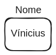

# Variáveis

Variáveis são elementos fundamentais em programação usados para armazenar e manipular dados. Elas atuam como "caixinhas" que guardam valores que podem ser alterados ao longo da execução de um programa. Variáveis possuem um nome (também chamado de identificador), que é utilizado para referenciar os dados armazenados, e um valor, que é o dado propriamente dito. Por exemplo:

# [[]]()