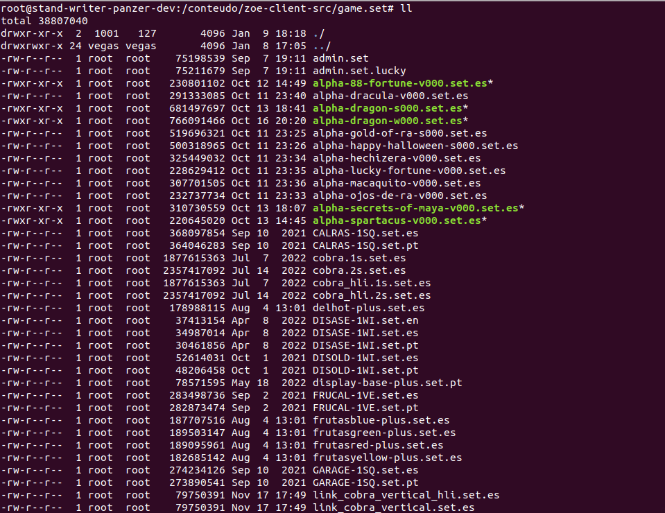

- É obrigatória a existência da chave "`scripts`" no seu **package.json**?
    + Além de pesquisar, testar isso na hora de publicar um pacote
    + A chave `scripts` não é obrigatória
- Refatorar para o novo formato o **Diretorio-heterogeneo**

- Criar um exemplo de exportação/importação com o código abaixo:

```JavaScript
const nome1 = "Maria";
export default nome1;

export const nome2 = "João";
```

- O que é a AWS?
- s3

-

```bash
$git config --global -l
fatal: unable to read config file '/home/luis/.gitconfig': Arquivo ou diretório inexistente
```

#

sudo apt install tilix

https://gnunn1.github.io/tilix-web/manual/vteconfig/

documentar sobre o updater -> o que precisa fazer para ele ser executado

sudo apt update
sudo apt install python3-pip
sudo pip3 install awscli

cargo install cross

---

for pkg in docker.io docker-doc docker-compose docker-compose-v2 podman-docker containerd runc; do sudo apt remove $pkg; done

Install using the apt repository
sudo apt install ca-certificates curl
sudo install -m 0755 -d /etc/apt/keyrings
sudo curl -fsSL https://download.docker.com/linux/ubuntu/gpg -o /etc/apt/keyrings/docker.asc
sudo chmod a+r /etc/apt/keyrings/docker.asc

Add Docker's official GPG key:
sudo apt-get update
sudo apt-get install ca-certificates curl
sudo install -m 0755 -d /etc/apt/keyrings
sudo curl -fsSL https://download.docker.com/linux/ubuntu/gpg -o /etc/apt/keyrings/docker.asc
sudo chmod a+r /etc/apt/keyrings/docker.asc
echo \
  "deb [arch=$(dpkg --print-architecture) signed-by=/etc/apt/keyrings/docker.asc] https://download.docker.com/linux/ubuntu \
  $(. /etc/os-release && echo "$VERSION_CODENAME") stable" | \
  sudo tee /etc/apt/sources.list.d/docker.list > /dev/null

sudo apt install docker-ce docker-ce-cli containerd.io docker-buildx-plugin docker-compose-plugin

sudo docker run hello-world

---

sudo apt install -y apt-transport-https ca-certificates curl software-properties-common
curl -fsSL https://download.docker.com/linux/ubuntu/gpg | sudo gpg --dearmor -o /usr/share/keyrings/docker-archive-keyring.gpg
echo "deb [arch=$(dpkg --print-architecture) signed-by=/usr/share/keyrings/docker-archive-keyring.gpg] https://download.docker.com/linux/ubuntu $(lsb_release -cs) stable" | sudo tee /etc/apt/sources.list.d/docker.list > /dev/null
sudo apt update
sudo apt install docker-ce docker-ce-cli containerd.io
sudo docker run hello-world

---




Add the repository to Apt sources:
echo \
  "deb [arch=$(dpkg --print-architecture) signed-by=/etc/apt/keyrings/docker.asc] https://download.docker.com/linux/ubuntu \
  $(. /etc/os-release && echo "$VERSION_CODENAME") stable" | \
  sudo tee /etc/apt/sources.list.d/docker.list > /dev/null
sudo apt-get update

`cargo make --makefile workflow.toml cross-release`

---

groups

sudo usermod -aG docker $USER

reiniciou o rolê

---

warning: `updater` (lib) generated 14 warnings (run `cargo fix --lib -p updater` to apply 8 suggestions)
    Finished release [optimized] target(s) in 0.10s
[cargo-make] INFO - Execute Command: "strip" "-s" "./target/x86_64-unknown-linux-musl/release/updater"
[cargo-make] INFO - Execute Command: "upx" "--best" "--lzma" "./target/x86_64-unknown-linux-musl/release/updater"
[cargo-make] ERROR - Error while executing command, error: Os {
    code: 2,
    kind: NotFound,
    message: "No such file or directory",
}
[cargo-make] WARN - Build Failed.

#
                       
npm ERR! code EISGIT                                                                                                                                                                                                                            
npm ERR! git /usr/lib/node_modules/@zoeslots/zoe-game-api: Appears to be a git repo or submodule.                                                                                                                                               
npm ERR! git     /usr/lib/node_modules/@zoeslots/zoe-game-api                                                                                                                                                                                   
npm ERR! git Refusing to remove it. Update manually,                                                                                                                                                                                            
npm ERR! git or move it out of the way first.                                                                                                                                                                                                   
                                                                                                                                                                                                                                                
npm ERR! A complete log of this run can be found in:                                                                                                                                                                                            
npm ERR!     /root/.npm/_logs/2024-03-25T19_32_12_559Z-debug.log

---

quando as API's saírem de RC, apagar o pacote

caminho "/" (diretório raiz)

deu bo com /conteudo, precisava adicionar permissão, mas só o chmod +w não rolou, precisou dar o 777

oot@2454-Homologacao-es:/usr/lib/node_modules/@zoeslots# npm install -g @zoeslots/zoe-game-api@rc                                                                                                                                              
npm WARN deprecated request@2.88.2: request has been deprecated, see https://github.com/request/request/issues/3142                                                                                                                             
npm WARN deprecated axios@0.19.2: Critical security vulnerability fixed in v0.21.1. For more information, see https://github.com/axios/axios/pull/3410                                                                                          
npm WARN deprecated sequelize@3.35.1: Please update to v6 or higher! A migration guide can be found here: https://sequelize.org/v6/manual/upgrade-to-v6.html                                                                                    
npm WARN deprecated har-validator@5.1.5: this library is no longer supported                                                                                                                                                                    
npm WARN deprecated uuid@3.4.0: Please upgrade  to version 7 or higher.  Older versions may use Math.random() in certain circumstances, which is known to be problematic.  See https://v8.dev/blog/math-random for details.                     
npm WARN deprecated terraformer-wkt-parser@1.2.1: terraformer-wkt-parser is deprecated and no longer supported. Please use @terraformer/wkt.                                                                                                    
npm WARN deprecated terraformer@1.0.12: terraformer is deprecated and no longer supported. Please use @terraformer/arcgis.                                                                                                                      
npm ERR! path /usr/lib/node_modules/@zoeslots/zoe-game-api                                                                                                                                                                                      
npm ERR! code EISGIT                                                                                                                                                                                                                            
npm ERR! git /usr/lib/node_modules/@zoeslots/zoe-game-api: Appears to be a git repo or submodule.                                                                                                                                               
npm ERR! git     /usr/lib/node_modules/@zoeslots/zoe-game-api                                                                                                                                                                                   
npm ERR! git Refusing to remove it. Update manually,                                                                                                                                                                                            
npm ERR! git or move it out of the way first.                                                                                                                                                                                                   
                                                                                                                                                                                                                                                
npm ERR! A complete log of this run can be found in:                                                                                                                                                                                            
npm ERR!     /root/.npm/_logs/2024-03-26T12_46_08_018Z-debug.log

---

FUCK MY BUT

CERTIFICADO TEM QUE SER 600 SÓ O PRIMEIRO MOTHERFUCKER PODE USAR

#

PRA FAZER A PORRA DO DUMP O BANCO PRECISA JÁ EXISTIR

sudo mysql -e "CREATE DATABASE zoeslots;"

sudo mysql zoeslots < dump

criar a porra do usuário do banco

CREATE USER 'orion'@'localhost' IDENTIFIED BY 'Bl4ckBox1337';

GRANT ALL PRIVILEGES ON zoeslots.* TO 'orion'@'localhost';

redis error agora, my butt

#

User
[2024-03-26T14:10:33.514Z] Redis error: Error: ERR AUTH <password> called without any password configured for the default user. Are you sure your configuration is correct?
ChatGPT
O erro que você está recebendo indica que você está tentando executar um comando que requer autenticação no Redis, mas você não configurou uma senha para o usuário padrão.

Se você configurou uma senha para o Redis, você precisa fornecê-la ao se conectar ou ao executar comandos que requerem autenticação.

Se você ainda não configurou uma senha ou deseja reconfigurá-la, você pode fazer isso editando o arquivo de configuração do Redis (geralmente redis.conf) e definindo a senha. Aqui está como você pode fazer isso:

Abra o arquivo de configuração do Redis em um editor de texto. Você pode usar o nano, por exemplo:
bash
Copy code
sudo nano /etc/redis/redis.conf
Localize a linha que começa com requirepass. Se não existir, você pode adicionar esta linha no arquivo de configuração:
Copy code
requirepass sua_senha
Substitua sua_senha pela senha que você deseja definir para o Redis.

Salve e feche o arquivo de configuração. No nano, você pode fazer isso pressionando Ctrl + O, Enter para salvar e Ctrl + X para sair.

Reinicie o servidor Redis para aplicar as alterações:

bash
Copy code
sudo systemctl restart redis-server
Depois de configurar a senha, você precisará fornecê-la ao se conectar ao Redis ou ao executar comandos que requerem autenticação. Por exemplo:

bash
Copy code
redis-cli -a sua_senha
Substitua sua_senha pela senha que você configurou no arquivo de configuração. Isso permitirá que você se conecte ao Redis com autenticação. Certifique-se de substituir <password> pelo valor correto da senha configurada no seu ambiente Redis.

#

git config --global pull.rebase false


commit d57f6ce9750228f75769e0efba740d74bcdb29b5 (origin/dev/lfernando)
Author: Luis <luisfernandopenhadecamargo@gmail.com>
Date:   Wed Mar 6 17:22:04 2024 -0300

    Conteúdo.

quero que meu código seja esse
ChatGPT
Se você deseja que o código do commit d57f6ce9750228f75769e0efba740d74bcdb29b5 do branch origin/dev/lfernando seja refletido no seu branch local, você pode fazer isso facilmente usando o comando git reset para mover a referência do seu branch local para esse commit específico. Aqui está como fazer:

bash
Copy code
git fetch origin                    # Busca as atualizações do repositório remoto
git reset --hard d57f6ce9750228f75769e0efba740d74bcdb29b5   # Reseta seu branch local para o commit desejado
Com este comando, o seu branch local será movido para apontar para o commit d57f6ce9750228f75769e0efba740d74bcdb29b5, que é o commit específico que você deseja ter em seu branch local.

A opção --hard do comando git reset define que o Git irá realizar um reset rígido, o que significa que o índice de trabalho e a área de trabalho serão modificados para corresponderem exatamente ao commit especificado, descartando quaisquer alterações locais não salvas. Certifique-se de não ter alterações locais importantes que você deseja manter antes de executar este comando.

Depois de executar esses comandos, seu branch local estará sincronizado com o commit desejado do branch remoto origin/dev/lfernando. Certifique-se de revisar as alterações resultantes e de que elas correspondam às suas expectativas antes de continuar. Se tudo estiver correto, você pode então fazer um novo commit local se necessário.

#

- PORQUE NÃO TÁ FICANDO SALVO JOGOS NO BANCO LOCAL

- https://pm2.keymetrics.io/docs/usage/quick-start/


Sim, ao utilizar npm install --unsafe-perms como root, o NPM tenta mitigar alguns riscos de segurança relacionados à execução de scripts de pacotes como root, e uma das maneiras de fazer isso é mudando para o usuário nobody durante a execução de scripts, como o postinstall. Isso significa que, durante a execução desses scripts, o processo terá as permissões limitadas do usuário nobody, o que pode impedir algumas ações, como a execução de comandos que necessitam de privilégios elevados.

No contexto de seu script, isso pode ser problemático porque:

Executar como nobody: O usuário nobody tem permissões muito limitadas e pode não ter permissão para executar comandos específicos necessários pelo seu script, especialmente se esses comandos exigirem privilégios elevados ou ações restritas a usuários específicos.

Fornecimento de senha: Tentar fornecer automaticamente uma senha para sudo dentro de um script executado como nobody enfrentará problemas, pois nobody geralmente não tem permissão para elevar privilégios, mesmo fornecendo a senha correta de outro usuário. Além disso, a prática de incluir senhas diretamente em scripts é altamente desaconselhada devido a preocupações de segurança.

Se você precisa que um script postinstall seja executado com privilégios elevados ou como um usuário específico diferente de nobody, você terá que considerar outras abordagens que não comprometam a segurança e estejam em conformidade com as melhores práticas. Uma dessas práticas é instruir os usuários sobre a configuração necessária pós-instalação através de documentação detalhada ou scripts de configuração que eles podem executar manualmente sob suas próprias credenciais de usuário.

zoe-updater é execuado pelo root

nobody --- me fode

#

##!/bin/bash

## Verifica se o usuário atual é root
## if [ "$(id -u)" != "0" ]; then
##     # Informa a senha do super usuário diretamente
##     echo "---------------TESTE---------------"
##     echo $(id -u)
##     echo $(whoami)
##     echo "Gibsonehl33t" | sudo -S su -c "su -l piranha -c 'pm2 start /usr/lib/node_modules/@zoeslots/zoe-terminal/ecosystem.config.js'"
##     echo "---------------TESTE---------------"
## else
##     echo "---------------TESTE2---------------"
##     pm2 start /usr/lib/node_modules/@zoeslots/zoe-terminal/ecosystem.config.js
##     echo "---------------TESTE2---------------"
## fi

su -l piranha -c 'pm2 start /usr/lib/node_modules/@zoeslots/zoe-terminal/ecosystem.config.js'

#

https://support.discord.com/hc/pt-br/articles/214925018-O-que-aconteceu-com-meu-Microfone-Diversos-Problemas-de-%C3%81udio

https://support.discord.com/hc/pt-br/articles/360045138471-Guia-de-Solu%C3%A7%C3%A3o-de-Problema-de-Voz-e-V%C3%ADdeo-no-Discord?utm_campaign=2020-06_help-voice-video&utm_content=--t%3Apm&utm_medium=blog&utm_source=discord


#

https://www.youtube.com/watch?v=CFRhGnuXG-4

#

package.json
package-lock.json
npm-shrinkwrap.json

sudo -E npm install -g @zoeslots/zoe-game-api

You
quando eu utilizo o sudo, dá erro na hora de achar o pacote
ChatGPT
ChatGPT
Se você está enfrentando um erro ao tentar instalar o pacote globalmente usando sudo, pode ser devido à forma como o sudo lida com as variáveis de ambiente, incluindo $PATH. O sudo geralmente redefine o $PATH para um valor mais seguro que não inclui diretórios potencialmente inseguros.

Para contornar esse problema, você pode usar a opção -E (ou --preserve-env) com o sudo para preservar as variáveis de ambiente, incluindo $PATH, durante a execução do comando. Isso permite que o sudo use o mesmo $PATH que o usuário normal, o que pode resolver o problema de não conseguir encontrar o pacote. Aqui está como você pode fazer isso:

bash
sudo -E npm install -g @zoeslots/zoe-game-api
O uso da opção -E pode ser útil em situações em que você precisa que o sudo use o mesmo ambiente do usuário normal, como ao instalar pacotes npm globalmente ou executar comandos que dependem de variáveis de ambiente específicas do usuário.

"mysql -u orion -pBl4ckBox1337 zoeslots --disable-column-names -B -e '{query}'"

#

Parece que há um problema com a sintaxe que você está usando. O erro indica que há um erro de sintaxe perto de 'varchar(15)'. Isso pode ocorrer porque o MariaDB pode não reconhecer o comando ALTER COLUMN diretamente.

Para alterar o tipo de uma coluna em MariaDB, você pode usar o comando MODIFY COLUMN em vez de ALTER COLUMN. Aqui está a sintaxe correta:

sql
Copy code
ALTER TABLE settings
MODIFY COLUMN homolog_version VARCHAR(15);
Com essa sintaxe corrigida, você deve conseguir alterar o tipo da coluna homolog_version para VARCHAR(15) sem problemas. Certifique-se de fazer um backup dos dados antes de fazer alterações em uma tabela existente.

#

User
como eu desinstá-lo o nvm?
ChatGPT
Para desinstalar o Node Version Manager (nvm) do seu sistema, você pode seguir os seguintes passos:

Abra um terminal.

Execute o seguinte comando para remover o diretório do nvm e quaisquer arquivos associados:

bash
Copy code
rm -rf ~/.nvm
Este comando irá excluir o diretório .nvm do seu diretório pessoal e todos os arquivos relacionados a ele.

Se você tiver adicionado as configurações do nvm ao seu arquivo de perfil (por exemplo, ~/.bashrc, ~/.bash_profile, ~/.zshrc, etc.), você também pode removê-las manualmente. Abra o arquivo de perfil com um editor de texto e remova quaisquer linhas relacionadas ao nvm.
Após seguir esses passos, o nvm estará desinstalado do seu sistema. Certifique-se de reiniciar o terminal para que as alterações entrem em vigor.

User
não há um comando que faça tudo isso?
ChatGPT
Sim, você pode desinstalar o nvm usando o script de desinstalação oficial fornecido pelo projeto nvm. Para isso, siga estes passos:

Abra um terminal.

Execute o seguinte comando para baixar o script de desinstalação:

bash
Copy code
curl -o- https://raw.githubusercontent.com/nvm-sh/nvm/v0.39.1/uninstall.sh | bash
Este comando baixará o script de desinstalação mais recente do repositório do GitHub do nvm e o executará usando o bash.

Siga as instruções no terminal para concluir a desinstalação.
Este script removerá o nvm e quaisquer versões do Node.js instaladas por meio dele, bem como quaisquer arquivos de configuração associados. Certifique-se de reiniciar o terminal após a desinstalação para garantir que todas as alterações entrem em vigor.

o script não funcionou

#

forever

---

vegas@stand-writer-panzer-suporte:~$ npm list -g --depth=0
/usr/lib
├── @zoeslots/updater@1.7.2
├── @zoeslots/zoe-terminal@2.0.0
├── forever@1.0.1
├── node-gyp@9.3.1
└── npm@4.6.1

vegas@stand-writer-panzer-suporte:~$ 

nvm install 7.3.0

nvm use system (versão que veio com o sistema)

npm list -g --depth=0 | sed '1d' | awk '{print $2}' > packages.txt

nvm use 7.3.0

root@stand-writer-panzer-suporte:/home/vegas# sudo xargs npm install -g < packages.txt
sudo: unable to resolve host stand-writer-panzer-suporte
npm WARN deprecated uws@8.14.1: New code is available at github.com/uNetworking/uWebSockets.js
npm WARN deprecated chokidar@1.7.0: Chokidar 2 will break on node v14+. Upgrade to chokidar 3 with 15x less dependencies.
npm WARN deprecated resolve-url@0.2.1: https://github.com/lydell/resolve-url#deprecated
npm WARN deprecated urix@0.1.0: Please see https://github.com/lydell/urix#deprecated
/usr/bin/updater -> /usr/lib/node_modules/@zoeslots/updater/target/x86_64-unknown-linux-musl/release/updater
/usr/bin/zoe-terminal-server -> /usr/lib/node_modules/@zoeslots/zoe-terminal/server.js
/usr/bin/zoe-terminal-client -> /usr/lib/node_modules/@zoeslots/zoe-terminal/client.js
/usr/bin/forever -> /usr/lib/node_modules/forever/bin/forever
/usr/bin/node-gyp -> /usr/lib/node_modules/node-gyp/bin/node-gyp.js
/usr/bin/npm -> /usr/lib/node_modules/npm/bin/npm-cli.js
- cookie@0.6.0 node_modules/@zoeslots/zoe-terminal/node_modules/express-session/node_modules/cookie
/usr/lib
├── @zoeslots/updater@1.7.2 
├─┬ @zoeslots/zoe-terminal@2.0.0 
│ ├─┬ body-parser@1.20.2
│ │ └─┬ qs@6.11.0
│ │   └─┬ side-channel@1.0.6
│ │     ├─┬ call-bind@1.0.7
│ │     │ └── set-function-length@1.2.2 
│ │     └─┬ get-intrinsic@1.2.4
│ │       └── hasown@2.0.2 
│ ├─┬ express@4.19.2 
│ │ └── cookie@0.6.0 
│ └─┬ express-session@1.18.0
│   └── cookie@0.6.0  deduped
├─┬ forever@1.0.1 
│ ├─┬ flatiron@0.4.3
│ │ └─┬ broadway@0.3.6
│ │   └─┬ utile@0.2.1
│ │     └─┬ deep-equal@2.2.3
│ │       ├─┬ call-bind@1.0.7
│ │       │ └── set-function-length@1.2.2 
│ │       ├─┬ es-get-iterator@1.1.3
│ │       │ ├── is-map@2.0.3 
│ │       │ ├── is-set@2.0.3 
│ │       │ └─┬ stop-iteration-iterator@1.0.0
│ │       │   └─┬ internal-slot@1.0.7
│ │       │     └── hasown@2.0.2  deduped
│ │       ├─┬ get-intrinsic@1.2.4
│ │       │ └── hasown@2.0.2 
│ │       ├─┬ which-collection@1.0.2 
│ │       │ ├── is-map@2.0.3  deduped
│ │       │ ├── is-set@2.0.3  deduped
│ │       │ ├── is-weakmap@2.0.2 
│ │       │ └── is-weakset@2.0.3 
│ │       └── which-typed-array@1.1.15 
│ ├─┬ forever-monitor@1.7.2
│ │ └─┬ chokidar@1.7.0
│ │   └─┬ readdirp@2.2.1
│ │     └─┬ micromatch@3.1.10
│ │       └─┬ define-property@2.0.2
│ │         └─┬ is-descriptor@1.0.3
│ │           ├─┬ is-accessor-descriptor@1.0.1
│ │           │ └── hasown@2.0.2  deduped
│ │           └─┬ is-data-descriptor@1.0.1
│ │             └── hasown@2.0.2  deduped
│ └─┬ shush@1.0.4 
│   └── strip-json-comments@3.1.1 
├─┬ node-gyp@9.3.1 
│ ├─┬ make-fetch-happen@10.2.1
│ │ └─┬ cacache@16.1.3
│ │   └── tar@6.2.1  deduped
│ └── tar@6.2.1 
└── npm@4.6.1 

npm WARN optional SKIPPING OPTIONAL DEPENDENCY: fsevents@^1.0.0 (node_modules/forever/node_modules/chokidar/node_modules/fsevents):
npm WARN notsup SKIPPING OPTIONAL DEPENDENCY: Unsupported platform for fsevents@1.2.13: wanted {"os":"darwin","arch":"any"} (current: {"os":"linux","arch":"ia32"})


   ╭──────────────────────────────────────╮
   │                                      │
   │   Update available 4.6.1 → 10.5.1    │
   │      Run npm i -g npm to update      │
   │                                      │
   ╰──────────────────────────────────────╯

root@stand-writer-panzer-suporte:/home/vegas# 

vegas@stand-writer-panzer-suporte:~$ sudo xargs npm install -g < packages.txt
sudo: unable to resolve host stand-writer-panzer-suporte
module.js:327
    throw err;
    ^

Error: Cannot find module 'semver'
    at Function.Module._resolveFilename (module.js:325:15)
    at Function.Module._load (module.js:276:25)
    at Module.require (module.js:353:17)
    at require (internal/module.js:12:17)
    at Object.<anonymous> (/usr/lib/node_modules/npm/lib/utils/unsupported.js:2:14)
    at Module._compile (module.js:409:26)
    at Object.Module._extensions..js (module.js:416:10)
    at Module.load (module.js:343:32)
    at Function.Module._load (module.js:300:12)
    at Module.require (module.js:353:17)
vegas@stand-writer-panzer-suporte:~$ 

ChatGPT
Parece que o comando sudo está encontrando dificuldades para resolver o nome do host stand-writer-panzer-suporte. Isso pode ocorrer devido a uma configuração incorreta do arquivo /etc/hosts ou do arquivo de configuração do sistema.

Para resolver esse problema, você pode adicionar manualmente o hostname ao arquivo /etc/hosts. Abra o arquivo /etc/hosts em um editor de texto como sudo e adicione uma entrada para o hostname stand-writer-panzer-suporte com o endereço IP correspondente. Por exemplo:

Copy code
127.0.0.1   localhost
127.0.1.1   stand-writer-panzer-suporte
Salve o arquivo e tente executar o comando sudo xargs npm install -g < packages.txt novamente. Isso deve resolver o erro "unable to resolve host".

Se o problema persistir, pode ser necessário verificar a configuração de rede e resolução de nomes do sistema.

ESTAVA ASSIM:

vegas@stand-writer-panzer-suporte:~$ cat /etc/hosts
127.0.0.1	localhost
127.0.1.1	dev-game

O FUCKER ACIMA ERA READONLY, ABRI COMO ROOT

Ubuntu 14.04.6 LTS


Parece que há um problema com as dependências necessárias para instalar o npm. O erro indica que o npm depende do pacote nodejs e de vários outros pacotes, mas essas dependências não podem ser instaladas devido a conflitos ou pacotes quebrados.

Para resolver esse problema, você pode tentar seguir estas etapas:

Atualizar os pacotes do sistema: Execute o comando abaixo para garantir que seus pacotes do sistema estejam atualizados:
bash
Copy code
sudo apt-get update && sudo apt-get upgrade
Corrigir pacotes quebrados: Use o comando apt-get com a opção -f para corrigir pacotes quebrados automaticamente, se houver:
bash
Copy code
sudo apt-get -f install
Reinstalar o nodejs: Se o nodejs estiver instalado, mas não funcionando corretamente, você pode tentar reinstalá-lo:
bash
Copy code
sudo apt-get install --reinstall nodejs

TALVEZ PRECISE DAR UM APT-GET UPDATE D:

#

User
quais os motivos pra eu não conseguir instalar um pacote?
ChatGPT
Existem várias razões pelas quais você pode encontrar problemas ao tentar instalar um pacote usando o npm ou outro gerenciador de pacotes. Algumas das razões mais comuns incluem:

Problemas de conectividade: Se o seu computador ou rede estiver com problemas de conectividade com a internet, o npm não será capaz de baixar os pacotes necessários.

Permissões inadequadas: Se você estiver tentando instalar pacotes globalmente (usando npm install -g) e não tiver permissões adequadas, pode encontrar erros de permissão.

Conflitos de dependências: Às vezes, as dependências de um pacote entram em conflito com outras dependências já instaladas em seu sistema. Isso pode resultar em erros durante o processo de instalação.

Problemas de versão: Algumas versões de pacotes podem ser incompatíveis com a versão do Node.js ou npm que você está usando. Isso pode resultar em erros durante a instalação ou problemas de funcionamento após a instalação.

Cache corrompido: O cache npm ou cache de pacotes pode ficar corrompido, o que pode causar problemas durante a instalação de pacotes. Limpar o cache do npm (npm cache clean) pode resolver esse tipo de problema.

Módulos nativos: Alguns pacotes npm contêm módulos nativos que precisam ser compilados no momento da instalação. Isso pode exigir dependências de compilação adequadas no seu sistema, como compiladores C++ e bibliotecas de desenvolvimento.

Problemas de rede: Se houver problemas na rede entre você e os servidores npm, como proxies ou firewalls restritivos, você pode enfrentar dificuldades para baixar pacotes.

Problemas de sistema: Em alguns casos, pode haver problemas específicos do sistema que afetam a capacidade do npm de instalar pacotes.

Ao enfrentar problemas de instalação de pacotes, é útil verificar os logs de erro fornecidos pelo npm para obter informações mais detalhadas sobre o problema específico que você está enfrentando. Isso pode ajudá-lo a identificar a causa raiz do problema e encontrar uma solução adequada.

User
node-gyp serve para o que?
ChatGPT
O node-gyp é uma ferramenta utilizada no ecossistema do Node.js para compilar módulos nativos. Módulos nativos são aqueles escritos em linguagens de baixo nível, como C++ ou Rust, e são usados para adicionar funcionalidades específicas ao Node.js que não estão disponíveis nativamente em JavaScript.

O Node.js, por si só, não pode executar código C++ diretamente. Portanto, quando um módulo nativo é instalado, é necessário compilá-lo para o ambiente específico do Node.js em que está sendo usado. O node-gyp facilita esse processo, fornecendo uma maneira de compilar módulos nativos de forma consistente em diferentes plataformas (Windows, macOS, Linux) e ambientes.

A maioria dos módulos nativos no ecossistema do Node.js utiliza o node-gyp para compilar e vincular o código C++ ao código JavaScript. Isso permite que desenvolvedores criem pacotes que integram bibliotecas existentes escritas em C++ com o código JavaScript do Node.js, aproveitando a velocidade e a eficiência das linguagens de baixo nível quando necessário.

User
quando você usa o nvm, além de alterar a versão do node, ele também altera a versão do npm?
ChatGPT
Sim, quando você usa o NVM (Node Version Manager) para alterar a versão do Node.js, ele também altera a versão do npm para corresponder à versão do Node.js selecionada. Isso ocorre porque o npm é instalado como parte do Node.js e é específico para cada versão do Node.js.

Ao alternar entre diferentes versões do Node.js usando o NVM, você obtém automaticamente a versão correspondente do npm para essa versão específica do Node.js. Isso garante que você tenha um ambiente de desenvolvimento consistente e compatível, onde as versões do Node.js e do npm são sincronizadas.

https://www.google.com/search?q=gyp+ERR!+build+error&oq=gyp+ERR!+build+error&gs_lcrp=EgZjaHJvbWUyBggAEEUYOTIHCAEQABiABDIICAIQABgWGB4yCAgDEAAYFhgeMggIBBAAGBYYHjIICAUQABgWGB4yCAgGEAAYFhgeMggIBxAAGBYYHjIICAgQABgWGB4yCAgJEAAYFhge0gEJMTAwNDdqMGo3qAIAsAIA&sourceid=chrome&ie=UTF-8

npm ERR! make: *** [pty.target.mk:111: Release/obj.target/pty/src/unix/pty.o] Erro 1
npm ERR! gyp ERR! build error 
npm ERR! gyp ERR! stack Error: `make` failed with exit code: 2
npm ERR! gyp ERR! stack     at ChildProcess.onExit (/usr/share/nodejs/node-gyp/lib/build.js:194:23)
npm ERR! gyp ERR! stack     at ChildProcess.emit (events.js:314:20)
npm ERR! gyp ERR! stack     at Process.ChildProcess._handle.onexit (internal/child_process.js:276:12)
npm ERR! gyp ERR! System Linux 6.5.0-26-generic
npm ERR! gyp ERR! command "/usr/bin/node" "/usr/share/nodejs/node-gyp/bin/node-gyp.js" "rebuild"
npm ERR! gyp ERR! cwd /home/luis/teste/node_modules/@zoeslots/zoe-terminal/node_modules/node-pty
npm ERR! gyp ERR! node -v v12.22.9
npm ERR! gyp ERR! node-gyp -v v8.4.1
npm ERR! gyp ERR! not ok

https://github.com/nodejs/node-gyp/issues/1694

npm info -g express dependencies

#

`git config --global credential.helper 'cache --timeout=28800'`

## Notas para Mim Mesmo

- Saiba dosar o quanto você deve imergir em uma tecnologia específica, para não se apronfundar sem necessidade, considerando que o mundo está inundado de informação
- Preciso ser mais organizado
- Como eu vou organizar as minhas anotações? Vou criar um repositório para cada tecnologia?

---

## Fazer

- A captação e a saída do áudio não está funcionando no Discord (Ubuntu, notebook pessoal)
- Configurando os backticks no VSCode
- O display da bateria não está correto (Ubuntu, notebook pessoal)
- Corrigir o problema relacionado ao modo sata do Windows e Ubuntu (**formatacao-dual-boot.md**)

## Estudar

+ `console.log("typeof:", Object.prototype.toString.call(machine));`
+ `console.log(Object.getOwnPropertyNames(machine));`
+ Diferença entre aspas simples e aspas duplas
+ Pelo que parece, no JavaScript, o corpo do arquivo atual é completamente percorrido antes de ir para outro arquivo que foi chamado. Podemos verificar isso invocando uma função em um parte do escopo e colocando uma impressão após a invocação, para assim ver se é impresso o log da função ou do arquivo atual, antes

- `INSERT INTO oriongames_testnew.games SELECT * FROM oriongames.games AS prod WHERE NOT EXISTS ( SELECT * FROM oriongames_testnew.games AS test WHERE prod.id = test.id )`
- `SELECT ROUTINE_NAME FROM information_schema.ROUTINES WHERE ROUTINE_SCHEMA = 'nome_do_banco_de_dados' AND ROUTINE_TYPE = 'FUNCTION' AND ROUTINE_NAME = nome_da_função';`
- `SELECT ROUTINE_NAME FROM information_schema.ROUTINES WHERE ROUTINE_TYPE = 'FUNCTION' AND ROUTINE_NAME = 'raffle_jackpot_prize';`
- `SHOW CREATE PROCEDURE nome_da_procedure;`
- `SHOW CREATE FUNCTION nome_da_função;`
- `SELECT nome_da_função();`
- `DROP PROCEDURE IF EXISTS nome_da_procedure;`
- `DECLARE CURSOR FOR`, `OPEN`, `FETCH` e `CLOSE`
- `DECLARE EXIT HANDLER FOR 1329 SELECT '0';`
- Funções não permitem que você realize a operação SELECT nas suas variáveis, então para ver o comportamento de uma, você pode torna-la uma procedure

#

mudar de deskpot sem que as aplicações abertas me sigam, o tilix e o vs code estão seguindo :'(