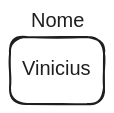

# Variáveis

Variáveis são elementos fundamentais em programação usados para armazenar e manipular dados. Elas atuam como "caixinhas" que guardam valores. Variáveis possuem um nome (também chamado de identificador), que é utilizado para referenciar os dados armazenados, e um valor, que é o dado propriamente dito. Por exemplo:

Utilizamos o identificador "nome" para nos referir à variável acima, e se perguntarmos o seu valor, ou seja, o que ela guarda, obteremos "Vinicius".

# [[Próximo tópico: Linguagem de Programação]](./linguagem-progamacao/linguagem-programacao.md)