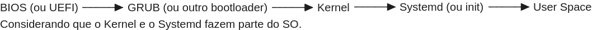
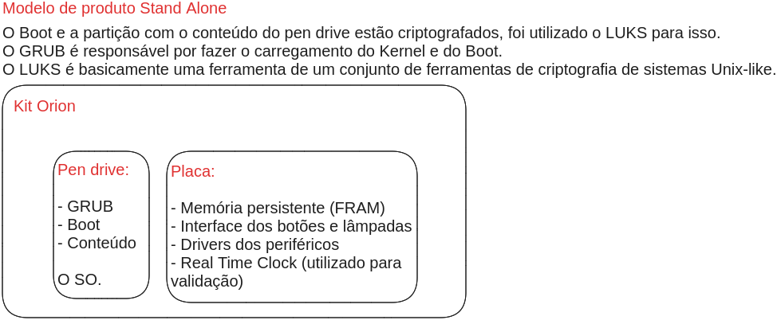

### <a name = "sumario"></a>Sumário

- [**Resumo do Conteúdo**](#resumo-conteudo)
- [**Sistema Operacional**](#sistema-operacional)
- [**Kernel**](#kernel)
- [**Unix-like**](#unix-like)
    + [**Serviços**](#servicos)
    + [systemctl](#systemctl)
    + [Daemon](#daemon)
    + [Execução em Primeiro e Segundo Plano](#execucao-primeiro-segundo-plano)
    + [Caminho Absoluto e Caminho Relativo](#caminho-absoluto-caminho-relativo) (Y)
    + [Permissões de Acesso a Arquivos e Diretórios](#permissoes-acesso-arquivos-diretorios)
    + [Diretórios Específicos](#diretorios-especificos)
- Linux
    + [GRUB](#grub)
    + [Diagrama de Inicialização de Um Sistema Computacional](#diagrama-inicializacao-sistema-operacional)
    + [LUKS](#luks)
    + [Shell](#shell)
        - Bash
        - [Scripts](#scripts)
- Windows
    + [Comandos do Terminal](#comandos-terminal)
    + [Atalhos](#atalhos)
    + [Atalhos (Durante a Inicialização)](#atalhos-durante-inicializacao)

# <a id = "resumo-conteudo"></a>Resumo do Conteúdo

1. **BIOS/UEFI:**
    - Inicializa o hardware
    - Fornece um ambiente básico para a inicialização do SO
    - Carrega o bootloader
2. **GRUB:**
    - Carrega o kernel na memória RAM
    - Permite ao usuário escolher o SO ou configuração de kernel a ser inicializado
3. **Kernel:**
    - Gerencia o hardware
    - Fornece uma interface entre o software e o hardware
    - Inicializa o SO
    - Pode iniciar o systemd (ou outro sistema de inicialização)
4. **Systemd (ou init):**
    - Inicializa os componentes do SO
    - Gerencia os serviços em segundo plano (daemons) e outros processos
    - Fornece uma variedade de recursos de gerenciamento de sistema
5. **Durante a execução do sistema:** serviços e daemons estão em execução em segundo plano, fornecendo funcionalidade específicas
6. **Systemctl:**
    - Gerenciador de serviços utilizado no systemd
    - Permite iniciar, parar, reiniciar e gerenciar serviços no sistema
7. **LUKS:**
    - Ferramenta para criação de volumes criptográficos
    - Usado para proteger dados sensíveis por meio de criptografia
8. **Shell:**
    - Interface de linha de comando que permite aos usuários interagirem com o SO
    - Pode ser usado para executar comandos, scripts e interagir diretamente com o sistema
9. **Scripts:** conjunto de instruções escritas em linguagem de script (alto nível)
10. **Foreground/Background:** programas em Foreground normalmente bloqueiam o uso do terminal e programas em Background não

A partição de boot contém o GRUB, o Kernel e outros arquivos essenciais para a inicialização.

# <a id = "sistema-operacional"></a>Sistema Operacional

Um sistema operacional (SO) é um software fundamental que atua como uma interface entre o hardware do computador e os programas da aplicação. Ele desempenha diversas funções essenciais para o funcionamento do sistema computacional como um todo. Aqui estão algumas das principais finalidades de um sistema operacional:

1. **Gerenciamento de recursos:**
    - **CPU (Unidade Central de Processamento):** o sistema operacional gerencia o uso da CPU, decidindo quais processos e tarefas têm acesso à CPU e por quanto tempo
    - **Memória:** alocação e desalocação de memória para os processos, garantido que cada programa tenha a quantidade necessária de memória para sua execução
    - **Dispositivos de entrada/saída:** controle e comunicação com periféricos como teclado, mouse, impressora, etc
2. **Abstração de hardware:** fornece uma camada de abstração entre o hardware do computador e os aplicativos. Isso permite que os desenvolvedores de software escrevam programas sem precisar se preocupar com detalhes específicos do hardware
3. **Gerenciamento de processos:**
    - Inicia, interrompe, retorna e encerra processos (programas em execução)
    - Gerencia a execução concorrente de vários processos
4. **Sistema de arquivos:**  fornece uma estrutura para armazenar, organizar e recuperar dados em dispositivos de armazenamento, como discos rígidos e unidades flash
5. **Interface com o usuário:** oferece uma interface para interação entre o usuário e o sistema. Pode ser uma interface gráfica de usuário (GUI) ou uma interface de linha de comando (CLI)
6. **Segurança:**
    - Controla o acesso a recursos do sistema, protegendo dados e previnindo acessos não autorizados
    - Implementa políticas de segurança, como autenticação e autorização
7. **Comunicação entre processos:** permite a comunicação e a troca de dados entre processos em execução no sistema
8. **Gerenciamento de redes:** facilita a comunicação entre computadores em uma rede, permitindo a troca de dados e o acesso a recursos compartilhados
9. **:Atualizações e manutenção** facilita a instalação de atualizações de software e realiza a manutenção do sistema operacional
10. **Gerenciamento de energia:** em dispositivos móveis e laptops, o sistema operacional gerencia o consumo de energia para otimizar a vida útil da bateria

Em resumo, um sistema operacional é uma camada essencial de software que permite que os aplicativos sejam executados em um computador, fornecendo abstração de hardware, gerenciamento de recursos, segurança e outras funcionalidades críticas para o funcionamento eficiente de um sistema computacional.

# <a id = "kernel"></a>Kernel

O kernel é uma parte central e essencial de uma sistema operacional (SO). Ele é responsável por gerenciar recursos de hardware e fornecer serviços básicos para os aplicativos e outros compenentes do SO. Aqui estão algumas das principais funções e finalidades do kernel:

1. **Gerenciamento de memória:**
    - Alocação e desalocação de espaço de memória para processos e programas em execução
    - Proteção da memória para evitar que processos acessem áreas de memória de outros processos
2. **Gerenciamento de processos:**
    - Inicia, interrompe, retoma e encerra processos
    - Coordena a execução concorrente de vários processos
    - Fornece mecanismos de comunicação entre processos
3. **Gerenciamento de dispositivos de entrada/saída (E/S):**
    - Controla a comunicação entre o SO e os dispositivos de E/S, como teclado, mouse, disco rígido, impressora, etc
    - Fornece interfaces para drivers de dispositivos para facilitar a comunicação com o hardware
4. **Comunicação com o hardware:**
    - Fornece uma camada de abstração para o hardware subjacente, permitindo que os software interaja com o hardware de maneira consistente, independente das diferenças de hardware específicas
    - Gerencia interrupções e eventos do hardware
5. **Sistema de arquivos:**
    - Gerencia o acesso e a manipulação de arquivos no sistema de arquivos
    - Implementa políticas de permissões e segurança no acesso aos arquivos
6. **Gerenciamento de recursos do sistema:**
    - Monitora e gerencia o uso de recursos do sistema, como CPU, memória e dispositivos de armazenamento
    - Garante que os recursos sejam alocados de maneira eficiente entre os processos em execução
7. **Políticas de segurança:** implementa controles de segurança, como controle de acesso e proteção da memória, para garantir que o SO e os processos sejam executados de maneira segura
8. **Temporização e gerenciamento de eventos:** fornece serviços de temporização e gerencia eventos temporizados no sistema
9. **Inicialização do sistema:**
    - Inicializa o sistema operacional durante o processo de inicialização (boot)
    - Carrega módulos e drivers necessários para a operação do sistema
10. **Gestão de energia:** em sistemas que suportam gestão de energia, o kernel pode desempenhar um papel na administração do consumo de energia para otimizar o uso de recursos e a vida útil da bateria

O kernel é uma camada de software crítica que atua como uma ponte entre o hardware do computador e os aplicativos em execução no sistema operacional. Ele é responsável por garantir o correto funcionamento e a eficiência do sistema operacional como um todo. Cada tipo de sistema operacional (Linux, Windows, MacOS, etc.) possui seu próprio kernel específico, adaptado para suas características e requisitos particulares.

# SO x Kernel

Como podemos ver, as listas de características são muito similares, a diferença entre as definições do sistema operacional e do Kernel reside nas camadas e nas responsabilidades específicas que cada um abrange no contexto de um sistema computacional.

- **Sistema operacional (SO):**
    + O SO é um software mais abrangente que inclui não apenas o kernel, mas também uma variedade de utilitários, bibliotecas, interfaces de usuário, gerenciadores de janelas, sistemas de arquivos, comandos de linha, ferramentas de rede, e muito mais
    + O SO oeferece uma interface completa para os usuários interagirem com o computador e para os aplicativos serem executados. Isso inclui uma interface gráfica de usuário (GUI) ou a interface de linha de comando (CLI)
    + O SO abrange tanto o espaço do kernel quanto o espaço do usuário, onde os aplicativos são executados
    + Ele fornece uma série de serviços e funcionalidades além daquelas diretamente gerenciadas pelo kernel, como a instalação e execução de aplicativos, controle de configurações, atualizações de software, etc.
- **Kernel:**
    + O kernel é uma parte central e fundamental do sistema operacional
    + Ele gerencia recursos de hardware, fornece serviços básicos e implementa políticas essenciais para o funcionamento do sistema
    + O kernel opera em um nível mais baixo, diretamente com o hardware, e é responsável pelo gerenciamento direto de processos, memória, dispositivos de E/S e comunicação entre hardware e o software
    + É uma camada de software que atua como uma interface entre o hardware e os aplicativos, proporcionando uma abstração eficiente dos recursos de hardware

Em resumo, o SO é uma entidade mais ampla que inclui não apenas o kernel, mas também outros componentes essenciais que fornecem uma experiência completa de computação. O kernel, por outro lado, é uma parte central do sistema operacional que lida diretamente com o gerenciamento de recursos de hardware e fornece uma base para o restante do SO. SO é a soma total de todos os componentes, enquanto o kernel é a parte central que lida com o núcleo das operações do sistema.

# <a id = "unix-like"></a>Unix-like

O termo "Unix-like" refere-se a sistemas operacionais (SOs) que compartilham características ou conceitos fundamentais com o SO Unix original. O Unix é um SO desenvolvido na década de 1970 no Bell Labs da AT&T e se tornou uma referência em SOs multiusuários e multitarefa, conhecido por sua eficiência, flexibilidade e robustez.

Os SOs "Unix-like" não são clones diretos do Unix, mas seguem os princípios e a filosofia de design do Unix. Eles incorporam características semelhantes, como:

1. **Modelo de permissões:** uso de permissões para controlar o acesso a arquivos e recursos
2. **Shell e interface de linha de comando (CLI):** presença de um shell de linha de comando para interação com o sistema
3. **Sistema de arquivos hierárquico:** organização de arquivos em diretórios hierárquicos
4. **Modelo de processos:** suporte a processos como unidades de execução
5. **Ferramentas e utilitários padrão:** disponibilidade de utilitários padrão, como `ls`, `cp`, `mv`, `rm`, etc.
6. **Comandos padrão e sintaxe de comandos:** uso de comandos padrão e sintaxe de comandos semelhante

Exemplos de SOs Unix-like incluem:

- **Linux:** um kernel Unix-like que é frequentemente combinado com outras ferramentas e utilitários para formar distribuições de SO completas, como Ubuntu, Fedora, CentOS, entre outros
- **BSD (Berkeley Software Distribution):** um ramo do Unix desenvolvido na Universidade da Califórnia em Berkeley, que inclui variantes como FreeBSD, OpenBSD e NetBSD
- **macOS:** o SO da Apple, que é baseado no kernel Darwin (um sistema Unix-like) e compartilha muitos conceitos com o Unix

Esses SOs Unix-like são conhecidos pela sua estabilidade, segurança e flexibilidade, e são amplamente utilizados em servidores, desktops, dispositivos embarcados e em várias outras áreas.

## <a id = "servicos"></a>Serviços

Um serviço, no contexto de sistemas operacionais (SOs) Unix-like, é um programa ou aplicativo que é executado em segundo plano e fornece funcionalidades específicas para o sistema ou para os usuários. Esses serviços podem variar desde processos essenciais ao sistema até aplicativos de terceiros. Aqui estão algumas características e exemplos de serviços:

1. **Execução em segundo plano:** um serviço é geralmente executado em segundo plano, sem uma interface de usuário interativa. Ele opera como um processo em execução, mas não requer a interação direta de um usuário
2. **Funcionalidade específica:** um serviço fornece uma funcionalidade específica para o sistema. Pode ser um serviço essencial para o funcionamento do SO ou um serviço de aplicativo que oferece recursos específicos
3. **Inicialização automática:** muitos serviços são configurados para iniciar automaticamente durante a inicialização do SO. Isso garante que o serviço esteja disponível assim que o sistema estiver pronto para uso
4. **Gestão por systemd:** em SOs Linux que utilizam o systemd, os serviços são frequentemente gerenciados por essa estrutura. O systemctl é a ferramenta padrão para controlar, monitorar e configurar serviços
5. **Exemplos de serviços:**
    - **Serviços do sistema:** alguns serviços essenciais para o sistema, como o serviço de gerenciamento de log ("systemd-journald"), serviço de rede ("networking"), serviço de impressão ("cups"), etc.
    - **Serviços de aplicativos:** bancos de dados, servidores web (por exemplo, "apache" ou "nginx"), servidores de banco de dados (por exemplo, "MySQL" ou "PostgreSQL"), serviços de mensagens (por exemplo, "rabbitmq"), etc.
6. **Monitoramento e controle:** os serviços podem ser monitorados para verificar seu status, logs e desempenho. O systemctl fornece ferramentas para realizar essas tarefas
7. **Dependências:** serviços podem ter dependências uns dos outros. Por exemplo, um serviço web pode depender de um serviço de banco de dados para funcionar corretamente
8. **Configuração:** os serviços geralmente têm arquivos de configuração associados que determinam o seu comportamento, como o local dos logs, portas de rede, etc.

Em resumo, um serviço em SOs Unix-like é uma entidade que fornece funcionalidades específicas para o sistema ou para os usuários, e é geralmente gerenciado por ferramentas como o systemctl em sistemas que utilizam o systemd.

## <a id = "systemctl"></a>systemctl

**O systemctl é uma ferramenta de controle e gerenciamento de serviços no sistema operacional Linux. Ela é parte do sistema de inicialização systemd**, que é amplamente adotado por muitras distribuições Linux modernas. O systemctl permite aos usuários e administradores controlar os serviços do sistema, examinar seu status e configurar sua inicialização. Aqui estão algumas das principais funcionalidades do systemctl:

1. **Gerenciamento de serviços:**
    - **Iniciar um serviço:** `sudo systemctl start nome_do_serviço`
    - **Parar um serviço:** `sudo systemctl stop nome_do_serviço`
    - **Reiniciar um serviço:** `sudo systemctl restart nome_do_serviço`
2. **Status do serviço:**
    - **Verificar o status de um serviço:** `sudo systemctl status nome_do_serviço`
    - Visualizar informações detalhadas sobre o serviço e seus logs associados
3. **Habilitar e desabilitar serviços na inicialização:**
    - **Habilitar um serviço para iniciar na inicialização:** `sudo systemctl enable nome_do_serviço`
    - **Desabilitar um serviço na inicialização:** `sudo systemctl disable nome_do_serviço`
    - Isso gerencia os links simbólicos no diretório de unidades do sistema
4. **Listagem de Serviços:**
    - **Listar todos os serviços:** `sudo systemctl list-units --type=service`
    - **Listar serviços ativos:** `sudo systemctl list-units --type=service --state=active`
5. **Verificação de dependências:**\
    **Visualizar dependências de um serviço:** `sudo systemctl list-dependencies nome_do_serviço`
6. **Recarregamento de configuração:**
    - **Recarregar a configuração do systemd sem reiniciar:** `sudo sytemctl daemon-reload`
    - Isso é útil após a dmodificação de arquivos de configuração do serviço
7. **Logs de serviço:**
    - **Visualizar logs de um serviço específico:** `sudo journalctl -u nome_do_serviço`
    - **Ver logs do sistema:** `sudo journalctl`
8. **Unidades e alvos:**
    **Listar todas as unidades disponíveis (serviços, montagens, dispositivos, etc.):** `sudo systemctl list-units`

O systemctl oferece uma interface poderosa para gerenciar serviços no contexto do sistema systemd. Isso facilita a administração e o monitoramento de serviços no Linux e é amplamente utilizado em distribuições que adotaram o systemd, como o Ubuntu a partir da versão 15.04, Fedora, CentOS 7 e outras.

## <a id = "daemon"></a>Daemon

Um "daemon" (ou "demon") é um tipo de programar de computador que é executado em segundo plano, muitas vezes como um serviço, sem a necessidade de interação direta com um usuário. Daemons são comumente encontrados em sistemas operacionais Unix-like, incluindo Linux.\
Principais características de daemons:

1. **Execução em segundo plano:** daemons são projetados para serem executados em segundo plano, sem ocupar a interface de usuário. Eles geralmente são iniciados durante a inicialização do sistema e continuam em execução enquanto o sistema está ativo
2. **Independência do usuário:** daemons não estão vinculados a sessões de usuários específicos e geralmente são executados como processos separados do contexto do usuário
3. **Funções diversas:** daemons podem realizar uma variedade de funções, desde gerenciamento de serviços do sistema até execução de tarefas específicas em intervalos regulares
4. **Persistência:** eles podem ser projetados para permanecerem em execução continuamente ou para serem iniciados automaticamente quando necessário
5. **Exemplos de uso:**
    - **Serviços de sistema:** muitos daemons gerenciam serviços do sistema, como daemon de impressão ("cupsd"), o daemon de rede ("networkd"), entre outros
    - **Atualização automática:** daemons podem ser usados para verificar e aplicar atualizações de software em segundo plano
    - **Servidores web e banco de dados:** daemons frequentemente controlam servidores web (por exemplo, "httpd" ou "nginx") e servidores de banco de dados
6. **Padrão POSIX:** o termo daemon é derivado do conceito de "daimon" na mitologia grega, que era um espírito divino ou entidade intermediária. No contexto da computação, daemon é frequentemente estilizado como um acrônimo para "Disk And Execution Monitor" (Monitor de Disco e Execução) ou "Derived from the Ancient ad Mystic Order of NETwork Daemons" (Derivado da Ordem Antiga e Mística de Daemon de Rede).

Em resumo, daemons são programas que operam em segundo plano, executando tarefas específicas ou gerenciando serviços do sistema, sem a necessidade de intervenção direta do usuário.

## Daemons x Serviços

A terminologia pode variar e ser usada de maneira intercambiável em alguns contextos, então aqui vai a definição de ambos e suas características:

1. **Daemon:**
    - **Definição:** um daemon é um programa que é executado em segundo plano, muitas vezes como um serviço, sem interação direta com os usuários. Eles são processos independentes que podem realizar tarefas específicas
    - **Características:**
        + Podem ser responsáveis por uma variedade de tarefas, desde gerenciar serviços até executar operações específicas em segundo plano
        + Não estão vinculados a sessões de usuários específicas
        + Podem ser iniciados durante a inicialização do sistema e continuar em execução enquanto o sistema está ativo
2. **Serviço:**
    - **Definição:** um serviço é um componente de software que executa uma função específica ou fornece uma capacidade específica no sistema. Pode incluir daemons e outros tipos de programas
    - **Características:**
        + Pode ser um conceito mais amplo que engloba vários tipos de programas, incluindo daemons
        + Fornecem funcionalidades específicas, como gerenciamento de rede, servidor web, banco de dados, etc.
        + Muitas vezes, a execução de serviços envolve a presença de processos em segundo plano, que podem ser daemons

A confusão pode ocorrer porque daemons, sendo programas em segundo plano, muitas vezes são usados para implantar serviços. Portanto, pode-se dizer que alguns daemons gerenciam serviços, mas daemons em si não são exatamente equivalentes a serviços. Um daemon pode ser um componente de um serviço maior, e o termo serviço é muitas vezes usado como um conceito mais amplo para abranger várias funcionalidades fornecidas por diferentes programas em execução em segundo plano.

Em resumo, um serviço pode envolver a presença de daemons, mas nem todo daemon é necessariamente um serviço isolado. A distinção entre os termos pode variar dependendo do contexto específico do sistema operacional e da implementação.

## <a id = "execucao-primeiro-segundo-plano"></a>Execução em Primeiro e Segundo Plano

A execução em primeiro ou segundo plano em sistemas Unix-like, está relacionada à forma como os processos são gerenciados. Vamos entender a diferença entre esses dois conceitos:

- **Primeiro plano (Foreground):**
    + Quando um programa é executado em primeiro plano, ele está na frente e tem controle direto do terminal. Isso significa que ele ocupa a tela e interage diretamente com o usuário
    + O processo em primeiro plano geralmente bloqueia o terminal até que seja concluído ou interrompido (por exemplo, pressionando `CTRL+C` para interromper a execução)
    + O usuário pode interagir diretamente com um programa em primeiro plano enquanto ele está sendo executado
- **Segundo plano (Background):**
    + Quando um programa é executado em segundo plano, ele ainda está em execução, mas não está ocupando o terminal. Isso permite que o usuário continue a usar o terminal para outras tarefas enquanto o programa em segundo plano executa em segundo plano
    + O processo em segundo plano não bloqueia o terminal e não requer interação direta com o usuário
    + Para iniciar um programa em segundo plano, você pode usar o caractere ampersand, ou "e comercial" ("`&`"), no final do comando. Isso informa ao shell para executar o comando em segundo plano.

A diferença entre primeiro e segundo plano é relevante quando você executa comandos no terminal. Se você iniciar um programa em primeiro plano sem usar o `&`, o terminal ficará bloqueado até que o programa termine. Se você usar `&` no final do comando, o programa será iniciado em segundo plano, permitindo que você continue usando o terminal para outros comandos.\
Uma forma interessante de observar isso é executar o comando `discord` com e sem o `&`. Sem o `&` o terminal realmente fica bloqueado e você não pode executar nenhum comando, até você fechar a aplicação do Discord que está aberta (fechar a janela).\
Observando que o terminal estar ou não bloqueado, não significa que as mensagens de log não serão impressas nele. A saída padão (stdout) e a saída de erro (stderr) do programa ainda estarão associadas ao terminal. Portanto, os logs do programa serão exibidos no terminal, mesmo que você possa continuar interagindo com ele para inserir outros comandos.

## <a id = "caminho-absoluto-caminho-relativo"></a>Caminho Absoluto e Caminho Relativo

Vamos utilizar o comando `cd` para auxiliar na explicação deste tópico.\
O uso de barra ("/") antes do diretório no comando `cd` está relacionado à forma como os caminhos são interpretados no sistema de arquivos. Existem duas maneiras principais de especificar um caminho ao usar o comando `cd`:

- **Caminho absoluto:**
    + Inicia com uma barra que representa a raiz do sistema de arquivos
    + **Exemplo:** `cd /conteudo/`
- **Caminho Relativo:**
    + Não começa com uma barra e é interpretado em relação ao diretório atual
    + **Exemplo:** `cd conteudo/`

A escolha entre o caminho absoluto e o caminho relativo depende do que você deseja alcançar:

- **Caminho absoluto:**
    + É usado quando você deseja acessar um diretório a partir da raiz do sistema de arquivos, independentemente de onde você está atualmente
    + Sempre começa com uma barra
    + Fornece um caminho completo e único para o diretório
- **Caminho relativo:**
    + É usado quando você deseja acessar um diretório em relação ao diretório atual
    + Não começa com uma barra
    + É mais conciso em termos de digitação, especialmente quando você está navegando dentro de uma hierarquia de diretórios a partir da sua localização atual

A escolha entre caminho absoluto e relativo dependerá do contexto e da estrutura do seu sistema de arquivos. Se você precisa se mover para um diretório específico a partir da raiz, use um caminho absoluto. Se estiver navegando a partir do diretório atual, use um caminho relativo.

Uma forma interessante de se observar isso, se você está na raiz do sistema de arquivos, onde você se encontra, é utilizar o comando `pwd`.

## <a id = "permissoes-acesso-arquivos-diretorios"></a> Permissões de Acesso a Arquivos e Diretórios

Ao criar um novo arquivo, as permissões padrões geralmente são definidas para permitir leitura e escrita. `rw-r--r--`, leitura e escrita ("read" e "write") para o proprietário, leitura para o grupo e para os outros (respectivamente).\
Da esquerda para a direita, proprietário, grupo e outros, três posições, no caso acima, para o proprietário `rw-`.

As permissões padrão para diretórios frequentemente são `rwxrwxr-x`, a execução é permitida para que seja possível para os outros usuários listarem o conteúdo do diretório. Em outras palavras, permitir a permissão de execução, permite que os outros usuários "entrem" no diretório e vejam seus arquivos e subdiretórios.

## <a id = "diretorios-especificos"></a>Diretórios Específicos

### /etc

O diretório **/etc** contém arquivos de configuração do sistema e de aplicativos. Ele é usado para armazenar configurações globais que afetam o sistema operacional e outros softwares instalados no sistema.

A sigla "**/etc**" representa "etcetera", indicando que o diretório contém "outras" configurações. Algumas das informações de configuração armazenadas no diretório **/etc** podem incluir:

1. **Configurações do sistema:** arquivos que definem configurações globais do sistema, como nomes de host, fuso horário, configurações de rede, e assim por diante
2. **Configurações de software:** arquivos de configuração de aplicativos instalados no sistema. Por exemplo, o diretório **/etc/apache2** pode conter configurações do servidor web Apache, e o diretório **/etc/mysql** pode conter configurações do servidor de banco de dados MySQL
3. **Scripts de inicialização:** alguns sistemas Unix-like usam o diretório **/etc** para armazenar scripts de inicialização e parada do sistema ou de serviços específicos
4. **Perfis de usuário:** algumas configurações específicas do usuários podem ser encontradas no diretório **/etc**, como o arquivo **/etc/passwd** que contém informações sobre usuários do sistema
5. **Lista de grupos:** o arquivo **/etc/group** armazena informações relacionadas sobre grupos de usuários no sistema
6. **Configurações de segurança:** certas configurações relacionadas à segurança do sistema podem ser encontradas no diretório **/etc**, como arquivos de configuração do sistema de controle de acesso, etc.

Lembrando que a estrutura exata e os arquivos específicos podem variar entre diferentes distribuições Unix-like, mas o conceito geral de armarzenar configurações no diretório **/etc** é uma convenção amplamente seguida.

# Linux

## <a id = "grub"></a>GRUB

O GRUB, ou Grand Unified Bootloader, é um gerenciador de inicialização de código aberto amplamente utilizado em sistemas operacionais baseados (SOs) em Linux. Ele desempenha um papel crítico no processo de inicialização do sistema, permitindo que você escolha qual sistema operacional ou kernel do Linux inicializar quando o computador é ligado.\
Aqui estão algumas características e funções principais do GRUB:

1. **Menu de inicialização:** o GRUB exibe um menu de inicialização que permite ao usuário selecionar entre diferentes SOs instalados no computador. Ele pode mostrar opções para vários Kernels do Linux, SOs diferentes ou modos de inicialização específicos
2. **Configuração flexível:** o GRUB é altamente configurável, permitindo que os usuários personalizem as opções de inicialização e os parâmetros do Kernel. Isso é útil, por exemplo, para modificar opções de inicialização do kernel do Linux ou escolher a partição específica do SO a ser inicializada
3. **Compatibilidade com múltiplos sistemas operacionais:** além de SOs baseados em Linux, o GRUB também é capaz de inicializar outros SOs, como o Windows. Isso torna possível ter um menu de inicialização unificado para escolher entre diferentes SOs durante o processo de inicialização
4. **Carregamento de imagens do kernel:** o GRUB é responsável por carregar a imagem do kernel do SO escolhido na memória RAM, preparando assim o sistema para a fase final da inicialização
5. **Interface de linha de comando:** o GRUB oferece uma interface de linha de comando que permite aos usuários executar comandos diretamente a partir do prompt, facilitando a execução de tarefas específicas relacionadas ao gerenciamento de inicialização
6. **Configuração por arquivo de configuração:** as configurações do GRUB são geralmente definidas em um arquivo de configuração, frequentemente chamado de grub.cfg. Este arquivo contém informações sobre os SOs instalados, opções de inicialização e configurações específicas

O GRUB desempenha um papel fundamental em SOs Linux e é uma parte essencial do processo de inicialização, facilitando a escolha e a execução de SOs diferentes em um computador.

## GRUB x BIOS

O GRUB (Grand Unified Bootloader) e a BIOS (Basic Input/Output System) são componentes distintos que desempenham funções diferentes no processo de inicialização de um computador.

- **GRUB (gerenciador de inicialização):**
    + O GRUB é um software de código aberto usado em sistemas operacionais Unix-like, principalmente em sistemas baseados em Linux
    + Sua função principal é carregar o sistema operacional no nomento da inicialização. Ele fornece um menu de inicialização que permite aos usuários escolher entre diferentes sistemas operacionais instalados no computador
    + O GRUB é instalado no disco rígido e é executado após a BIOS ou UEFI iniciar o processo de inicialização
- **BIOS (ou UEFI - Interface de Firmware Extensível Unificada):**
    + A BIOS é um software embutido em um chip na placa-mãe do computador. No caso de sistemas mais modernos, a BIOS foi em grande parte substituída pela UEFI
    + A BIOS (ou UEFI) tem a responsabilidade de inicializar o hardware do sistema e fornecer um ambiente básico para inicialização do sistema operacional. Isso inclui identificação e inicialização de dispositivos, como o processador, memória, e unidades de armazenamento
    + A BIOS (ou UEFI) é o primeiro software a ser executado quando um computador é ligado, sua principal função é carregar o bootloader (como o GRUB) para iniciar o sistema operacional

Em resumo, o GRUB é um componente do software que gerencia a escolha e o carregamento do sistema operacional, enquanto a BIOS ou UEFI é um componente de firmware que lida com a inicialização e o hardware básico do sistema. O GRUB é uma parte do processo que ocorre após a inicialização da BIOS ou UEFI.

## <a id = "diagrama-inicializacao-sistema-operacional"></a>Diagrama de Inicialização de Um Sistema Computacional



A ordem típica de inicialização em sistemas baseados em Linux é mais ou menos assim:

1. **BIOS ou UEFI:** quando você liga o computador, a BIOS ou UEFI é o primeiro software a ser executado. Sua função principal é inicializar e fornecer um ambiente básico para o hardware do sistema
2. **GRUB (ou outro bootloader):**
    - A BIOS ou UEFI, após a inicialização, procura pelo bootloader no dispositivo de inicialização configurado (geralmente o disco rígido). O GRUB é um exemplo comum de bootloader
    - O GRUB exibe um menu de inicialização, permitindo que o usuário escolha qual sistema operacional (SO) ou configuração de kernel utilizar
3. **Kernel:**
    - Uma vez que o usuário seleciona a opção desejada no menu do GRUB, o GRUB carrega o kernel do SO escolhido na memória RAM
    - O kernel é o núcleo do SO e assume o controle do sistema a partir deste ponto. Ele é responsável por inicializar o SO, gerenciar hardware, e fornecer uma interface entre software e hardware
4. **Init (ou Systemd em sistemas mais modernos):**
    - O kernel inicializa o processo init, que é o primeiro processo do sistema e serve como ancestral de todos os outros processos
    - Em sistemas mais modernos, especialmente aqueles que utilizam o systemd, o init pode ser ser substituído pelo systemd, que é um sistema de inicialização e gerenciamento de sistema mais abrangente
5. **User space:** após o systemd (ou init) iniciar, o SO entra no espaço do usuário, e os serviços e aplicativos podem ser carregados conforme necessário

O GRUB atua como intermediário entre a BIOS/UEFI e o kernel, enquanto o systemd (ou init) gerencia o espaço do usuário após o kernel assumir o controle.

## <a id = "luks"></a>LUKS

LUKS (Linux Unified Key Setup) é um padrão de especificação para a **criptografia de disco em sistemas Linux**. Ele é usado para criar volumes criptografados e é amplamente empregado para proteger a privacidade e segurança de dados armazenados em discos rígidos ou partições em sistemas Linux.\
Principais características do LUKS:

1. **Criptografia de disco completo:** o LUKS é comumente usado para aplicar a criptografia de disco completo (FDE), garantindo que todos os dados no disco sejam criptografados
2. **Camada de abstração:** LUKS fornece uma camada de abstração sobre os detalhes específicos da implementação da criptografia, permitindo que diferentes implementações de criptografia sejam usadas sob a mesma interface padrão
3. **Senhas e chave:** os usuários podem proteger o acesso aos dados criptografados por meio de senhas ou outras formas de autenticação, como chaves de arquivo ou tokens
4. **Gerenciamento de chave:** LUKS inclui mecanismos para o gerenciamento de chaves criptográficas, permitindo a adição, remoção e rotação de chaves de acesso
5. **Compatibilidade e interoperabilidade:** LUKS é um padrão amplamente adotado em distribuições Linux, garantindo a interoperabilidade entre diferentes implementações de criptografia
6. **Configuração flexível:** oferece operações de configuração flexíveis, permitindo que os usuários personalizem parâmetros de segurança e algoritmos criptográficos
7. **Suporte ao kernel do Linux:** o suporte ao LUKS está integrado ao Kernel Linux, facilitando a utilização em distribuições Linux
8. **Ferramentas de gerenciamento:** existem várias ferramentas de linha de comando e interfaces gráficas que facilitam a criação, formatação e gerenciamento de volumes criptografados usando o padrão LUKS

Ao criar um volume LUKS, os dados são criptografados e protegidos por uma chave mestra. Essa chave mestra pode ser protegida por senhas ou outras formas de autenticação. Quando o sistema é iniciado, os usuários precisam fornecer a senha ou autenticação correspondente para desbloquear o volume criptografado e permitir o acesso aos dados armazenados. Isso é particularmente útil para proteger os dados confidencias em laptops ou dispositivos de armazenamento externo.

Quando você utiliza o LUKS para configurar um dispositivo de armazenamento (como um disco rígido ou um arquivo, como no exemplo), ele criptografa todo o conteúdo desse dispositivo.\
Aqui estão os passos básicos:

1. **Inicialização:** quando você inicia o sistema, antes de poder acessar os dados do disco, você precisa fornecer uma senha (ou outra forma de autenticação, como uma chave). Essa senha é usada para desbloquear o volume criptografado
2. **Desbloqueio do volume:** após fornecer a senha correta, o LUKS desbloqueia o volume, permitindo que o sistema operacional acesse os dados armazenados nele
3. **Acesso aos dados:** depois que o volume é desbloqueado, o sistema operacional pode acessar os dados normalmente. Todas as operações de leitura e gravação no disco são transparentes para o usuário, pois o LUKS faz a descriptografia e criptografia em tempo real.

A criptografia de disco completo é uma medida de segurança valiosa, especialmente em ambientes nos quais a privacidade dos dados é crítica. Isso protege contra acessos não autorizados aos dados armazenados no disco, mesmo que o dispositivo física seja perdido ou robado.

Normalmente em ambientes reais, o volume criptografado criado pelo LUKS é aplicado a um disco rígido inteiro.

Exemplo de aplicação prática do LUKS:



**Pela minha compreensão**, no caso de você decidir criptografar todo o sistema (com exceção do GRUB, pois ele inicia o sistema computacional, por isso não é possível, ou faz sentido, criptografá-lo), antes do sistema começar a realizar o boot, a chave mestra será requerida. Após isso, você pode utilizar o conteúdo sem se preocupar com nada, qualquer alteração será salva com o seu conteúdo já criptografado.\
Ele faz isso de forma **transparente**, isso quer dizer que você consegue utilizar todo o conteúdo sem se preocupar em criptografá-lo ou descriptografá-lo, o LUKS cuida de tudo.\
Basicamente, ele cria um volume seguro e lá você guarda o que você quer proteger. Considerando que você pode precisar "montar" o volume para acessá-lo, neste caso, ele trata este volume como um pen drive, por exemplo, por isso utiliza o diretório /dev/ (devices).

## <a id = "shell"></a><>Shell

Shells são interfaces de linha de comando que permitem o usuário interagir com o sistema operacional atráves de comandos de texto.

Bash (Bourne-Again SHell) é um tipo de Shell presente em distribuições Linux. Considerado um dos shells mais poderosos para Linux, ele fornece uma grande quantidade de ferramentas, como comando de histórico, auto complete com o tab e scripts. Ele é altamente configurável, você pode ajustá-lo de acordo com as suas necessidades individuais.

### <a id = "scripts"></a>Scripts

Um "script" se refere a um programa ou conjunto de instruções escritas em uma linguagem de script, que é uma linguagem de programação de alto nível projetada para automação de tarefas específicas. Os scripts são frequentemente usados para realizar tarefas simples ou automatizar processos repetitivos.\
Aqui estão algumas características e aspectos associados a scripts:

1. **Interpretação:** os scripts são geralmente interpretados, o que significa que cada linha de código é executada pelo interpretador da linguagem de script em tempo de execução, sem a necessidade de compilação prévia
2. **Linguagens de script:** exemplos de linguagens de script incluem Python, Ruby, JavaScript, Perl, Shell Scripting (como o Bash), entre outras. Cada uma dessas linguagens é projetada para facilitar a automação de tarefas específicas
3. **Automação e tarefas específicas:** os scripts são frequentemente usados para automatizar tarefas, como processamento de arquivos, administração de sistemas, manipulação de dados, geração de relatórios, entre outras atividades
4. **Legibilidade:** em muitos casos, a ênfase nas linguagens de script é a facilidade de leitura e escrita, tornando scripts acesspiveis a pessoas não necessariamente especializadas em programação
5. **Portabilidade:** muitos scripts são portáveis entre diferentes sistemas operacionais (SOs), pois são frequentemente interpretados e dependem de ambientes de execução que são amplamente suportados
6. **Execução interativa:** muitas linguagens de script oferecem a capacidade de serem executadas de forma interativa, permitindo que os desenvolvedores experimentem e testem comandos diretamente
7. **Exemplos práticos:** scripts podem ser encontrados em vários contextos, desde automação de tarefas em SOs até a implantação de recursos específicos em páginas da web

É importante notar que a definição exata de um script pode variar em diferentes contextos e comunidades de desenvolvimento. Em resumo, um script é um conjunto de instruções escritas em uma linguagem de script para realizar uma tarefa específica ou automação.

# Windows

### Comando do Terminal

- `diskpart`**:** inicia a ferramenta de linha de comando que permite gerenciar discos, partições e volumes
- `list disk`**:** exibe uma lista de todas as unidades de armazenamento no computador
- `select disk número`**:** seleciona o disco de númeração especificada para realizar ações sobre ele
- `list volume`**:** exibe uma lista de informações sobre todas as partições ou volumes presentes nos discos
- `select volume número`**:** seleciona uma partição ou volume de numeração especificada para realizar ações sobre ela
- `delete volume`**:** remove todas as informações da partição, tornando-a não alocada (não esqueça de selecionar um volume primeiro)

`chkdsk /f`**:** verifica e corrigi erros no sistema de arquivos de uma unidade de armazenamento (como um disco rigído).

### Atalhos

`Win+X`**:** abre o menu de atalho do Windows ou Power User Menu (Menu de Usuário avançado).

### Atalhos (Durante a Inicialização)

- `F2`**:** acessa a configuração da BIOS
- `Shift` **(manter pressionado):** acessa o modo de reparo do sistema (através dele nós podemos utilizar o terminal, por exemplo)

# Guia de Instalação de Um Dual Boot

Contexto: nosso sistema operacional é o Windows, queremos formatá-lo e fazer um dual boot com o Ubuntu.

No caso da utilização de um HD externo como um flash drive:

### Erros

```shell
Error
Verification failed (0x1A) Security Violation
```

Precisei criar uma senha de supervisor na configuração BIOS para poder acessar o modo de segurança e desabilitá-lo, pois quando utilizamos um flash drive criado com o Ventoy o erro de segurança acima é acusado.